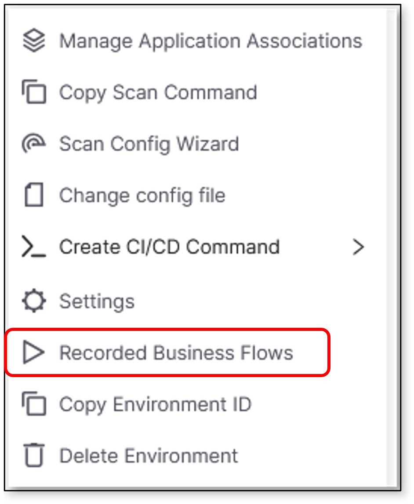
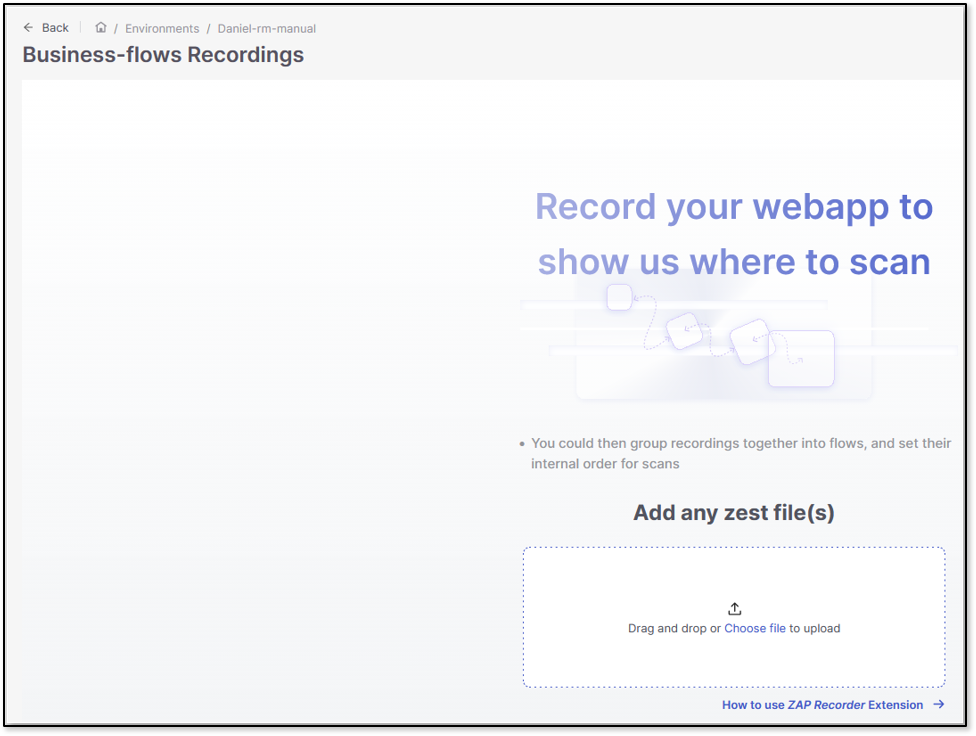
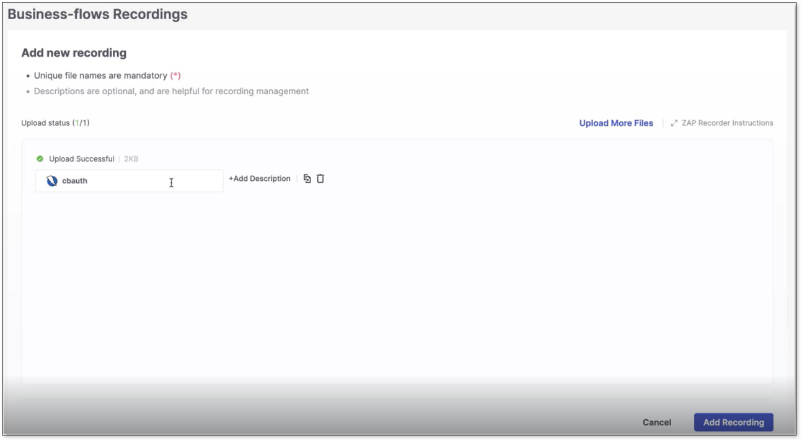
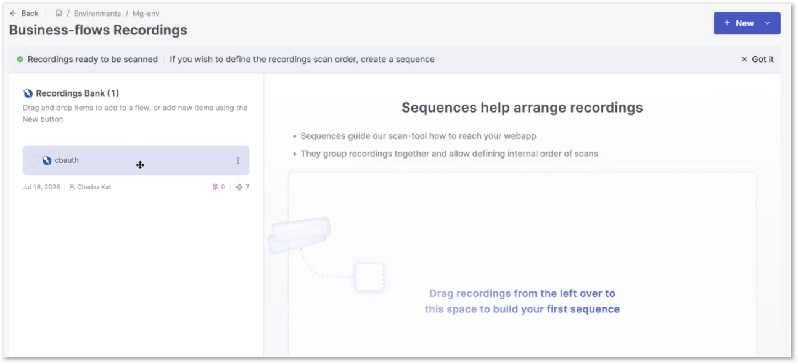
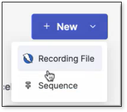
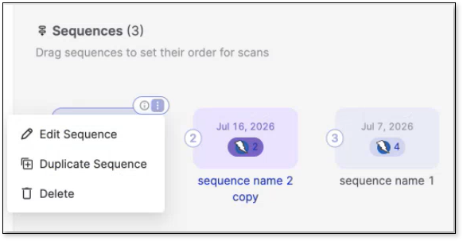
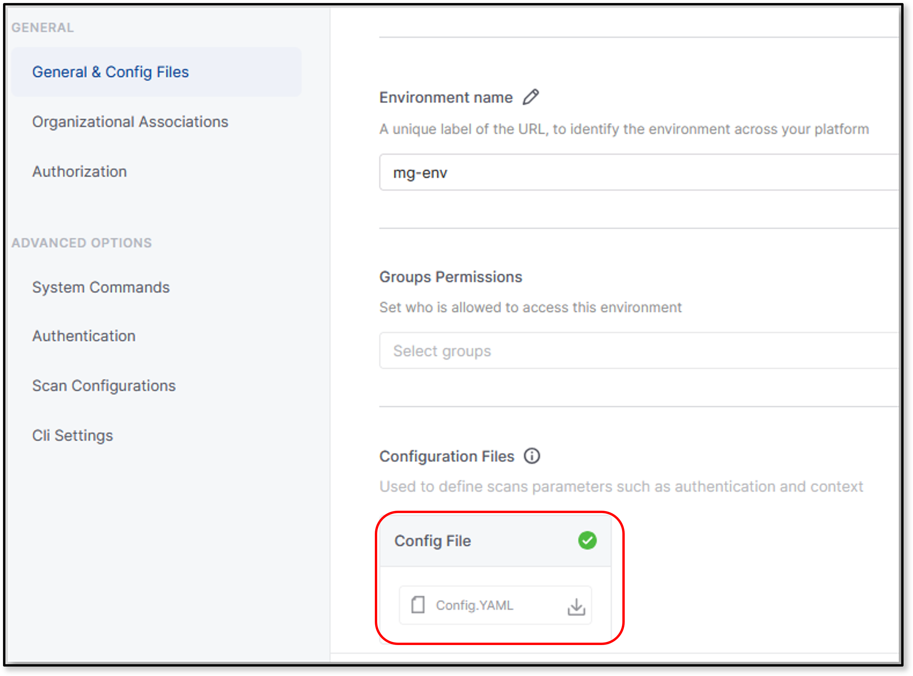
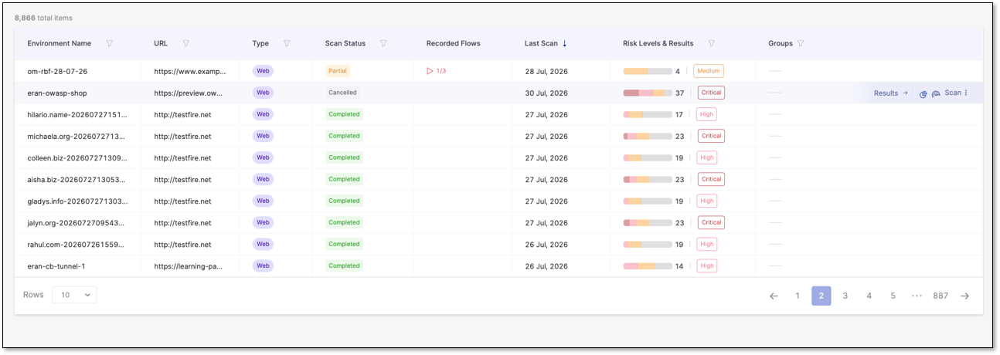
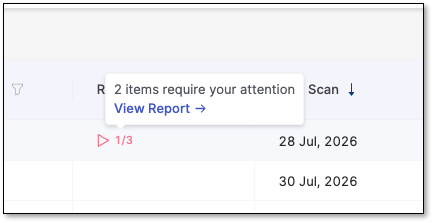
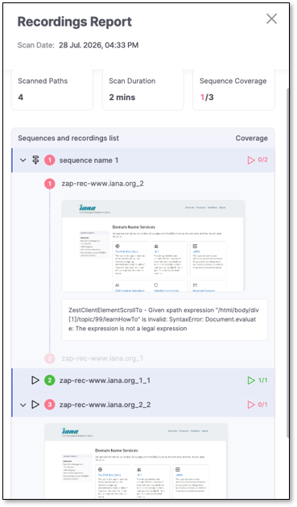

# Business Flow Recorder

Define business flows for your environment by organizing your recordings into sequences. A Business Flow is built from one or more recordings - saved captures of a your navigation through your webapp, exported as .zst files. Recordings are created using the ZAP Recorder extension (download for [Chrome](https://chromewebstore.google.com/detail/zap-by-checkmarx-recorder/belmenkmkfloppjbbgibipmgcmnkaiki) or [Firefox](https://addons.mozilla.org/en-US/firefox/addon/zap-by-checkmarx-recorder/)). You can upload single or multiple recordings, set their order, reuse recordings across flows, and edit or replace them as needed.

If you delete a recording, you will see how many sequences use it, and those sequences will skip that step. During scans, recordings run in the order you set. If a specific recording fails, any recordings that depend on it are skipped, and you receive a clear error with a screenshot so you can fix the issue. See [here](business-flow-recorder---sequences-command-guide--cli-.md) for using the CLI to set up sequences.


Break long flows into several smaller recordings that run in sequence, rather than one long recording that covers everything end to end.

For example, an insurance quote-and-purchase flow might involve many steps - get a quote, enter details, select coverage, pay - and each step can change independently as the website evolves. If you record the whole flow as one file, a single field change anywhere in it means re-recording everything. If you record each step separately and chain them in a sequence, you only need to update the one recording that changed. Splitting recordings this way also lets you reuse the same recording across multiple business flows - record a shared step (like login) once, and use it in every flow that needs it.


Recordings are a great way to automate repetitive scan setup steps across environments, so you don't have to reconfigure the same navigation flow for every scan.

## Setting Up Your Recorded Business Flow

Ensure you have a .zst file then continue below.

On the Environments page, perform the following to setup your recorded business flow for your environment:

1. At the end of an environment row, select  \> Recorded Business Flows. This opens the Business-flows Recordings page.

   
<figure><figcaption></figcaption></figure>

2. Upload the designated .zst file in the upload box.

   
<figure><figcaption></figcaption></figure>

   
   If you don't have a .zst file, click the How to use ZAP Recorder Extension link below the upload box and follow the instructions on using the ZAP Recorder Extension there.
   

3. Choose to upload more files, edit the existing uploaded files names and descriptions, or delete the file. Click Add Recording to proceed.

   
<figure><figcaption></figcaption></figure>

4. Drag the recording from the bank on the left-side panel into the designated area. This opens the sequence page.

   
<figure><figcaption></figcaption></figure>

   
   Click +New on the top-right corner for a dropdown to create a new recording or sequence.

   
<figure><figcaption></figcaption></figure>

   

5. Drag to rearrange the order of the sequences and their recordings. Dragging a recording into a sequence box will add it to the sequence. Click the  on the corner of a sequence to open a dropdown to edit, duplicate, or delete it. Click Save when done.

   
<figure><figcaption></figcaption></figure>

Any sequences and their recordings are updated and viewable in the config file for the environment. Download and view the config file by clicking  at the end of the environment's row then Settings \> General & Config Files \> Configuration Files.

<figure><figcaption></figcaption></figure>

### Reviewing Recording Results After a Scan

Once a scan finishes, you can see how each recording performed. In the environment table, in case there are recordings, you can see data in the Recorded Flows column.

<figure></figure>

For every recording included in the scan, you'll see:

- Whether it ran successfully or failed

- If it failed, why - so you know which recording to fix. You can see this in more details in the report. Click the value in the Recorded Flows column to see a quick summary, then select View Report → to open the full breakdown.

  
<figure><figcaption></figcaption></figure>

  
<figure><figcaption></figcaption></figure>

- How it affected scan coverage - a failed recording (or one whose dependents were skipped) means the scan may not have reached every path it was designed to cover, so results should be read with that in mind

This helps you judge whether a scan's results are complete, or whether a recording issue means some paths or vulnerabilities may not have been tested.


A scan can complete successfully even if a recording fails - check recording results to confirm full coverage before trusting a clean scan as complete.

