# DAST Environment Setup Wizard - Overview

## Overview

The Checkmarx DAST Environment Setup Wizard streamlines the configuration of scans, authentication setup, and launching scans for both public and private applications. It also helps you generate YAML configuration files and manage setup flows for new or existing environments.

You can quickly configure authentication using simple form fields - no manual YAML editing is required. Choose from multiple login methods, such as TOTP (2FA), browser-based, or recorder-driven authentication, or upload an existing configuration. Built-in pre-scan verification allows you to test authentication before initiating a full scan.

## Navigating the Wizard

1. Start the wizard by clicking + New Environment.

2. Configure the following settings to set up your Environment:

   - Environment Name: Enter the name of the web application you want to scan and track.

   - Environment URL: Provide the base URL of the web application.

   - Groups Permissions: Groups assigned and allowed to access the environment.

   - Type: Web or API: Select whether the environment is Web- or API-based.

     
     Choose Web if you're scanning through the browser-rendered UI. Choose API if you're scanning API endpoints directly using a spec file (Postman, OpenAPI, etc.). This selection cannot be changed after setup - create a new environment if you need to switch.
     

   - Reachability: Private: Select this if the target application is internal and not externally accessible; Public: Select this if the target application is accessible online.

     
     Private environments require a DAST Tunnel to scan. You'll need a private host with Docker installed. See [DAST Tunneling](dast-environment-setup-wizard-overview.md#UUID-34ba78da-792c-7d01-7fec-50e996ae8534_UUID-9b0d3002-7a67-7a11-6384-404d6c582b02) before starting your scan.
     

   - Authentication: Toggle whether the environment requires authentication.

   Click Next to proceed.

   **The remaining steps depend on the Type you selected - follow Web-type environment below if you chose Web, or API-type environment if you chose API.**

## Web-type Environment

1. Copy the provided Docker command, then paste and run it in your console. Once the CLI connection succeeds, click Next to proceed. (If the CLI doesn't connect, re-run the setup command.)

2. Select an authentication method: Form-Based, Recorder-Based, or Upload Config file.

3. (Optional) If your application uses 2FA, enter your TOTP secret key in the Secret Key field. (See [Setting up TOTP (2FA)](dast-environment-setup-wizard-overview.md#UUID-34ba78da-792c-7d01-7fec-50e996ae8534_section-id235742900011822) if you only have a QR code.)

4. Click Authenticate to verify your setup before launching a full scan.

   
   Do not close the wizard tab during authentication - the process may take a few moments.
   

5. Copy the final Docker command into the CLI, or click Finish and start the scan from the UI.

   - Start Scan from the UI - single-click trigger. Optional for public apps
   - Copy the CLI Command - ideal for CI/CD pipelines. Optional for public apps, required for private apps.

## API-type Environment

API setup is shorter than Web setup - authentication is handled via your uploaded file, so there's no separate authentication step.

1. Upload API File: Supported formats: Postman, OpenAPI, HAR, SOAP, or GraphQL.

   
   Checkmarx supports only bundled .wsdl files; all definitions must be contained in a single file, rather than multiple .wsdl files. After environment setup, you can manage your uploaded API collection in an environment’s Settings \> Scan Configuration, including viewing, downloading, deleting, editing, and adding new files.
   

2. Verify API Key or Token: Ensure the uploaded file includes valid credentials. Use the preview option to confirm.

   
   In rare cases, including the bearer token in the API specification does not grant access to the API docs, causing scans to fail. To resolve this, manually specify your bearer tokens to ensure your scans succeed by clicking + Add custom headers and filling out the form. Ensure your headers and target URL are correct. For more information on headers, see [Scan Configurations](environment-settings.md#UUID-438f45cc-772b-67e8-7eb5-7c1b0ad987ef_id_SettingsDAST-AdvancedOptions).
   

3. On the final step, select Copy Command, Run Scan, or Upload a Config File. Click Finish when done.

### Uploading an API File

Supported formats: Postman, OpenAPI, HAR, SOAP, or GraphQL.

After uploading, you can optionally define extra attributes for certain file types. Click the icon next to the uploaded file to add or edit these:

- Postman (JSON): Add custom variables (key/value pairs), the same way you'd add headers. You can add multiple variables or delete them as needed.

- OpenAPI (YAML/JSON): Set a Target URL - either select one from your environment's included URLs or type a new one. If your file doesn't define a server/host URL, this tells DAST where to send requests for relative paths (e.g., https://api.example.com/v1). Only one URL per file is allowed. If you type a URL that isn't already in your included URLs list, you'll be prompted to add it there too.

- HAR and SOAP (WSDL): No additional attributes are available for these formats. Once saved, the uploaded file shows an indicator icon confirming it has extra definitions attached, and you can edit or delete them later. Deleting a saved URL prompts you to confirm whether to also remove it from the environment's included paths.

- GraphQL: Works the same as OpenAPI, but the field is labeled Endpoint instead of Target URL.

  <div align="left"><figure>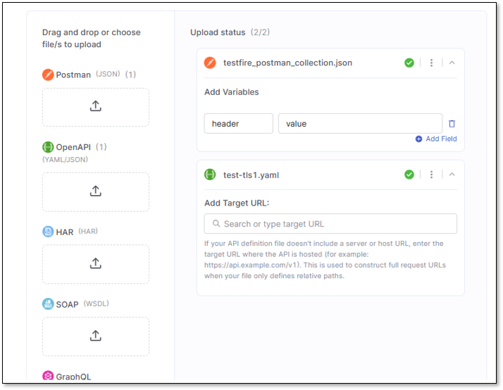</figure></div>

## Choosing an Authentication Method

| Method | Best for |
| --- | --- |
| Form-Based | Simple login forms - standard URL, username/email, password |
| Recorder-Based | Complex login flows; available only via DAST-CLI |
| Upload Config File | You already have a saved configuration |


If you sign in through the Microsoft Entra ID login page (https://login.microsoftonline.com), use Form-Based instead of Recorder-Based, since Form-Based has built‑in support for this login flow.


For complex authentication flows, you may upload a Selenium script or HTTP Sender written in JavaScript. Selenium scripts run whenever ZAP (the OWASP ZAP scanning engine used by DAST) launches a browser via Selenium - for example, for crawling (Ajax Spider). These scripts have full access to the active browser instance and can interact with it directly. They can execute JavaScript, navigate to URLs, fill out forms, click buttons, and manipulate localStorage or sessionStorage. HTTP Sender scripts are executed for every request. You may also edit this after you complete your environment setup in the environment's Settings \> Authentication \> Zap Scripting.

<div align="left"><figure>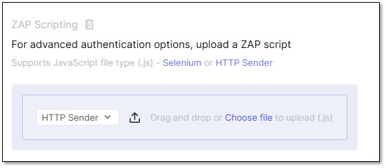<figcaption></figcaption></figure></div>

## Setting up TOTP (2FA)

(optional) When enabling 2FA: Some applications require an additional layer of authentication using TOTP (Time-Based One-Time Passwords). TOTP generates a unique passcode based on the current time, which is valid for only a short period. This code is used during each authentication attempt to verify access to secured areas of your web application.

Checkmarx DAST supports form-based authentication using TOTP by allowing you to provide a shared secret key.

When you enable 2FA in your application, it typically shows a QR code for scanning with an authenticator app (e.g., Google Authenticator, Authy, Microsoft Authenticator). Most apps also offer a manual setup option, which displays the secret key - a Base32-encoded string, such as:

```
JBSWY3DPEHPK3PXP
```

Paste this TOTP secret key into the Secret Key field in CxDAST.


The secret key is often shown alongside the QR code with a label like:

"Can’t scan the code? Enter this key manually:"


<details>
<summary>What If You Only See a QR Code?</summary>

If the application only displays a QR code and doesn't show the key explicitly, you can extract the key using a QR scanner app that reveals the raw data behind the code.

Example using Microsoft Lens:

- Open the Microsoft Lens app.
- Switch to Actions → Select QR Code.
- Scan the QR code.

The app will display a URL like:

```
otpauth://totp/MyApp:user@example.com?secret=JBSWY3DPEHPK3PXP&issuer=MyApp 
```

From this URL, extract the value of the secret parameter:

secret = JBSWY3DPEHPK3PXP

Use this value in CxDAST as your secret key.

- Secret Key

  Base32-encoded key provided by your 2FA application

- Digit (Default: 6)

  Specifies the number of digits in the generated OTP. Most systems use 6 digits.

- Period (Default: 30 seconds)

  Determines how long each OTP remains valid before a new one is generated.

Leave these fields unchanged unless your authentication system requires different values.

</details>

<details>
<summary>Viewing the Authentication Report</summary>

As an outcome of your onboarding, the Authentication Report gives you a clear, structured view of your authentication setup - complete with key insights and screenshots.

The Authentication column in the environment table displays the status of each authentication attempt. A green check mark indicates that authentication was successful, while a red Failure signifies a failure.

<div align="left"><figure>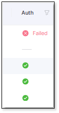</figure></div>

To view the authentication report, locate the row of the environment you wish to review and click  at the end of the row. This opens a dropdown menu. From the menu, select Authentication Report.

<div align="left"><figure>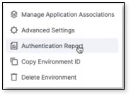</figure></div>

A side panel will appear, providing an overview of the authentication process for that specific environment.

Scrolling through the panel, from the beginning, is a summary of what worked and what did not during authentication. Scroll further for step-by-step login instructions and screenshots that guide you through the process. The report also includes information about how your Zap is configured, any verification processes that are currently in place, and the setup details of your environment. Toward the bottom of the panel are statistics from Zap that offer deeper insight into authentication. See [here](https://www.zaproxy.org/docs/internal-statistics/) for more information on these statistics.

When you are ready to share or save the report, click Share or .

</details>

## Troubleshooting Authentication Failures

After completing the authentication setup, you can verify it to ensure everything is configured correctly before launching a full scan. Once all required fields are filled, the Authenticate button will become active. Click Authenticate to verify your authentication setup.


Do not close the wizard tab during authentication - the process may take a few moments.


If authentication succeeds, you’ll move directly to the next screen, where you can either start the scan from the UI or copy the scan command for CLI use. If authentication fails, an error screen will appear with troubleshooting guidance, including confirming that your username and password are correct, ensuring you’re using stable non‑expiring credentials, and - if you rely on TOTP-based 2FA- optionally completing the 2FA form to validate your setup.

For Recorder-based authentication, make sure you complete the entire login flow in the browser recorder rather than stopping after entering credentials, and avoid incognito mode or any extensions that block cookies or session data during recording.

<details>
<summary>Form-based: Enter your Login Page Credentials</summary>

This is the Form-Based method selected above. The Form-based method is best suited for applications with simple login forms - those with a standard login URL, username/email field, and password input.

This method allows CxDAST to authenticate automatically using the credentials you provide, without needing to record a session or upload a config file.


All credentials are handled securely and used solely for scanning purposes.


- Log-in URL- The direct URL of your login page (e.g., `https://yourapp.com/login`)
- User Name- The username or email address used to sign in to the application
- Password- Your password - used securely by CxDAST only for authentication purposes

</details>

<details>
<summary>Recorder Extension: Record a New Login Session</summary>


Due to security reasons, the recorder authentication method is currently available only for scans initiated via the DAST-CLI.


The browser extension allows you to record your login interactions for authentication setup.

This method is a quick and visual way to create authentication flows, allowing you to record an authentication session.

The ZAP by Checkmarx extension is available for both Chrome and Firefox.

To record your login session, follow these steps:

1. Add the ZAP by Checkmarx Recorder extension to your browser by selecting the appropriate link for your browser- Chrome Extension or Firefox Extension support.

   **If the extension is installed on your browser, you can skip to the next step.**

2. In your browser’s top-right corner, locate the ZAP extension icon.

3. Navigate to your application's login page, then click Record to start capturing the login process.

   <div align="left"><figure>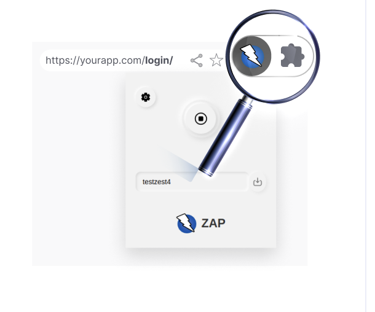<figcaption></figcaption></figure></div>

4. Perform all necessary login actions while recording.

5. Once complete, click Stop Recording and Download to save the recording file to your local machine.

6. Upload your saved recording file on the recorder step to complete the authentication setup.


Auto-filled saved passwords are currently not recognized by the browser recorder and must be entered manually.


</details>

## Managing Saved Configuration Files

1. Environment Configuration Indicator

   An indicator will appear for each environment, showing that an environment with a saved configuration file is ready for scanning.

   <div align="left"><figure>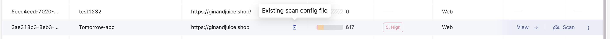</figure></div>

2. Scan Options by Environment Type

   - Public Environments

     - Hover and click Scan at the end of the environment row to trigger a scan directly.

       <div align="left"><figure><figcaption></figcaption></figure></div>

     - Alternatively, click ⋮ and select Copy Scan Command.

   - Private Environments

     - Scanning requires CLI execution. Hover over the environment row to reveal the Copy Scan CMD, which you can use in your local or CI/CD environment.

       <div align="left"><figure>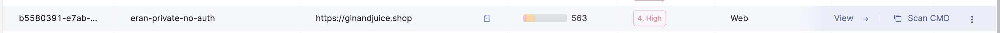<figcaption></figcaption></figure></div>

3. Update Configuration File

   You can replace an existing configuration file by clicking ⋮ on the environment row and selecting Change Config File.

   
   To edit the config file in the wizard for an existing environment (or a recently created one), hover over its row and click + Config File.

   <div align="left"><figure>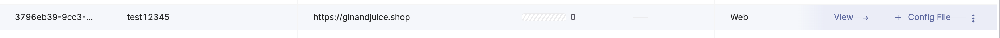</figure></div>
   

4. Download Configuration File

   On the environment row, click ⋮, then Advanced Settings \> ID & Config Files \> Configuration Files, then click  on the file you wish to download.

You can modify settings for each environment at any time through the Environment Settings panel. The following options are available:

- Tags (Optional)

  Assign custom tags to the environment. Tags help filter environments in the UI.

  Note: Tagging is independent and intended for organizational purposes. They do not impact other components.

- Groups (Optional)

  Assign user groups to the environment.

  Once a group is assigned, all group members will have permission to perform actions in the environment, such as initiating scans and viewing results.

## DAST Tunneling

DAST tunneling makes secure testing simple. Perform DAST scans on internal, private, or firewall-protected applications directly from the cloud - no need to open inbound ports or allow list scanner IPs. All traffic is securely transmitted through an end-to-end encrypted tunnel. Use an existing tunnel or create a new one.


Requirements for Connecting Your Tunnel:

1. You need a private host that can access the application you want to scan.
2. You need Docker installed on the private host.
3. A CMD execution will be provided after creating an environment on Checkmarx One. This command must remain running for the tunnel to be active and able to scan using Checkmarx One cloud services.


<details>
<summary>Proxy information</summary>

- Traffic direction: outbound only from your Connector to the internet (TCP 443)
- Proxy protocol: SOCKS5 inside the tunnel; encrypted end‑to‑end
- Identity & access: one‑time tokens, mutual authentication, zero‑trust transport

</details>

### Configuring the Tunnel in the Wizard

1. Create an environment by clicking + Add Environment

2. Define its name, Base URL, scan type (Web/API), and toggle authentication.

3. Define a tunnel to associate with the Environment

   <div align="left"><figure>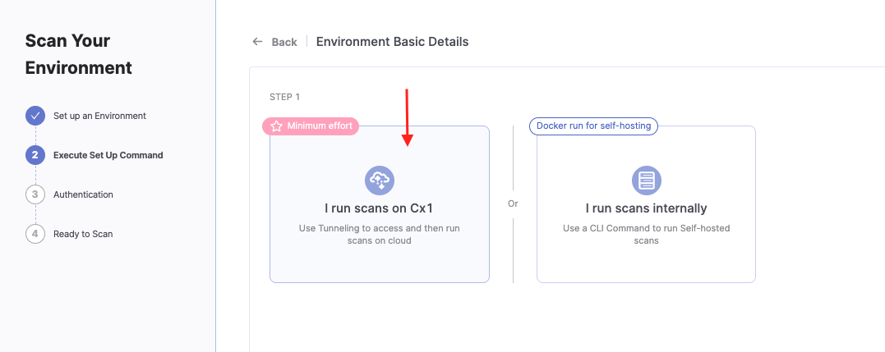<figcaption></figcaption></figure></div>

4. You can create a new tunnel or use an existing one:

   - Creating a new tunnel (give it a descriptive name)

     <div align="left"><figure>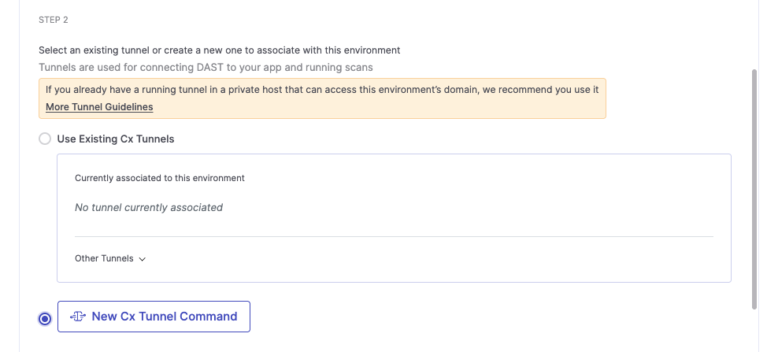<figcaption></figcaption></figure></div>

   - Using an existing tunnel

     <div align="left"><figure>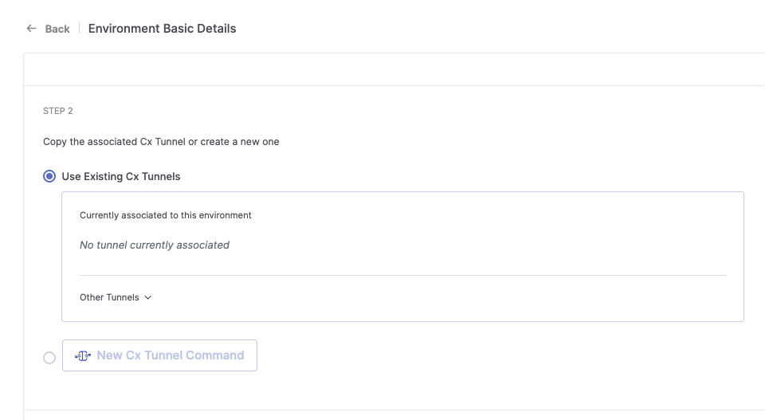<figcaption></figcaption></figure></div>

     Retrieve execution command to run in your private host by clicking:

     <div align="left"><figure>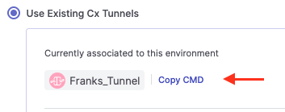<figcaption></figcaption></figure></div>

5. Verify the connection by scanning.
