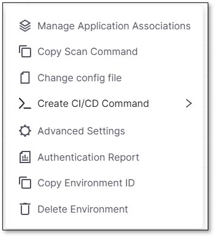
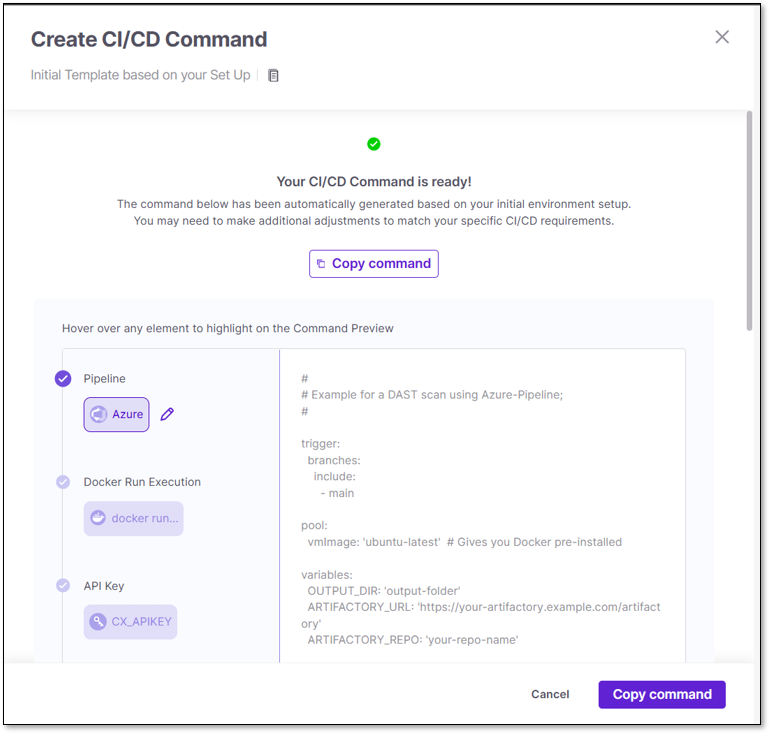
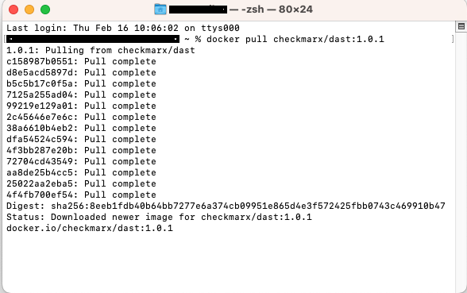

# Installing the DAST CLI in a Pipeline


Before you begin: API key must be generated by a user with the dast-external-scans role. Navigate to the  → Copy Environment ID). For more information see [Configuration File](configuration-file.md).


You can integrate DAST with your favorite CI/CD pipelines. This section explains how to install the DAST CLI in a pipeline.

## CI/CD Command

Your DevOps pipeline can include DAST scans and store all of its configuration data in Checkmarx One. This will ensure that every subsequent scan uses the same settings, giving you greater flexibility and making integrating DAST into your workflow easier.

To add your own CI/CD command, at the end of the environment row:

1. Click  to open the dropdown menu.

   <div align="left"><figure><figcaption></figcaption></figure></div>

2. Select \>\_ Create CI/CD Command.

3. A second dropdown will appear with available templates - choose one to open the CI/CD panel.

   <div align="left"><figure><figcaption></figcaption></figure></div>

The left side of the panel contains all the template sections. The right side contains the full template, including the Docker command. When you hover over a section on the left, the corresponding parameter in the text will be highlighted on the right.

Click Copy Command when ready.

Replace the following variables:

- `environment-id` → replace the ID with the corresponding ID on Checkmarx One. You can copy it from the UI by clicking  \> Copy Environment ID.
- `config` → replace with the corresponding location of the configuration file.
- `base-url` → Specify the URL of your Checkmarx One tenant.
- `output` → specify the location for the output folder.
- `openapi` (only mandatory for API scans)→ specify the location of the API file.

The following CI/CD pipelines integrate with DAST:

<details>
<summary>Azure Pipelines</summary>

Integrate DAST into Azure Pipelines CI/CD to run DAST scans in Azure DevOps repositories.

```
#

# Example for a DAST web scan using PowerShell;

#

 

trigger: none

 

# API key variables are stored in a Library

variables:

- group: "CxOne DAST Variables"

 

pool:

  vmImage: "ubuntu-latest"

 

jobs:

- job: build

  displayName: 'Initiate DAST scan'

 

  steps:

  # Use PowerShell to do the heavy lifting

  - powershell: |
     sudo chmod a+rw -R ./
     docker pull checkmarx/dast:latest

     docker run -e CX_APIKEY=$(CANARY_API_KEY) -v "/home/vsts/work/1/s:/dast_home" checkmarx/dast:latest web --environment-id="99f10aac-6a73-49a3-81b1-0adae9a158fc" --config="/dast_home/DAST-AZURE/dast-config/zap_config.yaml" --base-url=https://deu.ast.checkmarx.net/ --output=/dast_home/DAST-AZURE/test_output --timeout=10000 --update-interval=10 --jvm-properties=-Xmx3G --log-level=info --verbose --retry=3 --retry-delay=20

     sudo chown -R vsts:docker test_output

    displayName: 'Run CxOne DAST via PowerShell'

 

  # Publish the contents of the output directory as artifacts

  - task: PublishPipelineArtifact@1

    displayName: 'Publish CxOne DAST Artifacts'

    inputs:

      targetPath:  '$(Build.SourcesDirectory)/DAST-AZURE/test_output'

      artifact: 'CxOne DAST Artifacts'
```

</details>

<details>
<summary>Bamboo</summary>

You can integrate DAST into Bamboo. The example below demonstrates running DAST in a build plan linked to a GitHub repository. After you create a project with a build plan linked to a GitHub repository, you need to create a task to run DAST. The script body should contain `docker run -e CX_APIKEY=$API_KEY -v ${PWD}:/demo checkmarx/dast:latest web --environment-id=<ENVIRONMENT_ID> --config=/demo/zap_config.yaml --base-url=https://<CxOne-address>/ --output=/demo/test_output --verbose`.

</details>

<details>
<summary>Bitbucket Pipelines</summary>

You can integrate DAST into Bitbucket Pipelines CI/CD, and run DAST scans in your Bitbucket repositories to streamline risks. The following is an example DAST web scan configuration:

```
pipelines:
  default:
    - step:
        name: "Run Cx-DAST-CLI scan"
        script:
          - docker run -e CX_APIKEY=**** checkmarx/dast:latest web --base-url=%CxOne-address% --environment-id=**** --config=${PWD}/zap_config.yaml --output=/tmp --jvm-properties=-Xmx3G --verbose
        services:
          - docker
```

</details>

<details>
<summary>CircleCI</summary>

Enable CircleCI to access your profile or GitHub organization.

Create a `.circleci` directory in your project's root and place a `config.yaml` inside:

```
version: 2.1
jobs:
  dast:
    docker:
      - image: checkmarx/dast:latest
    steps:
      - checkout
      - run:
          name: Run DAST
          command: |
            /app/bin/dast web \
              --environment-id=<ENVIRONMENT_ID> \
              --base-url=https://<CxOne-address>/ \
              --config=${PWD}/zap_config.yaml \
              --verbose
          environment:
            CX_APIKEY: $CX_APIKEY
workflows:
  version: 2
  build:
    jobs:
      - dast
```

</details>

<details>
<summary>Docker Image</summary>


Click here for a full list of DAST docker tags: [Docker Tags](https://hub.docker.com/r/checkmarx/dast/tags).


To run Checkmarx DAST as a Docker image:

1. Download the Docker image. In your terminal, enter the command docker pull checkmarx/dast:latest to use the last updated version. If you want to download a specific version, you can replace it with the version you want to download; for example, docker pull checkmarx/dast:1.0.1.

   <div align="left"><figure></figure></div>

2. Open the terminal and access the folder where the configuration and Swagger files (for an API scan) are located.

3. Run the following command to start the DAST scan from the docker image:

   API Scan Example

   ```
   docker run -e CX_APIKEY=$API_MASTER_KEY \  
   -v $(pwd):/demo checkmarx/dast:latest \  
   api \  
   --environment-id=889259e2-c24b-4dc7-99f5-67009c43e73c \  
   --config=/demo/zap_config_api.yaml \  
   --base-url=https://urlCxOne.com/ \  
   --output=/demo/test_output \  
   --timeout=10000 \  
   --update-interval=10 \  
   --jvm-properties=-Xmx3G \  
   --log-level=info \  
   --verbose \  
   --retry=3 \  
   --retry-delay=20 \  
   --fail-on high \  
   --openapi /demo/openapi.yaml
   ```

   
   Instead of --openapi, you may use --postman, or --har, and then specify the file path accordingly. Remember to include the filename in the flag.
   

   Web Scan Example

   ```
   docker run -e CX_APIKEY=$API_MASTER_KEY \  
   -v $(pwd):/demo checkmarx/dast:latest \  
   web \  
   --environment-id=889259e2-c24b-4dc7-99f5-67009c43e73c \  
   --config=/demo/zap_config_web.yaml \  
   --base-url=https://urlCxOne.com/ \  
   --output=/demo/test_output \  
   --timeout=10000 \  
   --update-interval=10 \  
   --jvm-properties=-Xmx3G \  
   --log-level=info \  
   --verbose \  
   --retry=3 \  
   --retry-delay=20 \  
   --fail-on high 
   ```

</details>

<details>
<summary>Github</summary>

You can integrate DAST into your Github CI/CD pipelines and run DAST scans in your Github repositories.


Mounting or binding a file or folder would mark it as private by default, and prevent it from being accessed by other containers or processes in the hosting machine.

To prevent this from destabilizing the GitHub agent (hosting machine), mounting private paths is allowed only on selected paths, for example:

- $\{{ runner.temp }}.

To mount a path as shared, add :z. See [here](https://docs.docker.com/engine/storage/bind-mounts/#configure-the-selinux-label) for more information on binding mounts.


```
jobs:
  dast:
    runs-on: ubuntu-latest
    name: DAST Action
    steps:
      - name: Checkout Code
        uses: actions/checkout@v3
      - name: Create Output folder
        run: mkdir ${{ github.workspace }}/output_fold
      - name: Change dast-config owner
        run: sudo chmod 777 -R dast-config
      - name: Run DAST-CLI command
        run: |
          docker run \
           -e CX_APIKEY=eyJhbGciO... \
           -v ${{ github.workspace }}/output_fold:/output_fold:z \
           -v ${{ github.workspace }}/dast-config:/dast-config:z \
           checkmarx/dast:latest web \
           --base-url=https://ast-master-components.dev.cxast.net \
           --environment-id=9257043d-fce7-4566-9b51-025f0164f5f7 \
           --config=/dast-config/gin_juice.yaml \
           --output=/output_fold \
           --timeout=10000 \
           --update-interval=30 \
           --jvm-properties=-Xmx3G \
           --log-level=info \
           --verbose \
           --retry=3 \
           --retry-delay=20
```

</details>

<details>
<summary>GitLab CI</summary>

You can integrate DAST into your Git CI/CD pipelines and run DAST scans in your GitLab repositories.

```
image:
    name: checkmarx/dast:1.0.1
    entrypoint: [""]
 
stages:
    - CxOneDast
 
dast-scan:
  stage: CxOneDast
  image: docker:latest
  services:
    - docker:dind
  script:
       - docker run -e CX_APIKEY=$SECRETKEY -v $CI_PROJECT_DIR:/demo checkmarx/dast:1.0.1 web  --environment-id=7d5b6942-192c-4d04-a9d2-47f5acdd24bf --config=/demo/zap_config.yaml --base-url=https://deu.ast.checkmarx.net   --output=/demo/output.log --timeout=10000 --update-interval=10 --jvm-properties=-Xmx3G --log-level=info --verbose --retry=3 --retry-delay=20  --fail-on high
 
```

</details>

<details>
<summary>Jenkins</summary>

You can integrate DAST into your Jenkins CI/CD pipelines and run DAST scans as a stage in your pipeline.

Plugins required:

- [Docker Plugin](https://plugins.jenkins.io/docker-plugin/)
- [Docker Pipeline Plugin](https://plugins.jenkins.io/docker-workflow/)

```
#!groovy

def ret

pipeline {

    agent {

        node {

            label 'Dynamic-AST-Deployment-New'

        }

    }

    options {

        timestamps() 

        timeout(time: 2, unit: 'HOURS')

    }

    stages {

        stage("Docker Pull"){

            script{

                sh " docker pull checkmarx/dast:latest”

            }

 

        }

        stage("Run DAST"){

            script{

                git credentialsId: 'github_creds', url: 'https://github.com/CheckmarxDev/dast-demo-env'

                ret = sh(

                    script:

                    """ 

                    docker run -v \$(pwd)/dast-config:/tmp/config -v \$(pwd)/output:/output -e CX_APIKEY=$API_KEY --user 0 checkmarx/dast:latest \

                    web --base-url=https://deu.ast.checkmarx.net/ --timeout=10000 --log-level=info --verbose \

                    --config=/tmp/config/zap_config.yaml --environment-id=49e32846-7455-407c-aed6-be17dfe1632e \

                    --fail-on high --output /output 

                    """

                , returnStatus: true)

                if(ret != 0){ 

                    currentBuild.result = 'FAILED' 

                    return 

                }

            }

        }

    }

    post {

        always{

            archiveArtifacts artifacts: 'output'

        }

    }

}

 

 
```

</details>

<details>
<summary>TeamCity</summary>

You can easily integrate DAST into TeamCity pipelines by [Kotlin DSL](https://www.jetbrains.com/help/teamcity/2021.2/kotlin-dsl.html) and DAST docker image to run DAST scans as a stage of your pipeline. Ensure that the [TeamCity agent](https://www.jetbrains.com/help/teamcity/2021.2/setting-up-and-running-additional-build-agents.html) has Docker configured to run containers. Check out Getting Started with Kotlin DSL and modify your `.teamcity/settings.kts` as the example

```
import jetbrains.buildServer.configs.kotlin.v2019_2.*
import jetbrains.buildServer.configs.kotlin.v2019_2.buildSteps.script
version = "2021.1"

project {
    description = "DAST TeamCity integration test"
    buildType(Build)
}

object Build: BuildType({
    name = "DAST TeamCity integration test"
    vcs {
        root(DslContext.settingsRoot)
    }

    steps {
        script {
            scriptContent = """
                #!/bin/bash
                docker run -v ${'$'}PWD:/path checkmarx/dast:latest web --config /path/zap_config.yaml --verbose --environment-id  <ENVIRONMENT_ID>
            """.trimIndent()
        }
    }
})
```

With versioned settings enabled, you can see the build progress, logs, and success status after pushing the changes to the repository.

</details>

<details>
<summary>TravisCI</summary>

You can integrate DAST into your Travis CI/CD pipelines and run DAST scans in your repositories.

Example Configuration Using Docker

```
services:
    - docker

before_install:
    - docker pull checkmarx/dast:latest

script:
    - docker run -v ${PWD}/path checkmarx/dast:latest web --config /path/zap_config.yaml --verbose --environment-id  <ENVIRONMENT_ID>
```

</details>
