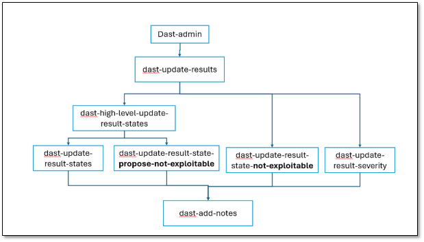

# DAST Permissions

To execute various actions in DAST, a user needs to be assigned one of the following permissions:

<table>
<thead>
<tr><th>
Permission
</th><th>
Description
</th></tr>
</thead>
<tbody>
<tr><td>
<strong><strong>dast-add-notes</strong></strong>
</td><td>
Add notes to a scan.
</td></tr>
<tr><td>
<strong><strong>dast-admin</strong></strong>
</td><td>
Manage Environments, Scans, update results, and execute other actions in DAST.
</td></tr>
<tr><td>
<strong><strong>dast-cancel-scan</strong></strong>
</td><td>
Cancel a Scan in DAST.
</td></tr>
<tr><td>
<strong><strong>dast-create-automation-scripts</strong></strong>
</td><td>
Create an automation script in DAST.
</td></tr>
<tr><td>
<strong><strong>dast-create-environment</strong></strong>
</td><td>
Create a new Environment in DAST.
</td></tr>
<tr><td>
<strong><strong>dast-create-scan</strong></strong>
</td><td>
Create a new Scan in DAST.
</td></tr>
<tr><td>
<strong><strong>dast-delete-environment</strong></strong>
</td><td>
Delete an Environment in DAST.
</td></tr>
<tr><td>
<strong><strong>dast-delete-scan</strong></strong>
</td><td>
Delete a Scan in DAST.
</td></tr>
<tr><td>
<strong><strong>dast-external-scans</strong></strong>
</td><td>
CI/CD user for executing actions related to External Workers.
</td></tr>
<tr><td>
<strong><strong>dast-high-level-update-result-states</strong></strong>
</td><td>
Allows for updating result states and propose not exploitable.
<figure></figure></td></tr>
<tr><td>
<strong><strong>dast-update-environment</strong></strong>
</td><td>
Update an Environment in DAST.
</td></tr>
<tr><td>
<strong><strong>dast-update-results</strong></strong>
</td><td>
Update results in DAST (severity, comments, etc.).
</td></tr>
<tr><td>
<strong><strong>dast-update-result-severity</strong></strong>
</td><td>
Update a Result Severity.
</td></tr>
<tr><td>
<strong><strong>dast-update-result-state-not-exploitable</strong></strong>
</td><td>
Update a Result State to <strong><strong>Not Exploitable</strong></strong>.
</td></tr>
<tr><td>
<strong><strong>dast-update-result-state-propose-not-exploitable</strong></strong>
</td><td>
Update a Result State to <strong><strong>Propose Not Exploitable</strong></strong>.
</td></tr>
<tr><td>
<strong><strong>dast-update-result-states</strong></strong>
</td><td>
Update a Result State.
</td></tr>
<tr><td>
<strong><strong>dast-update-scan</strong></strong>
</td><td>
Update a Scan's properties in DAST.
</td></tr>
<tr><td>
<strong><strong>dast-view-environments</strong></strong>
</td><td>
View a DAST Environment.
</td></tr>
<tr><td>
<strong><strong>manage-application</strong></strong>
</td><td>
Manage an application in DAST.
</td></tr>
<tr><td>
<strong><strong>view-applications</strong></strong>
</td><td>
View an application in DAST.
</td></tr>
</tbody>
</table>
