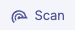
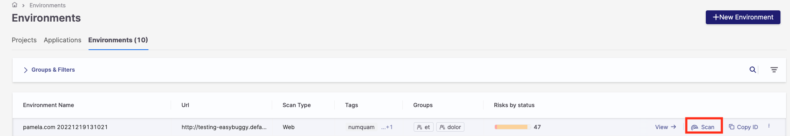
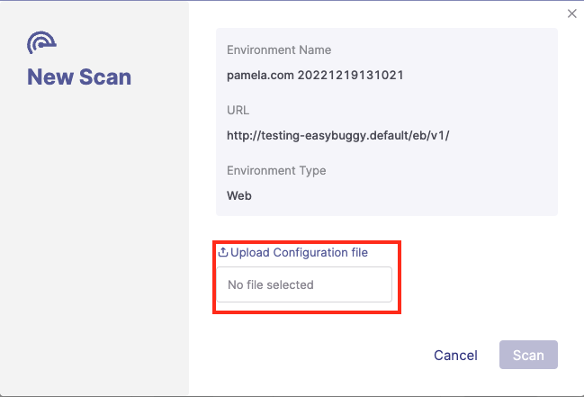
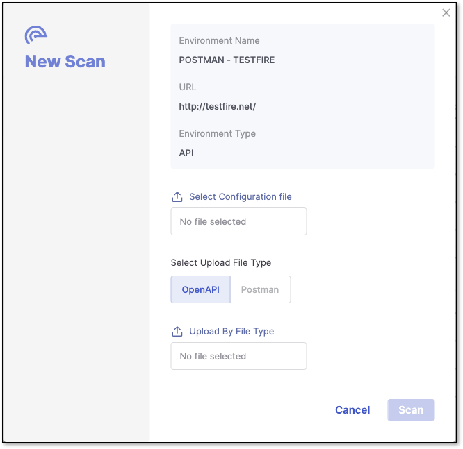
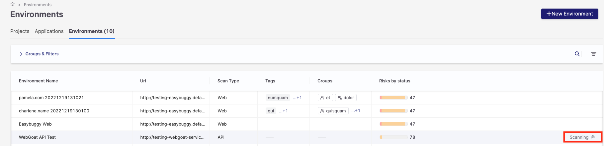

# Running a Scan

After an environment is configured, you can run a scan within that environment. A ZAP configuration file is selected as part of the scanning procedure each time a scan is executed. Selecting an API specification file (OpenAPI or Postman Collection) is also mandatory if the scanning is for an API environment. Initiating a scan is possible only within an existing API or web environment.


- Before you begin: You'll need a ZAP configuration file to run a scan. If you don't already have one, see [Generate a ZAP Configuration File](dast-generate-a-zap-configuration-file.md) before starting the steps below.
- You'll need the dast-create-scan permission (included in the dast-admin role) to start a scan. If the Scan button isn't visible, check with your account administrator.


To run a scan:

1. On the Application and Projects home page, select the Environment tab.

2. In the row of the project that you want to scan, click Scan.

   
<figure></figure>

   
<figure></figure>

3. The New Scan dialog opens, presenting the Environment Name, URL, and Environment Type.

   1. If the Environment Type is Web, select the ZAP configuration file you want to use in the scan in the Upload Configuration file section.

      
<figure></figure>

   2. If the Environment Type is API, you will need to select the following:

      - The ZAP configuration file
      - The file type containing the endpoints to test. Currently, Checkmarx supports Swagger open API (OPENAPI option) and Postman Collection file (Postman option).
      - The API specification file itself, uploaded in the Upload By File Type field.

      
<figure></figure>

4. Click Scan. The New Scan dialog closes, and the scanning starts.

5. You can monitor the scan status from the Environments tab.

   
<figure></figure>

The following downloadable files can be used as a base for Web or API ZAP configuration files. See [Configuration File Structure](configuration-file-structure.md) for guidance on editing these files for your environment:

[WEB.YAML](https://download.checkmarx.com/cxcustomersdocuments/web.yaml)

[API.YAML](https://download.checkmarx.com/cxcustomersdocuments/api.yaml)


Running DAST scans on Checkmarx One has a time limit of 2 hours and 45 minutes. If a scan exceeds this limit, it is stopped and does not complete; the scan status will not update to reflect the timeout, so check elapsed time if a scan appears to run indefinitely. To run DAST scans without any timeout, use the docker image or run DAST on one of the supported pipelines.


## Troubleshooting - DAST Scan

If your scan with a custom configuration file fails to scan or you see logs showing configuration parsing/validation errors, such as **invalid config**, **schema validation error**, or **unknown parameter**, this can be due to an invalid configuration structure, used parameters that do not match the expected standard, or if a configuration contains not-supported fields/invalid value types. Validate the following before running the scan again:

- parameter names
- value types
- correct nesting/indentation (YAML) or correct JSON structure

See [here](configuration-file.md) for more information on configuration files in DAST.
