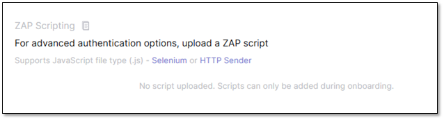
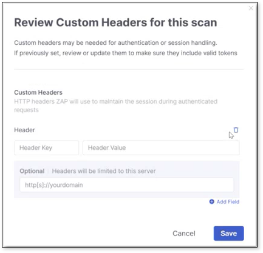
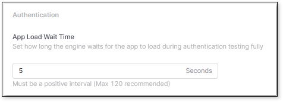
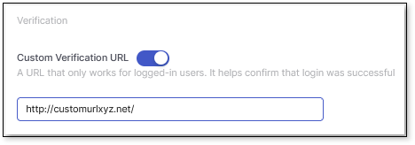

# Environment Settings

In the Settings panel, you have greater flexibility and control to set and edit settings that override the default parameters for authentication and scans, providing more customized results. Each tab in the panel includes the details and instructions for completing its fields. They have been documented below for reference.

Navigate to Workspace \> Environments in the left-hand sidebar to see your list of environments. To open an environment’s settings panel, click  at the end of the environment row, then Settings in the dropdown menu.

## Navigating the Settings Panel

At the top of the panel, you can search for environment settings in the search bar and copy your environment ID by clicking Copy ID. The settings panel is divided into two categories: General and Advanced Options. Remember to Save your changes when done.

The following details the tabs in Settings:

### General

- General & Config Files - The default view when opening the Settings panel. Details the Environment URL, Type, Discoverability, Groups Permissions, and Authentication. You can configure the environment name, assign groups to environments, and download the config file here.
- Organizational Associations - Associate projects, applications, and existing tags to your environment here. Associating projects is only applicable to API environments. When a project is associated with a DAST environment, the next time a scan is run, it will include results from both SAST and DAST. See [below](environment-settings.md#UUID-438f45cc-772b-67e8-7eb5-7c1b0ad987ef_id_SettingsDAST-AssociatingApplicationstoanEnvironment) for more on associating applications with an environment.

### Advanced Options

- System Commands - This is where you copy the command to run the CLI scan.

- Authentication (Web-only) - If your authentication fails during setup, you can configure the fields in this panel to resolve the issue. For example, changing the App-Load Wait Time, or changing the attribute for TOTP (Time-based One-Time Password, used for MFA), or changing the verification URL used in the testing (Poll POST Data), all are changes that can fix common authentication issues.

  
  For complex authentication flows, you may upload a Selenium script or HTTP Sender written in JavaScript. Selenium scripts run whenever ZAP (Checkmarx's underlying DAST scanning engine, based on OWASP ZAP) launches a browser via Selenium- for example, for crawling (Ajax Spider). These scripts have full access to the active browser instance and can interact with it directly. They can execute JavaScript, navigate to URLs, fill out forms, click buttons, and manipulate localStorage or sessionStorage. HTTP Sender scripts are executed for every request.

  
<figure></figure>

  You are able to add a Selenium or HTTP Sender authentication script to a selected environment during setup, or update it later in the settings. If one or more files are already saved for this environment, uploading a file through the CLI overrides all files that are currently stored there. If you want to upload only a single file and you do not have the other existing files, you must use the UI. The UI allows you to download the existing files or add an additional file without deleting the others
  

- Scan Configurations - Here you can select a predefined scan mode: Fast, Balanced, Thorough, or Deep to better fit your goals. Predefined scan modes are ideal for quick scanning without requiring an understanding of file configuration or ZAP. Use the following table to determine the scan rules run in each type of scan mode:

  | Scan Option | No Server | Include Server |
  | --- | --- | --- |
  | Fast: Quick scan with minimal coverage - best for CI/CD or early testing. | [Dev CICD](https://www.zaproxy.org/docs/desktop/addons/scan-policies/policy-dev-cicd/) | [QA CICD](https://www.zaproxy.org/docs/desktop/addons/scan-policies/policy-qa-cicd/) |
  | Balanced: Balanced depth and speed - suited for regular QA scans. | [Dev Standard](https://www.zaproxy.org/docs/desktop/addons/scan-policies/policy-dev-std/) | [QA Standard](https://www.zaproxy.org/docs/desktop/addons/scan-policies/policy-qa-std/) |
  | Deep: Extended scan for broader vulnerability detection before release. | [Dev Full](https://www.zaproxy.org/docs/desktop/addons/scan-policies/policy-dev-full/) | [QA Full](https://www.zaproxy.org/docs/desktop/addons/scan-policies/policy-qa-full/) |
  | Thorough: Maximum coverage and detailed testing - ideal for full audits. | [Dev Full](https://www.zaproxy.org/docs/desktop/addons/scan-policies/policy-dev-full/) | [QA Full](https://www.zaproxy.org/docs/desktop/addons/scan-policies/policy-qa-full/) |

  
  Deep and Thorough share the same crawl depth, duration limits, and attack policy. Thorough runs a longer Ajax crawl with a broader click strategy, and adds URL paths and HTTP headers as attack vectors. Choose Deep for a fast full scan, Thorough when you need maximum coverage and have more time.
  

  Additionally, consider including server-related checks in the scan and support for slower applications.

  Select your crawler: Ajax Spider (default) for most applications, or Client Spider (Beta) for modern JavaScript-based applications and Single Page Applications.

  
  Client Spider is optimized for modern JavaScript-based applications and Single Page Applications. It executes JavaScript in a browser environment, interacts with DOM elements (clicks, form submissions), and discovers dynamically rendered content. It's ideal for modern apps but Ajax Spider remains recommended for traditional server-rendered applications or if you need exclude-element functionality.
  

  Include or Exclude file paths in the scan by adding them in their respective fields. Add a custom header with your scans. HTTP headers are key-value pairs in requests and responses that carry metadata needed for authentication, content handling, caching, and security. They’re not part of the URL but accompany it to provide context and control. For API environments, ensure that the API attribute files are uploaded. After, you can add the Authentication token in the custom header, by inputting Authentication in the Header Key, and the Bearer \<token\> in the Header Value.

  
<figure></figure>

- CLI Settings - Here you can adjust the level of detail in scan logs (Info/Debugging), define the number of scan retry attempts in case of failure, the retry delay time between attempts, the JVM memory settings for the scan, and the output directory to save the scan results.

### Associating Applications with an Environment

Your applications can be associated with an environment and scanned with DAST. This enables a centralized view of your security, where you can see its results in the application overview and in risk management, allowing your security team to prioritize vulnerabilities effectively.


Scans run while the tenant's DAST display mode is set to By Path (a display setting that shows each vulnerability occurrence individually (per path)) will not appear in the application overview or in risk management. See [Alerts and Paths](dast-viewing-results-overview.md#UUID-30427aa1-570e-611b-29b4-f58a8ace7f5e_section-id235387000509417) for details.


To associate an application with your environment, perform the following on the Environments page:

1. Click the ellipsis at the end of the environment row, then select Settings.
2. Select Organizational Associations.
3. Click + Add Application.
4. Mark the checkbox for the application you want associated from the dropdown list, then click Select.
5. Click Set as Primary Environment, then Save when done.


Ensure you set the environment as the Primary Environment; otherwise, the application will not be scanned by DAST. You can associate multiple environments with a specific application, but only one environment can be set to Primary.


## Troubleshooting - Authentication

This section includes a few rare but possible authentication issues in DAST, along with their solutions.

- Authentication Timeout - If your authentication starts but fails due to a timeout, you see logs containing messages like Authentication Timeout, or the login page loads slowly (slow redirects, MFA, or a heavy login flow); this can all be due to the default authentication timeout not being sufficient for your login flow. We recommend setting a larger timeout to provide an extra buffer. Resolve this issue by performing the following:

  1. Click  at the end of the environment row and click Settings. This opens the Environment Settings panel.

  2. Select Authentication on the left-side panel.

  3. Under App Load Wait Time, increase the timeout value.

     
<figure></figure>

  4. Click Save when done. Try authenticating again.

- Incorrect Login Redirection - If after clicking Log In, you are redirected to another domain, authentication stops or becomes blocked, or logs/traces show navigation to URLs such as: **https://auth.company-login.com** or **https://sso.partner.net/callback**; your security configuration only allows authentication within a set of approved domains, or the redirect domain (SSO/custom domain) is not included in the whitelist. Resolve this by performing the following:

  
  This setting works alongside the Poll POST Data verification field mentioned in the [Authentication](environment-settings.md#UUID-438f45cc-772b-67e8-7eb5-7c1b0ad987ef_N1785929033649) tab - both help confirm a successful login.
  

  1. Click  at the end of the environment row and click Settings. This opens the Environment Settings panel.

  2. Select Authentication on the left-side panel.

  3. Under Verification, enable the Custom Verification URL.

     
<figure></figure>

  4. Input the custom redirect URL/domain used during the login.

  5. Click Save when done. Try authenticating again.
