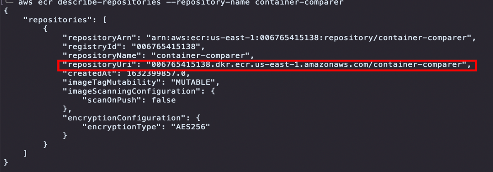
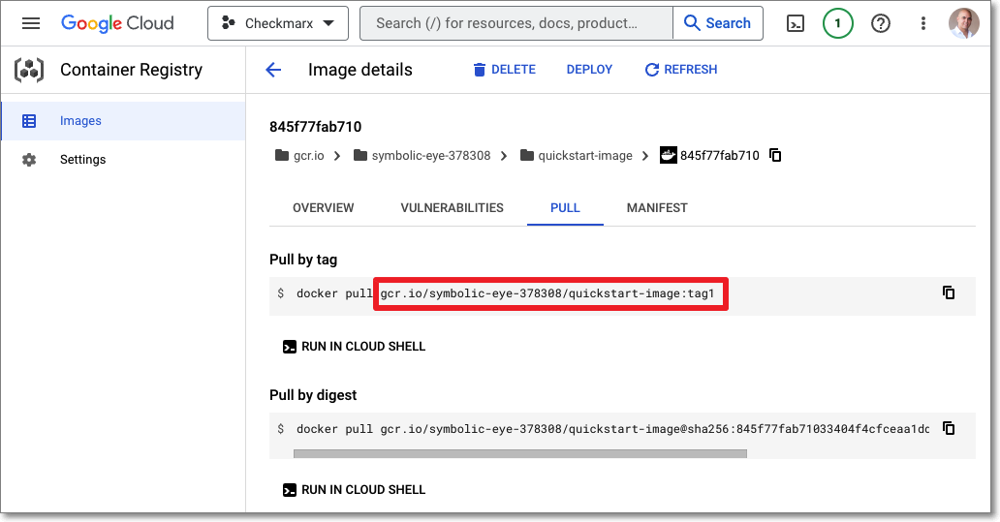

# Container Scans



In addition to scanning the packages in your source code itself, Checkmarx SCA also scans the Dockerfiles in your project to identify the container images used in your project. Checkmarx SCA extracts all layers of each public base image located in the Dockerfile, and identifies the packages used by each layer.

For scans run via the Checkmarx SCA web portal or Checkmarx plugins only public base images in the Dockerfile are scanned. For scans run via SCA Resolver, in addition to scanning the Dockerfile itself, you can also scan the image that is created from the Dockerfile, using the Syft open source tool. This enables greater visibility into all packages used in the image for all languages supported by SCA as well as many non-supported languages (e.g., Dart, Haskell, Swift etc.). In addition, you can use SCA Resolver to submit specific images from public or private registries for analysis by SCA using the Syft tool.





## Viewing Container Scan Results

The Scan Results \> Container tab shows the container packages identified in your project and the vulnerabilities associated with them. For a description of the info shown in the Container tab, see [Container Tab](https://app.gitbook.com/s/XSPACE_USER_GUIDE/viewing-results/viewing-the-project-page/project-page-tabs#UUID-cb7b834c-d2fc-5c05-7b96-6955938c4e1a).

<div align="left"><figure></figure></div>

## Running Container Scans Using Resolver

You can run a container scan on the Dockerfile in your project, on specific images in your repository, or on both.







### Authentication for Scanning Private Repos

In order to access private repos you need to be authenticated in your container repo when you run the scan via Checkmarx SCA Resolver.


In addition, even when using public repos in DockerHub there is an advantage to authenticating your user in order to avoid the limits that apply to anonymous requests to public repos.


<details>
<summary>Example - DockerHub Authentication</summary>

For DockerHub authentication make sure that your environment variables are set as:

- **DockerhubUsername** - your username
- **DockerhubToken** - your password or authorization token

</details>

### Build Arguments Configuration

Some projects may contain build arguments that are required for layer resolution.

Checkmarx SCA Resolver supports use of a `.env_cxsca-container-build-args` file, which can be added to repository code to provide custom build-arguments to Dockerfile `FROM` instructions. We recommend using this file when the docker is present and the build process requires arguments in order to enhance the docker layer resolution and improve results.

The format of this file is similar to an [.env file](https://smartmob-rfc.readthedocs.io/en/latest/2-dotenv.html), with each line containing a single argument with an = sign between the argument key and value.

Example:

An `.env_cxsca-container-build-args` file with the following argument for layer resolution:

```
LAYER=golang
TAG=bullseye
```

can be used in Dockerfile as follows: `FROM $LAYER:${TAG}`

#### Hierarchy

Since many different Dockerfiles can be used inside a project, Checkmarx SCA Resolver applies a folder hierarchy. The following priority (high to low) is given to the files:

1. Same directory `.env_cxsca-container-build-args`
2. Same directory `.env`
3. Parent directory `.env_cxsca-container-build-args`
4. Parent directory `.env`
5. Ancestor directory `.env_cxsca-container-build-args`
6. Ancestor directory `.env`
7. Default argument value on resolution Dockerfile



This section provides additional info about how to scan images from an AWS ECR registry.

### Authentication for AWS ECR

Before running scans via Resolver, make sure that your AWS IAM user is authenticated, and that the token is in the credentials file (AWS_SESSION \_TOKEN) as explained [here](https://awscli.amazonaws.com/v2/documentation/api/latest/reference/sts/get-session-token.html). And, if you are scanning images in a different region, then make sure that the region is correctly configured in the credentials file (REGION).

### Obtaining the Image Name and Tag for an AWS ECR Image

The value submitted for the `--images` parameter for GCR uses the following syntax {repository_uri}:{image_tag}.

The following procedure describes how to obtain these values via the CLI.

1. To obtain the repository uri, run the CLI command `aws ecr describe-repositories --repository-name {your_repo_name}`, and make a note of the value returned for `repositoryUri`.

   <div align="left"><figure></figure></div>

2. To obtain the image tags of the images in the repo, run the CLI command `aws ecr list-images --repository-name {your_repo_name}`, and make a note of the value returned for `ImageTag` for the desired image.

   <div align="left"><figure></figure></div>

3. Run the SCA Resolver command with the `--scan-containers` flag, and add the `--images` flag specifying the desired images using the syntax {repository_uri}:{image_tag}. For example:

   ```
   ./ScaResolver -s /Users/DemoUser/scan_ecr_image -n DemoImageScan -a Checkmarx -u jack -p 'demo123!' --scan-containers --images 006765415138.dkr.ecr.us-east-1.amazonaws.com/container-comparer:2021.10.18.1155-8aefe81 
   ```

### Configuring Environment Variables for AWS ECR

Resolver is configured to scan your AWS ECR repo assuming that the default values/paths are in use. If the “credentials” file is in the default AWS path, and you are using the “default” profile, then no action is needed. If you have changed these settings, then you need to configure the following environment variables.

- **AWS_PROFILE** (default value: “**default**”)


You can configure multiple profiles, e.g., for different environments.


- **AWS_CONFIG_FILE** (default path: “**~/.aws/config**”)
- **AWS_SHARED_CREDENTIALS_FILE** (default path: “**~/.aws/credentials**”)

See [AWS SDKs and Tools](https://docs.aws.amazon.com/sdkref/latest/guide/overview.html)

Example of Credentials File

File ““~/.aws/credentials”

```
[default]
aws_access_key_id=ASI
aws_secret_access_key=abcd
region=us-west -1
aws_session_token=Absd
[prod]
aws_access_key_id=AKI
aws_secret_access_key=xyz
region=us-west -1
```


This section provides additional info about how to scan images from a GCR registry.

### Authentication for GCR

Before running scans via Resolver, make sure that you are authenticated in GCR. You can test this by running the `docker pull` command for the desired image. Learn about possible authentication methods [here](https://cloud.google.com/container-registry/docs/advanced-authentication).

The recommended authentication is using [gcloud](https://cloud.google.com/container-registry/docs/advanced-authentication#gcloud-helper).

To authenticate using gcloud:

1. Log in to gcloud as the user that will run Docker commands and run the command `gcloud auth login`.

2. Configure Docker using the following command `gcloud auth configure-docker`.

   Your credentials are saved in your user home directory.

   - Linux: $HOME/.docker/config.json
   - Windows: %USERPROFILE%/.docker/config.json

### Obtaining the Image Name and Tag for a GCR Image

The value submitted for the `--images` parameter for GCR uses the following syntax gcr.io/{project_id}/{image_name}:{image_tag}.

1. Obtain the value needed to identify this image. The following is on possible method for obtaining this info:

   - Open ECR in the Google Cloud portal and navigate to the image and tag of the desired image. Then, in the PULL tab, copy the value given in the Pull by tag snippet (without the "docker pull" command).

     <div align="left"><figure></figure></div>

2. Run the SCA Resolver command with the `--scan-containers` flag, and add the `--images` flag specifying the desired images using the syntax gcr.io/{project_id}/{image_name}:{image_tag}. For example:

   ```
   ./ScaResolver -s /Users/DemoUser/scan_gcr_image -n DemoImageScan -a Checkmarx -u jack -p 'demo123!' --scan-containers --images gcr.io/symbolic-eye-1234/quickstart-image:tag1
   ```


This section provides additional info about how to scan images from a GAR registry.

### Authentication for GAR

Before running scans via Resolver, make sure that you are authenticated in GAR. ou can test this by running the `docker pull` command for the desired image. Learn about possible authentication methods [here](https://cloud.google.com/artifact-registry/docs/docker/authentication).

The recommended authentication is using [gcloud](https://cloud.google.com/artifact-registry/docs/docker/store-docker-container-images#auth).

To authenticate using gcloud:

- If it is the first time that you are pulling images, run the following command on your machine `gcloud auth configure-docker us-docker.pkg.dev`

  
  This command assumes that you are using the US region of GAR. If you are using a different region, then replace "us" with the name of your region.
  

### Obtaining the Image Name and Tag for a GAR Image

The value submitted for the `--images` parameter for GAR uses the following syntax {gar_region}-docker.pkg.dev/{project_id}/{image_name}:{image_tag}.

1. Obtain the values needed to identify this image.

2. Run the SCA Resolver command with the `--scan-containers` flag, and add the `--images` flag specifying the desired images using the syntax gcr.io/{project_id}/{image_name}:{image_tag}. For example:

   ```
   ./ScaResolver -s /Users/DemoUser/scan_gar_image -n DemoImageScan -a Checkmarx -u jack -p 'demo123!' --scan-containers --images us-docker.pkg.dev/symbolic-eye-1234/quickstart-image:tag1
   ```


