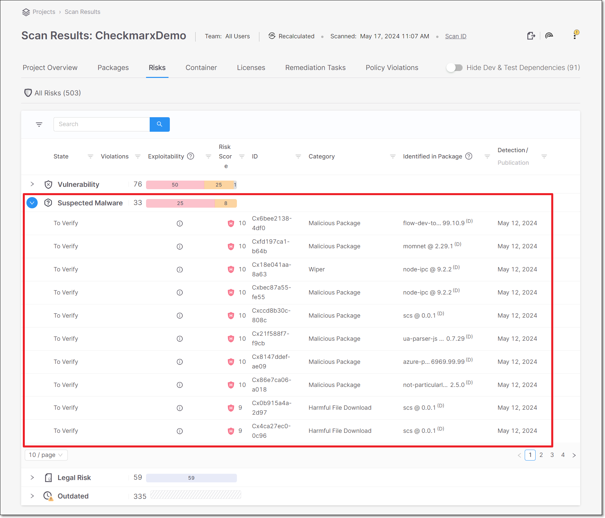
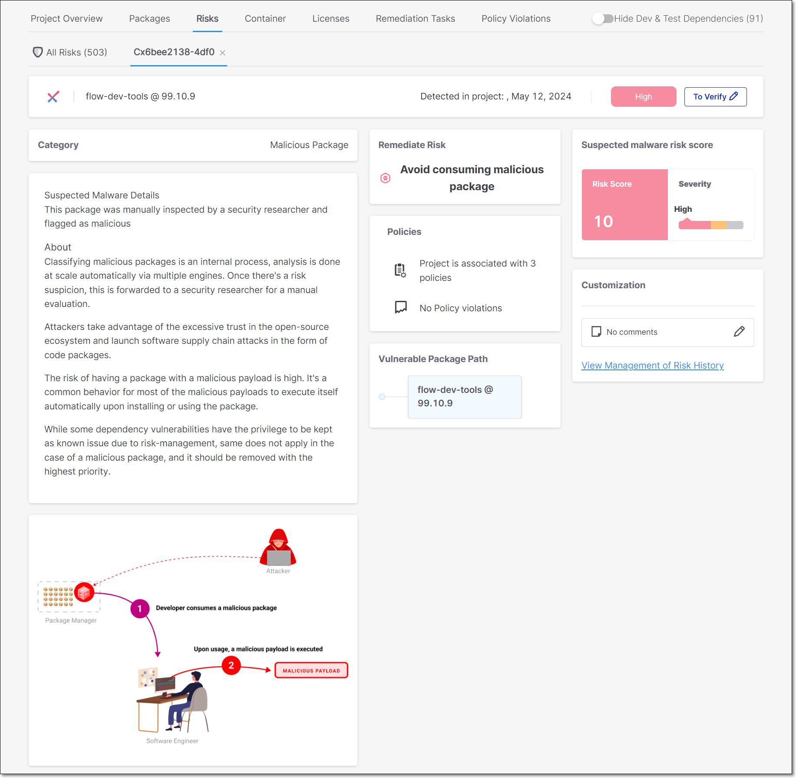
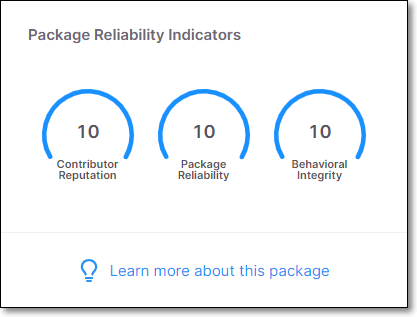
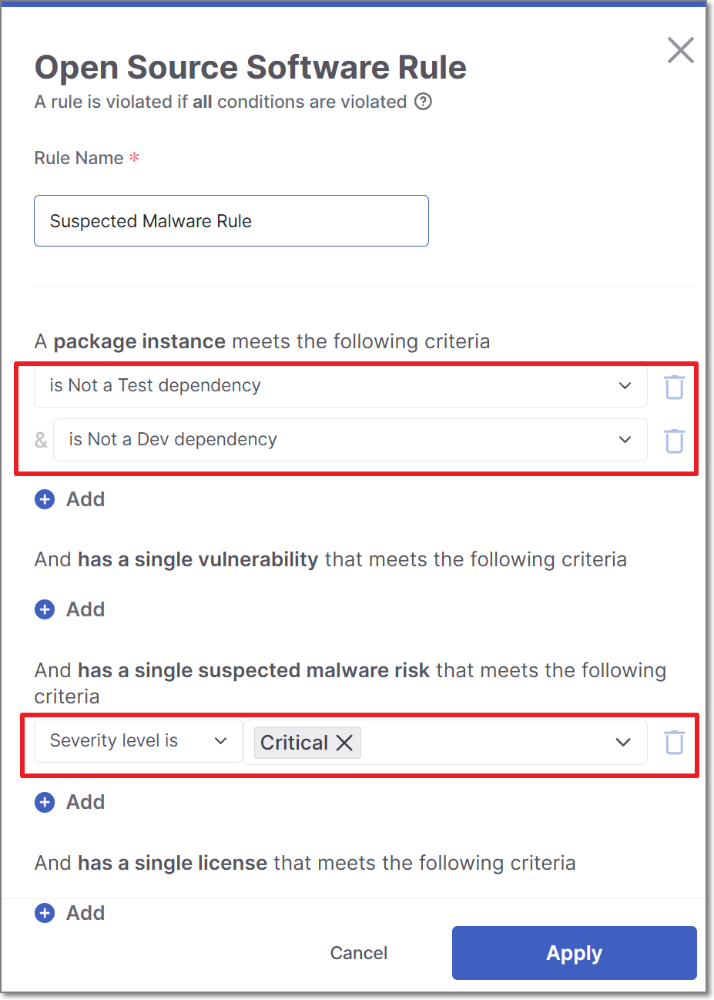

# Preventing Malicious Software Attacks

Malicious Software (Malware) attacks are perpetrated by causing developers to download packages that initiate harmful activities on the developer's PC. This can provide hackers with access to sensitive information and introduce severe risks down-the-line in the development process.

Checkmarx is at the forefront of efforts to provide protection from malware attacks.

## How We Detect Malware Risks

The Checkmarx SCA scanner identifies packages with a wide range of known or suspected malware risks, and lists those risks in the scan results. Checkmarx SCA identifies suspected malware vulnerabilities of the following types:

- Reputation - There is reason to suspect the credibility of the owner or contributors of the package, e.g., a newly created user is registered as the package owner.
- Reliability - There are irregularities in the naming or maintenance patterns of the package, e.g., Typeosquatting, or Chainjacking.
- Behavior - The behaviors of the package are unsafe. The package may be malicious by design or it may inadvertently introduce risks into your project. This category includes packages that exfiltrate info about OSs, user credentials etc.

The following table shows some examples of suspected malware risks of each type that are identified by Checkmarx SCA.

<table>
<thead>
<tr><th>
<strong><strong>Title</strong></strong>
</th><th>
<strong><strong>Description</strong></strong>
</th></tr>
</thead>
<tbody>
<tr><td colspan="2">
Reputation
</td></tr>
<tr><td>
New User
</td><td>
The owner of this package is a newly created user.
</td></tr>
<tr><td>
Protestware
</td><td>
Software that includes functionality which aims to protest or raise an issue - <a href="https://checkmarx.com/blog/new-protestware-found-lurking-in-highly-popular-npm-package/">learn more</a>
</td></tr>
<tr><td>
Repojacking
</td><td>
Taking over the repository of a legitimate package - <a href="https://www.linkedin.com/posts/tzachi-zornstain_supplychainsecurity-github-repojacking-activity-6966415993157922816-ZgDK?utm_source=share&amp;utm_medium=member_desktop">learn more</a>
</td></tr>
<tr><td>
Account takeover
</td><td>
The compromise of a good maintainers account by an attacker which is then used to spread malicious packages - <a href="https://www.linkedin.com/posts/tzachi-zornstain_supplychain-threatintelligence-opensourcesecurity-activity-6971041430546853888-1t7b?utm_source=share&amp;utm_medium=member_desktop">learn more</a>
</td></tr>
<tr><td colspan="2">
Reliability
</td></tr>
<tr><td>
Typosquatting
</td><td>
This package mimics the name of a popular package, inducing users to inadvertently call this package. <a href="https://medium.com/checkmarx-security/typosquatting-attack-on-requests-one-of-the-most-popular-python-packages-3b0a329a892d">learn more</a>
</td></tr>
<tr><td>
StarJacking
</td><td>
There is a weak link between the package metadata and the referenced Git repository. <a href="https://checkmarx.com/blog/starjacking-making-your-new-open-source-package-popular-in-a-snap/">learn more</a>
</td></tr>
<tr><td>
<a href="chainjacking-risks.md">ChainJacking</a>
</td><td>
This package is stored in a renamed GitHub repository, making it vulnerable to an attacker taking control of the repo and serving malicious code through the package.
</td></tr>
<tr><td colspan="2">
Behavior
</td></tr>
<tr><td>
Harmful File Download
</td><td>
This package downloads a harmful file.
</td></tr>
<tr><td>
<a href="malicious-packages.md">Malicious Package</a>
</td><td>
This package was manually inspected by a security researcher and flagged as being malicious by design.
</td></tr>
<tr><td>
Data Exfiltration
</td><td>
This package exfiltrates sensitive information such as stored credentials or computer and operating system details.
</td></tr>
<tr><td>
Network Anomaly
</td><td>
This package initiates one of the following anomalous network behaviors:
<ul><li>
This package sends information via DNS Tunneling, which exploits the highly trusted DNS protocol to tunnel malware and other data through a client-server model.
</li><li>
This package communicates with a service (domain address) commonly used by attackers.
</li></ul></td></tr>
<tr><td>
Crypto Miner
</td><td>
This package executes crypto mining software.
</td></tr>
</tbody>
</table>

## Viewing Suspected Malware Risks in the Checkmarx SCA Web Portal

Suspected malware risks are shown as a separate group in the Scan Results \> Risks tab.

<figure></figure>

Click on the row of a suspected malware risk to open a details page showing detailed info about that risk. On the details page, you can also manage the risk state and add comments.

<figure></figure>

In addition, when you click on a package with a suspected malware risk on the Scan Results \> Packages tab, the details page that opens shows gauge widgets representing three risk categories (Reputation, Reliability and Behavior). The scores are given on a scale of 0-10, with 10 indicating the highest level of security.

<figure></figure>

## Creating Suspected Malware Policies

Checkmarx SCA Policy Management enables you to apply customized security rules to the open source packages in your Projects. This makes it easy to identify Projects that are non-compliant with your self-defined security policies.


Learn more about [Policy Management](https://app.gitbook.com/s/XSPACE_USER_GUIDE/policy-management).


Checkmarx SCA offers a specialized set of Policy conditions for suspected malware risks. When defining a policy, you can configure conditions based on two independent attributes of a suspected malware finding: its severity level (for example, Low, Medium, High, or Critical) and its risk type (which represents the category of the suspected malware, for example, Malicious Package).

For example:

- Setting **Severity level = High** means the policy will be triggered for any suspected malware risk with a High severity score, regardless of its risk type (category).
- Setting **Risk type = Malicious Package** means the policy will be triggered for any finding classified as a malicious package, regardless of its severity level.
- Setting both conditions together will further narrow the trigger so that only findings that match both the selected severity and risk type are included.

Suspected Malware conditions can also be combined with other condition sets, such as package conditions, to further refine the scope of the policy and control when it is triggered.

In the following example, the policy is configured to trigger only when a Critical severity suspected malware risk is identified in a package that is not classified as a Dev or Test dependency

<figure></figure>

