# Checkmarx SCA - Quick Start Tutorial

The simplest way to run scans and view results in Checkmarx SCA is via our web portal. This Quick Start tutorial shows you how to get started using the Checkmarx SCA web portal and describes the platform’s main features.


Checkmarx SCA users are assigned specific roles which determine what permissions they have in the system. Some features described in this article may not be available to you if you do not have the relevant permissions.




## Logging in to your Account

### Step 1. Log in to the Web Portal

In order to log in to your account, you need to have your **Account** name, **Username**, and **Password.** If you have not yet received this info, contact your organization’s Checkmarx administrator.


If you are your organization’s primary admin user, you should have received a “Welcome to Checkmarx SCA” email from Checkmarx. In that case you need to complete the registration process before logging in. See [Completing Your Account Registration](README.md#UUID-ead5ea0c-b805-c61a-c3b3-37165a24ad7b).


1. Go to one of the following URLs:

   - For a US environment: [https://sca.checkmarx.net](https://sca.checkmarx.net)

   - For a EU environment: [https://eu.sca.checkmarx.net](https://eu.sca.checkmarx.net)

     
<figure>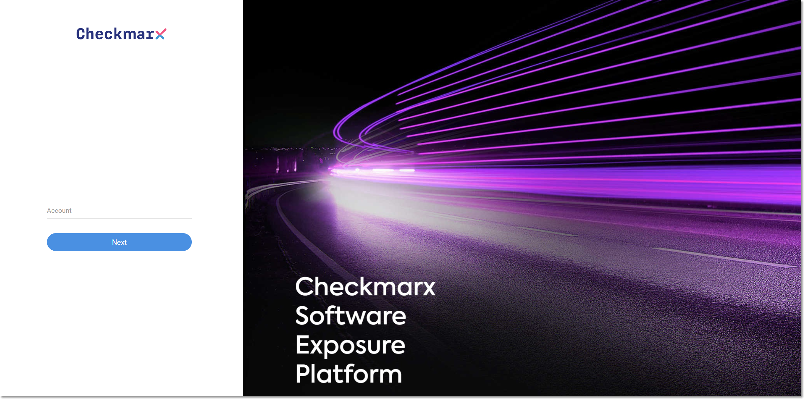</figure>

2. In the Account field, enter your account name and click Next.

   The login screen opens.

   
<figure>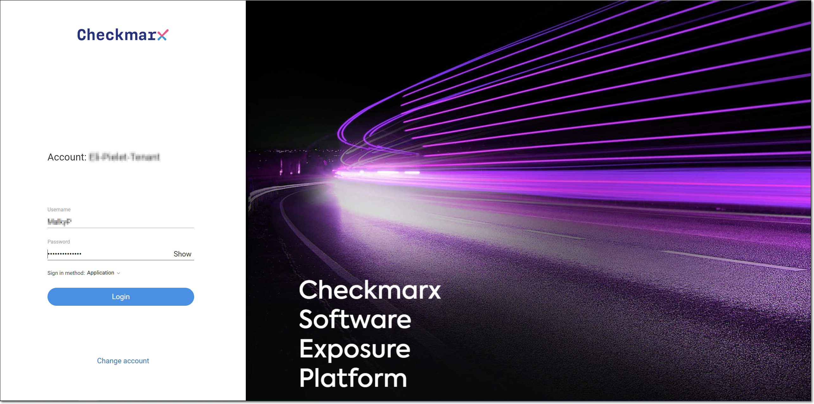</figure>

3. Enter your Username and Password, and click Login.

   The Checkmarx SCA web portal opens, showing the Dashboard (HOME) screen.

   
<figure>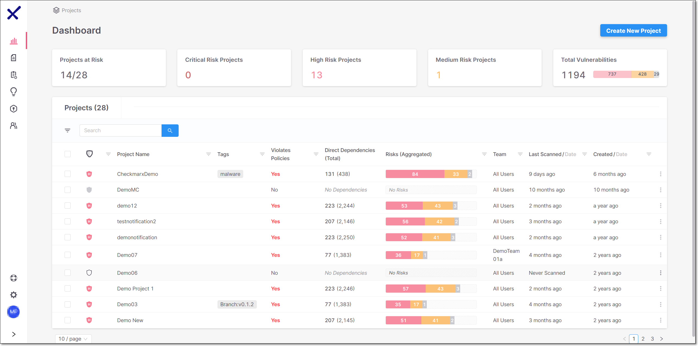</figure>

### Completing Your Account Registration

When a new account is registered with Checkmarx, a welcome email is sent to the primary admin user. This email contains a link that enables the admin to complete the registration process and activate the account. If you received the welcome email, use the following procedure to activate your account.

To activate your account:

1. Open the “Welcome to Checkmarx SCA” email from Checkmarx.

2. Click on the Complete Registration button in your email.

   
<figure>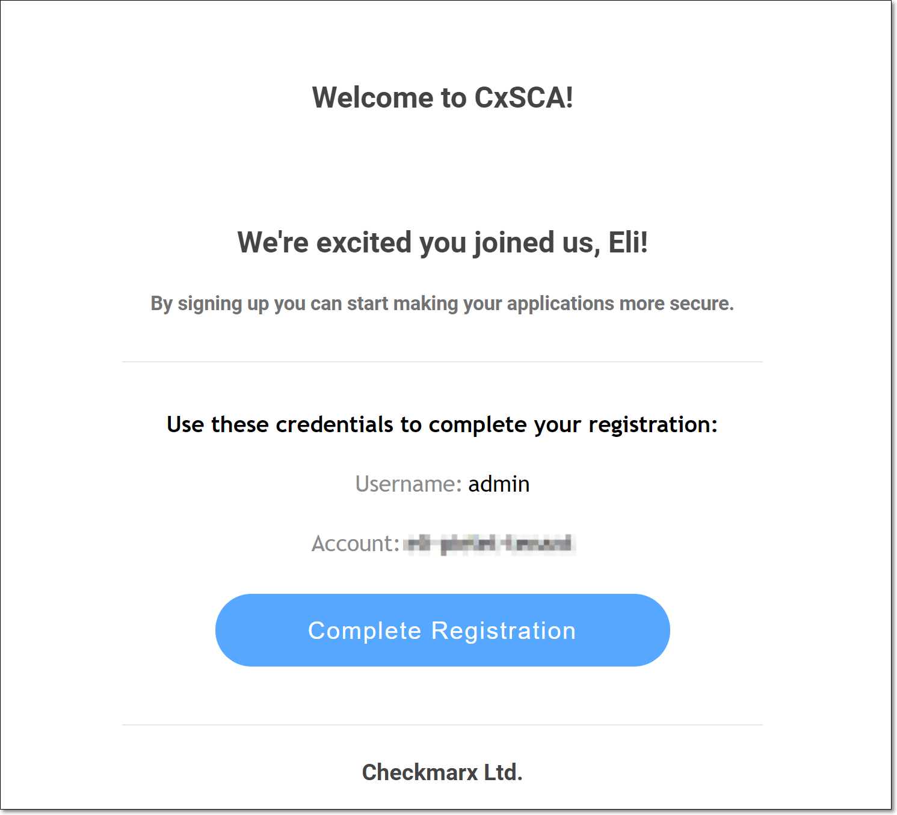</figure>

   A new tab opens in your browser, taking you to the Complete Registration page.

   
<figure>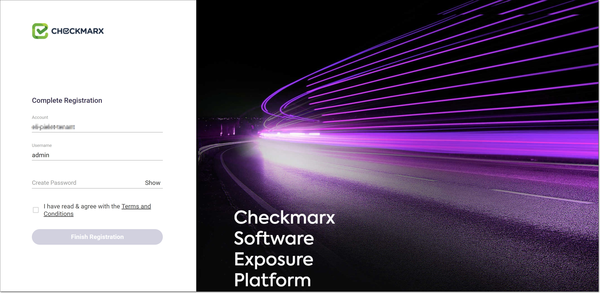</figure>

3. Your Account name and Username are automatically filled in.

   
   Make a note of this info, as you will need it for subsequent logins.
   

4. In the Create Password field, enter a password.

   
   Password Requirements:

   - Minimum 8 characters
   - At least one uppercase letter
   - At least one symbol
   - At least one number digit
   

5. After reviewing the terms and conditions, select the Terms and Conditions checkbox, and click Finish Registration.

   The Checkmarx SCA web portal opens, showing the Dashboard (HOME) screen for your account.

   
<figure>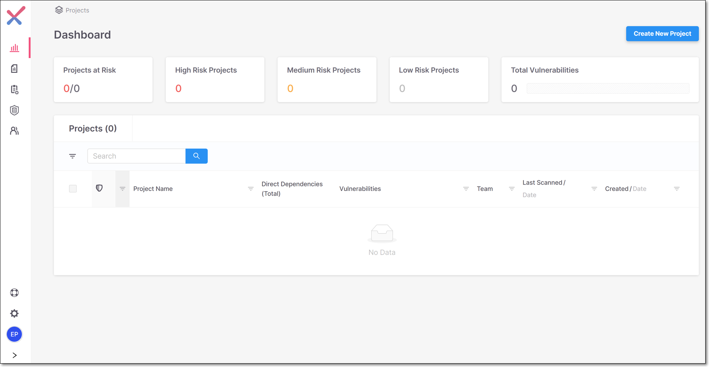</figure>


For subsequent logins, enter the appropriate URL in your browser:

- For a US environment: [https://sca.checkmarx.net](https://sca.checkmarx.net/)
- For a EU environment: [https://eu.sca.checkmarx.net](https://eu.sca.checkmarx.net/)

Then, enter your account name, username and password to access the system.


## Creating a Project and Running the Scan

In order to run a scan in Checkmarx SCA, you need to create a Project. Each time that you rescan the source code, you do so within the same Project, enabling you to track vulnerabilities throughout your SDLC. There are two types of Projects in SCA:

- General - upload the source code as a ZIP file, or enter a URL to a public repository.
- GitHub - integrate your Project with a private GitHub repository.


For this tutorial we will create a General Project. To learn how to create a GitHub Project, see [Creating a GitHub Project](https://app.gitbook.com/s/XSPACE_USER_GUIDE/creating-and-configuring-projects/creating-a-project---project-types/creating-a-github-project).


To create a General Project and run the scan:

1. On the Dashboard, click on the Create New Project button.

   The Create New Project window opens, showing the General Project tab.

   
<figure>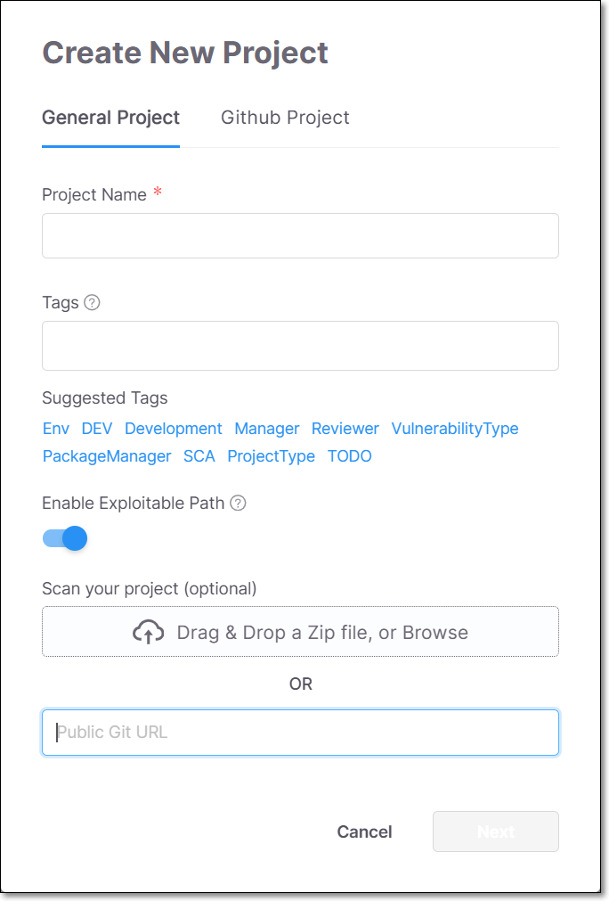</figure>

2. In the Project Name field, enter a name for the Project.

3. In the Tags field, specify tags for your project. You can select from the suggested tags by clicking on the desired tag. Multiple tags can be added to the Project.

4. You can enable the Exploitable Path feature, which analyzes whether your source code provides a path that can be exploited by a specific vulnerability. To activate this feature toggle the Enable Exploitable Path switch to the right. For more information see [Exploitable Path](https://app.gitbook.com/s/XSPACE_USER_GUIDE/exploitable-path).

5. Add your source code using one of the following methods:

   - Drag the ZIP file containing your source code into the box (or click on the box and navigate to the desired file).
   - Enter the Public Git URL of the source code.

6. Click Next.

   The Assign Teams options are shown.

   
<figure>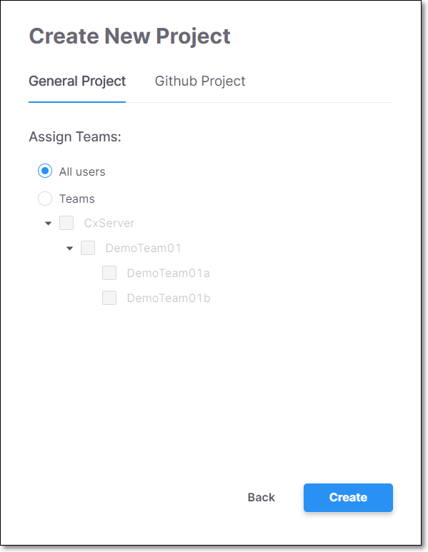</figure>

7. Verify that All users is selected (default).

   
   Once you have set up teams, you will be able to specify which teams the Project is assigned to.
   

8. Click Create.

   While your Project is being set up, you may see a **Please Wait** window. Do not navigate away from this screen until the scan is initialized.


After creating a Project, there are additional settings that can be configured, these settings can be accessed by clicking on the context menu for the Project and selecting Project Settings, see [Editing Project Settings](https://app.gitbook.com/s/XSPACE_USER_GUIDE/creating-and-configuring-projects/editing-project-settings).


## Viewing Scan Results

The top section of the Dashboard shows aggregated results for all of your organization’s Projects. The **Projects** pane shows results for each individual Project. Each record shows general Project info and overall results for the most recent scan of that Project.



You can drill-down to view detailed results for a specific Project by clicking on the row of the desired Project.

The **Project** page (Overview tab) opens showing widgets representing the packages and vulnerabilities discovered in the Project. The bottom pane shows the **Top Vulnerable Packages**.

<figure>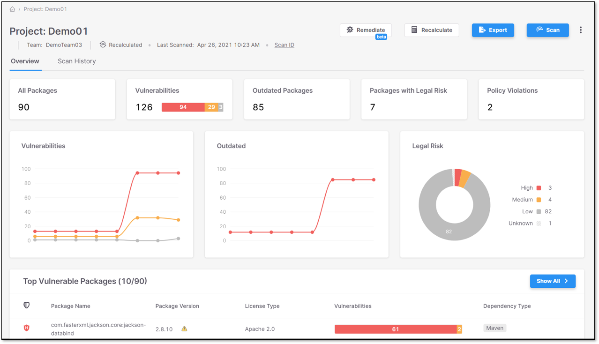</figure>

### Packages Drill-Down

Click on the row of a specific package to open the **Project -** **Scan Results** screen (Package tab), showing detailed information about the specific risks that apply to that package. This screen shows detailed info about various types of risks that apply to open source dependencies, including: vulnerabilities, legal risks, and outdated versions.

<figure>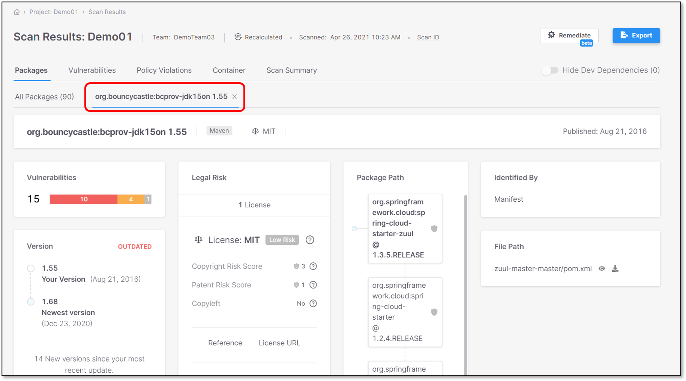</figure>

### Vulnerabilities Drill-Down

Click on the Vulnerabilities tab to show a list of all vulnerabilities discovered in the Project. The vulnerabilities are listed by CVE and info is shown about the packages to which they apply. Click on the row of a specific vulnerability to drill-down to see detailed info about that vulnerability.

<figure>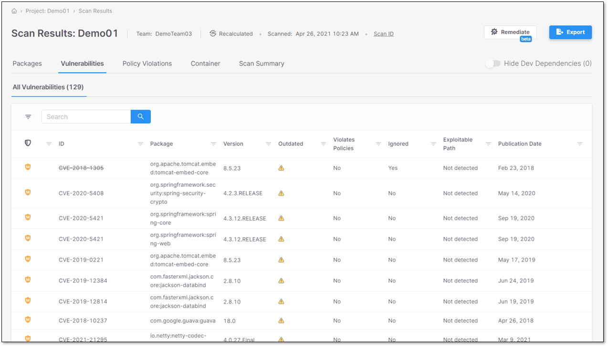</figure>

A new tab opens, showing detailed information about the vulnerability. This screen includes a description of the vulnerability, links to external resources, the CVSS score (with a breakdown of its components), and remediation recommendations. There is also a control for changing the risk state of this vulnerability in subsequent scans of this Project.

<figure>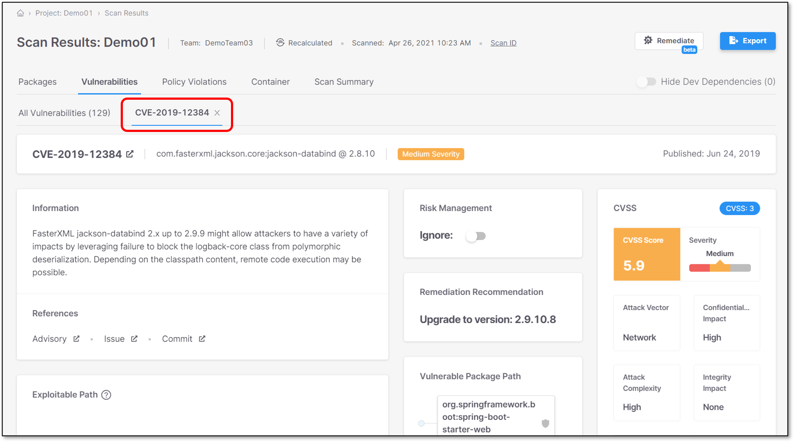</figure>


To learn more about viewing SCA results, see [Viewing Scan Results](https://app.gitbook.com/s/XSPACE_USER_GUIDE/viewing-results).

