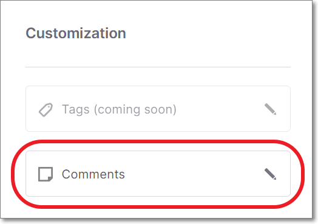
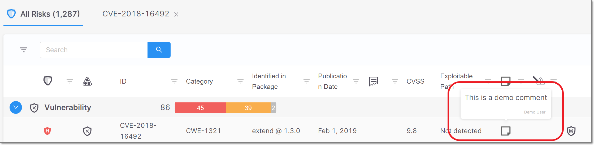

# Adding Comments to Risks

## Adding Comments to Risks

You can now add comments to Risks (vulnerability, suspected malware or legal risk). This can be useful for planning remediation steps, assigning responsibility, and explaining decisions to modify the risk state. Comments are applied on the Project level, so that if a risk is identified on a subsequent scan of that Project, the comment is shown.

Comments can be added by opening the Scan Results \> Risk Details page and clicking on the Comments button.

<figure></figure>

The Add Comment form is shown on the side of the screen, with fields for entering the comment and the name of the contributor (by default the name of the current user).

<figure></figure>

Comments are shown on the details page for that vulnerability. In addition, an icon is shown in the row of that vulnerability on the All Risks page. When you hover over the icon, the comment is shown.

<figure></figure>

Whenever you change the Risk State, the Add Comments form opens automatically, enabling you to add a comment explaining your action.
