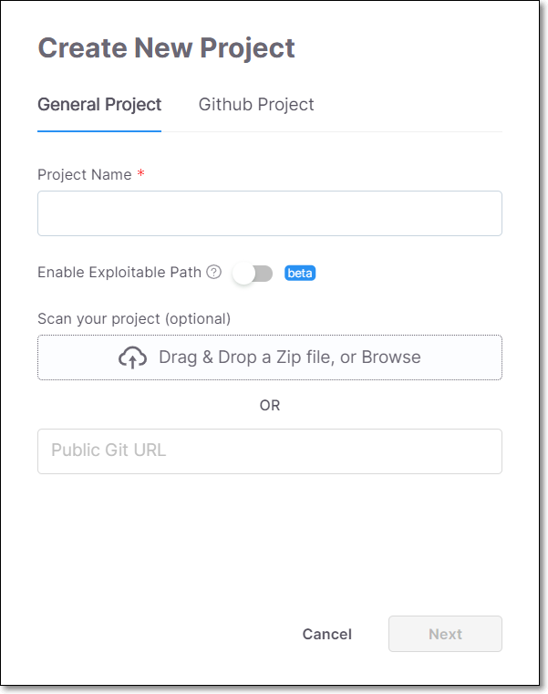
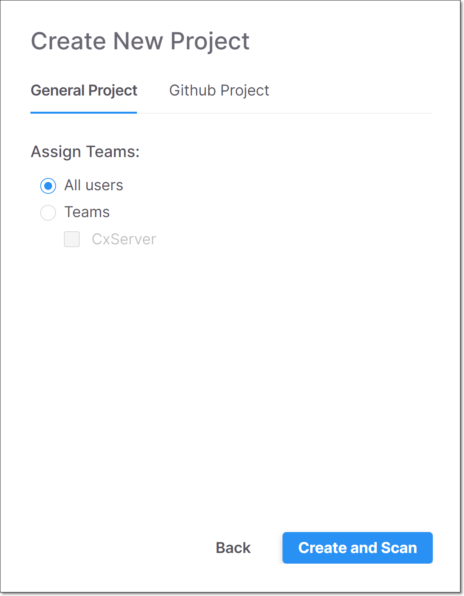

# Creating a General Project


You have the option of scanning your Project at the same time that you create it or scanning it later.


If the source code for your Project is on your local machine or in a public GitHub repository, you should configure it as a **General Project**.

To create a General Project:

1. On the Dashboard, click the Create New Project button on the top right of the page.

   The Create New Project window opens, showing the General Project tab.

   
<figure></figure>

2. In the Project Name field, enter a name for the Project.

3. You can enable the Exploitable Path feature, which analyzes whether your source code provides a path that can be exploited by a specific vulnerability. To activate this feature toggle the Enable Exploitable Path switch to the right. For more information see [Exploitable Path](exploitable-path.md).

4. Under Scan Your Project, if you would like to scan the source code as you create the Project, add your source code using one of the following methods:

   - Drag the ZIP file containing your source code into the box (or click on the box and navigate to the desired file).

   - Enter the Public Git URL of the source code

     
     Alternatively, you can create the Project without specifying the source code and then you can run the scan at a later time.
     

5. Click Next.

   The Assign Teams options are shown.

   
<figure></figure>

6. Under Assign Teams, do one of the following:

   - Select All users if you would like to allow all users to have access to this Project.

   - Select Teams if you would only like specific Teams to have access to this Project. Then select one or more Teams or sub-Teams.

     
     You can select a sub-Team without selecting its parent Team. Members of the parent Team can view Projects assigned to the child Team but not the reverse.
     

7. Click Create and Scan or, if you skipped **step 4**, click Create.

   Your new Project appears at the top of the Projects section on the Dashboard, and a scanning icon (if you performed step 4) or “Never Scanned” (if you skipped step 4) appears in the Last Scanned column.


As the Project is scanned, the Last Scanned column on the Projects tab will show **Scanning…** When the status shows a relative time (e.g., a few seconds ago), the scan is completed and you can view the results.



After creating a Project, there are additional settings that can be configured, these settings can be accessed by clicking on the context menu for the Project and selecting Project Settings, see [Editing Project Settings - Activating Notifications](editing-project-settings.md).

