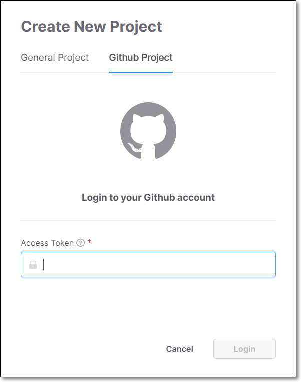

# Creating a GitHub Project

If your source code is hosted on a private GitHub repository, then you should create a GitHub Project, as described below. If it is on a public GitHub repository then you can create a [General Project](creating-a-general-project.md).


Prerequisites:

Before creating a GitHub project, you need to create an Access Token to enable the engine to scan the source code. For details about how to create an Access Token, see [Creating an Access Token for GitHub Projects.](creating-an-access-token-for-github-projects.md)


To create a private GitHub Project:

1. On the Dashboard, click the Create New Project button.

   The Create New Project window opens.

2. Select the GitHub Project tab.

   
<figure></figure>

3. In the Access Token field, enter your personal access token.

4. Click Login.

   A list of your projects stored in GitHub is displayed.

5. Select a project from the displayed list of projects.

6. You can enable the Exploitable Path feature, which analyzes whether your source code provides a path that can be exploited by a specific vulnerability. To activate this feature toggle the Enable Exploitable Path switch to the right. For more information see [Exploitable Path](exploitable-path.md).

7. Click Next. The Assign Teams option is displayed in the dialog.

8. Under Assign Teams, do one of the following:

   - Select All users if you would like to allow all users to have access to this Project.

   - Select Teams if you would only like specific teams to have access to this Project.

     - If you selected Teams, select the checkbox next to each Team and sub-Team that you would like to allow to access this Project.

       
       You can select a sub-Team without selecting its parent Team. Members of the parent Team can view Projects assigned to the child Team but not the reverse.
       

9. Click Create and Scan.

   Your new Project is created with a name identical to the name of the selected repository and appears at the top of the Projects section on the Dashboard.


As the Project is scanned, the Last Scanned column on the Projects tab will show **Scanning…** When the status shows a relative time (e.g., a few seconds ago), the scan is completed and you can view the results.



After creating a Project, there are additional settings that can be configured, these settings can be accessed by clicking on the context menu for the Project and selecting Project Settings, see [Editing Project Settings - Activating Notifications](editing-project-settings.md).

