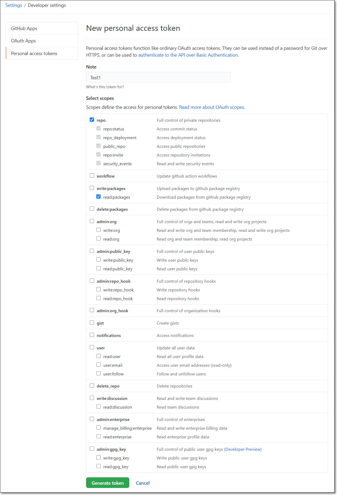

# Creating an Access Token for GitHub Projects

You can create an access token in GitHub to enable your Checkmarx SCA GitHub Projects to run scans on the source code in your private GitHub repository. This is a prerequisite for creating a Checkmarx SCA GitHub Project, as described in [Creating a GitHub Project](creating-a-github-project.md). An access token can be used for multiple SCA Projects.

**To create an access token in GitHub:**

1. In your GitHub account, go to **Settings**.
2. Click on **Developer Settings**.
3. Select the **Personal access tokens** tab and click **Generate new token**.

   The **New personal access token** page opens.

   
<figure></figure>

4. In the **Note** field, enter a note explaining that the token will be used for running Checkmarx SCA scans.

   
   This note, which is associated with the permissions that you will select in the next step, remains in the list on the **Personal access tokens** page, even after the temporary generated token expires or is deleted. After the token has expired, you can quickly create a new access token for scanning, by selecting this note and clicking **Regenerate token**.)
   
5. Select the **repo** and **read:packages** permissions. These permissions allow Checkmarx SCA to access the repositories and packages in your project for scanning.
6. Click **Generate token**. Your new access token appears at the top of the list on the **Personal access tokens** page.
7. Copy the access token, so that you can paste it into the **Access Token** field in your GitHub Project configuration. The Procedure for creating a GitHub Project is described in [Creating a GitHub Project](creating-a-github-project.md).
