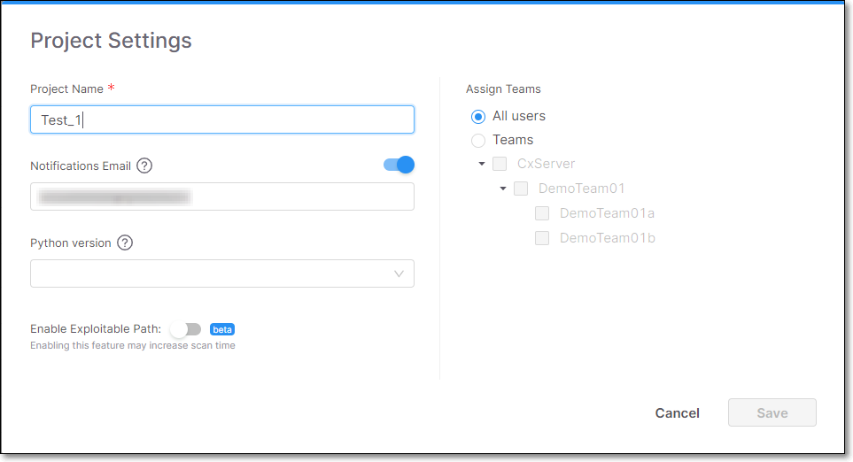

# Editing Project Settings

You can edit the settings of an existing Project. In addition to adjusting the settings that were configured when the Project was created, you can also configure Notifications and Python version, which are only available here.

- Notifications - When a project is created, by default Notifications is activated and it is configured to send notifications to the email of the user who created the project. By default, notifications are sent when new vulnerabilities that affect the packages in your project are identified by our AppSec research team, and also when a policy violation is detected. You can activate/deactivate Notifications and edit the email recipients on the Project Settings screen. Additional notification options are available on the Policies & Notifications screen, see [Notifications](notifications.md).

- Python - For Python projects, you can specify the Python version used, in order to optimize the Checkmarx SCA results.

To edit the Project settings:

1. On the Dashboard (Home page), in the Projects pane, click on the context menu for the desired Project.

   
   Alternatively, you can access the Project Settings by clicking on the context menu at the top of the Project page of the desired Project.
   

2. In the context menu, select Project Settings.

   The Project Settings dialog window is displayed.

   
<figure></figure>

3. Adjust the settings as desired.

4. If you would like to enable notifications, in the Notifications Email field set the toggle to On (right) and enter the email addresses of one or more recipients to whom you want the notifications to be sent.

5. For Python projects, In the Python version field, click on the field and select the desired version from the dropdown list. Options are **2**, **3** or **Not Specified** (default).

6. Click Save.

   The changes are saved.
