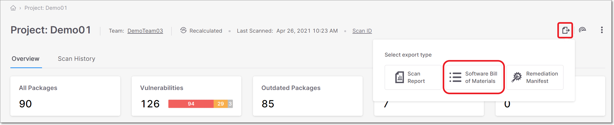
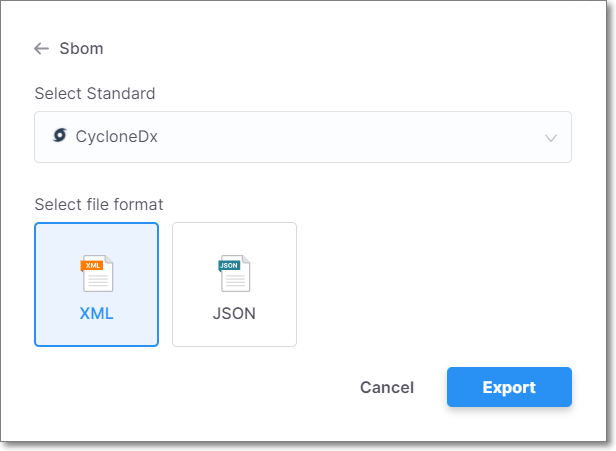

# SBOM Reports

What is an SBOM Report?

Software Bill of Materials (SBOM), in simple words, is a list of all ingredients (i.e., components) of a software product. Just like you would check the ingredients of a food product before eating it, so too you should know what’s in your software before using it.

> **“On May 12, 2021, the President issued** [**Executive Order 14028,**](https://www.federalregister.gov/executive-order/14028) **“Improving the Nation's Cybersecurity.” \[[1](https://www.federalregister.gov/documents/2021/06/02/2021-11592/software-bill-of-materials-elements-and-considerations#footnote-1-p29568)\] An initial step towards the Executive Order's goal of “enhancing software supply chain security” is transparency.**
>
> (Quote: [federalregister.gov](http://federalregister.gov))

Generating an SBOM report may sound like a relatively simple task, but in most cases it’s not. Modern software projects make use of a long list of 3rd party software packages, each of which often calls on many other dependencies. This can create a very extensive tree of dependencies being used by your software.

SBOM reports follow a standard format that includes detailed information about each involved component. At a minimum, for each component, it must give the component’s name, supplier name, version, hashes and other unique identifiers, dependency relationship, author of SBOM data and timestamp.

It also needs to cover every software modification and update in order to reflect the current status of the project. This is best accomplished using an automated process that is integrated into your CI/CD pipeline.

## Checkmarx SCA SBOM Reports

The first and most fundamental task in generating an SBOM is analyzing the software dependencies, which is a very natural task for a Software Composition Analysis platform such as Checkmarx SCA. But the ultimate purpose of SBOM is not just providing a list of materials, rather it is to identify potential risks. A standard SBOM doesn’t provide a simple way to detect risks associated with the 3rd party dependencies.

Checkmarx SCA leverages our existing infrastructure for identifying vulnerabilities as well as license and suspected malware risks to supplement the standard SBOM info. This creates an SBOM that provides real insight into the risks associated with your 3rd party components.

Our reports can be generated in [CycloneDX](https://cyclonedx.org/specification/overview/) and [SPDX](https://spdx.dev/about/) formats, with additional “property” fields showing supplemental risk data. The reports can be exported in XML or JSON format. You can generate SBOM reports for Checkmarx SCA Projects on which a scan has already run using the following methods:

- [Checkmarx SCA web portal (UI)](sbom-reports.md#UUID-722be9b2-a05a-a8f1-66fb-a867910ef0ff) - supports [CycloneDX v1.7](https://cyclonedx.org/docs/1.7/#SchemaProperties) and [SPDX v2.3](https://spdx.github.io/spdx-spec/v2.3/) formats.

- [Checkmarx One web portal (UI)](sbom-reports.md) - supports [CycloneDX v1.7](https://cyclonedx.org/docs/1.7/#SchemaProperties) and [SPDX v2.3](https://spdx.github.io/spdx-spec/v2.3/) formats.

- [Checkmarx One CLI](/document/preview/68645#UUID-a0bb20d5-5182-3fb4-3da0-0e263344ffe7_section-idm4534802519251233733631284888) - supports [CycloneDX v1.7](https://cyclonedx.org/docs/1.7/#SchemaProperties) and [SPDX v2.3](https://spdx.github.io/spdx-spec/v2.3/) formats.

- [SCA Resolver](https://app.gitbook.com/s/XSPACE_RESOLVER/running-scans-using-checkmarx-sca-resolver#UUID-af718204-6dfc-2b27-439e-419b9157d364_id_RunningScansUsingCheckmarxSCAResolver-Reports) - supports [CycloneDX v1.3](https://cyclonedx.org/docs/1.3/json/) format.

- [Reports API](https://app.gitbook.com/s/XSPACE_REST_API/checkmarx-sca--rest--apis---apis-that-will-be-deprecated/checkmarx-sca--rest--api---get-scan-reports-and-sboms) - supports [CycloneDX v1.3](https://cyclonedx.org/docs/1.3/json/) format.

- [Export Service API](https://app.gitbook.com/s/XSPACE_REST_API/checkmarx-sca--rest--api---export-service) - supports [CycloneDX v1.7](https://cyclonedx.org/docs/1.7/#SchemaProperties) and [SPDX v2.3](https://spdx.github.io/spdx-spec/v2.3/) formats.

  
  For best results generating reports that are compliant with SBOM formatting specifications, we recommend using the Export Service API as opposed to the Reports API.
  

## Generating SBOM Reports

You can generate an SBOM report via the web portal (UI). You can generate a report for the most recent successful scan of a Project from the Project page, as described below. It is also possible to generate a report from the Scan Results page (which makes it possible to generate reports for older scans).


Alternatively, when running a scan using Checkmarx SCA Resolver you can add a flag to generate a “CycloneDx” report for that scan.


To generate an SBOM report:

1. Navigate to the Projects screen for the desired Project.

2. Click on the Export button  in the header bar.

   The export type menu opens.

   
<figure></figure>

3. Click on Software Bill of Materials.

   The SBOM configuration dialog opens.

   
<figure></figure>

4. Select the desired SBOM standard. Options are: SPDX orCycloneDx.

5. Select the Hide Private Packages checkbox if you want to exclude private packages from the report.

6. Select the Exclude Dev and Test packages checkbox to exclude Dev and Test packages from the report.

   
   To learn more about Dev and Test dependencies, see [here](https://docs.checkmarx.com/en/34965-322318-sca-scanner.html#UUID-2865b187-60e6-84f0-67c8-c5313ef205fc_UUID-ce0b5676-9ab8-dee1-1004-5c32410eaa0a).
   

7. Select the Include only effective licenses checkbox if you want to exclude licenses that haven't been designated as effective from the report. By default, the checkbox is selected.

8. Select the output format. Options are: for CycloneDx, XML or JSON; for SPDX only JSON is supported.

9. Click Export.

   The SBOM report is downloaded and can be viewed on standard XML/JSON viewers.

## Viewing CycloneDx SBOM Reports

Checkmarx CycloneDx SCA SBOM Reports can be generated in XML or JSON format and can be viewed in standard XML and JSON viewers.

The report follows the [CycloneDX v1.7](https://cyclonedx.org/docs/1.7/#SchemaProperties) format, which includes standard SBOM fields such as: Id (Purl), Component name, Version, License and Hashes, all those will be included in every SBOM as a required fields list.

In addition, Checkmarx SCA adds a “properties” section with extended information for each library. This section contains key information about the risks associated with the library.

Sample XML:

<figure></figure>

### SBOM Component Dependencies

Each component contains its dependent components, and each dependency section contains a set of required fields and a properties section.

Sample Components Section (XML):

<figure></figure>

