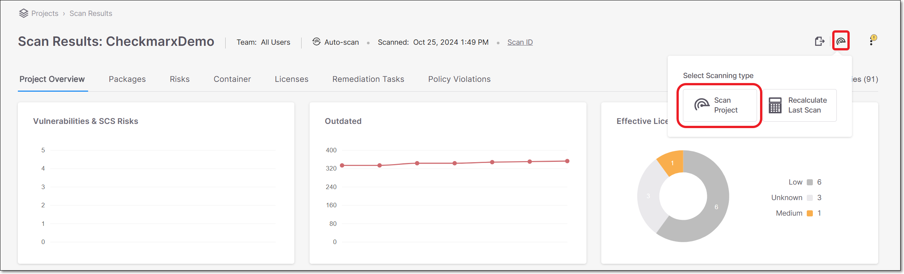
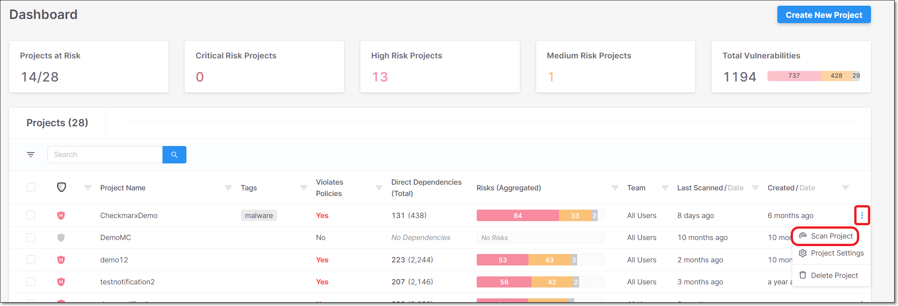
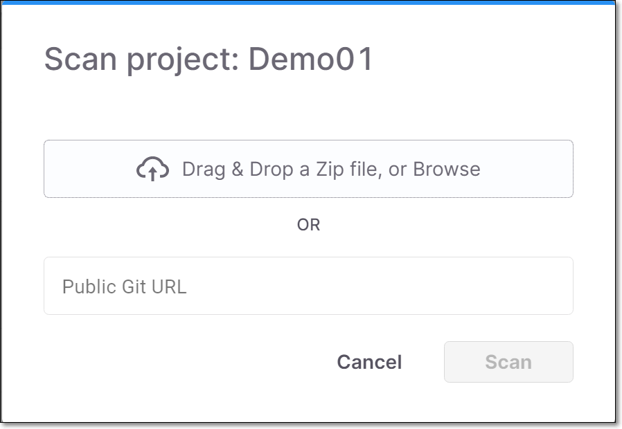

# Scanning a Project

## Preparing your Source Code for Scanning

If the source code uses a “lock” file, you must also include the package.json file in the project folder.

## Running a Scan Manually

You can manually run a scan of an existing Project through the web application, using one of the following methods:


If you haven’t yet set up a Project for the source code that you would like to scan, then first create the Project as described in [Creating a Project - Project Types](creating-a-project---project-types.md).


- On the Project page, hover over the Scan icon located on the top right corner of the page and click the Scan Project button.

  
<figure></figure>


If the Project has not yet been scanned, then the Scan now button is shown in the center of the screen. Otherwise, the procedure is identical whether this is the initial scan or a rescan of a Project that has already been scanned.


- On the Dashboard (Home page), in the Projects pane, click on in the row of the desired Project and select Scan Project.

  
<figure></figure>

- For a **General** project, the Scan project dialog opens. Enter the zip file or Git URL, since Checkmarx SCA does not save this information.

  
<figure></figure>

- For a **GitHub** project, the scan starts immediately, since Checkmarx SCA saves the access token and Git URL.


If the access token has been deleted from GitHub, you will get an error message when you try to re-scan the project.


## Scan Automation

You can set up integrations that will automatically trigger scans as part of your SDLC, e.g., scanning the project before each build. This can done using the Checkmarx CLI plugin or specialized plugins for various platforms (e.g., Jenkins, Azure DevOps etc.), see [Checkmarx SCA - Integrations and Plugins](https://app.gitbook.com/s/XSPACE_INTEGRATIONS/).
