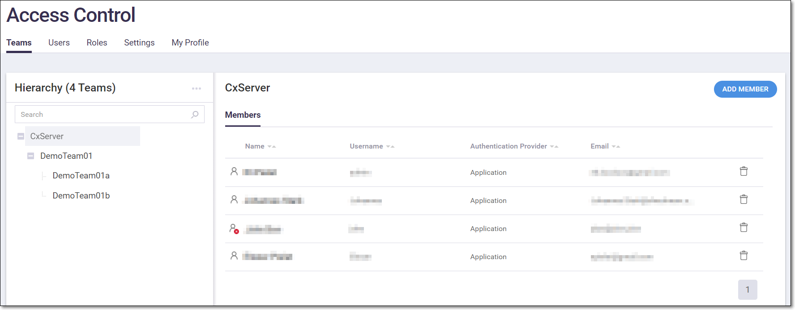
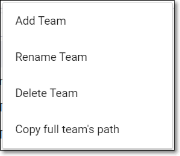
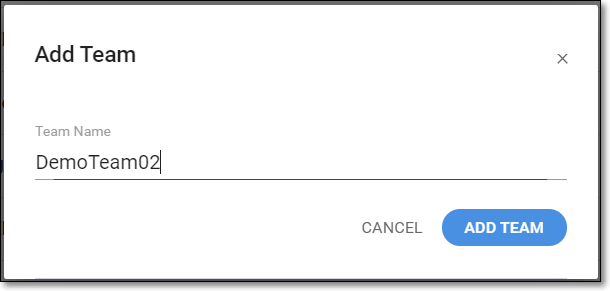
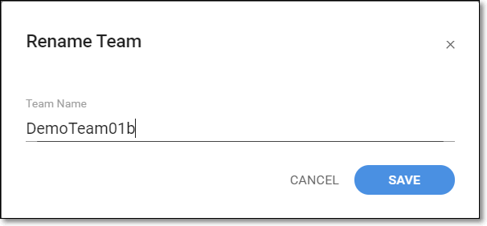
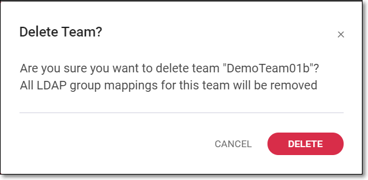
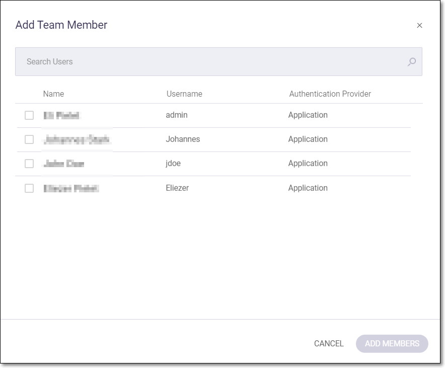

# Teams

Teams are used to control access to specific Projects. A Project can be assigned to a one or more specific Teams, so that only members of the designated Teams (or their parent Teams) can view data and take actions for that Project (alternatively, Projects can be left open to “All users”). Teams are structured as a hierarchy with members of the parent Teams able to access Projects assigned to the sub-Teams but not the reverse. The highest level Team is “CxServer”. There must always be at least one admin user assigned to this Team.

The **Access Control** \> **Teams** tab shows a hierarchy of Teams and sub-Teams in your organization. On this screen, admin users can edit Teams, create new Teams and assign users to Teams and sub-Teams.

The **Teams** tab shows a list of all teams within the Organization and their assigned members.

<figure></figure>

You can search for a Team by entering the search text in the *Search* box.

Select a Team to view a list of the members of the Team. You can sort the list of members by clicking on a column header.

The following table describes the info shown for each member on the Teams tab.

| **Parameter** | **Description** | **Possible values** |
| --- | --- | --- |
| Status | Indicates whether the member’s account is enabled or disabled. |  <ul><li>enabled</li></ul>  <ul><li>disabled</li></ul> |
| Name | The first and last name of the member. | e.g., John Doe |
| Username | The username of the member. This is the name used for login. | e.g., JohnDoe |
| Authentication Provider | The method used for assigning login credentials. | <ul><li><em>Application -</em> credentials configured in the web platform</li><li><em>LDAP server</em> <em>(name of server</em>) - credentials assigned via the LDAP server</li></ul> |
| Email | The member’s email. | JohnDoe@example.com |

## Viewing Teams

The **Access Control** \> **Teams** tab shows a list of all Teams within the organization and their assigned members. On this page you can view existing Teams and their members. You can also take actions such as creating new Teams and adding and removing members to existing Teams.

<figure></figure>

The *Hierarchy* pane shows hierarchy structure of the Teams.

The following actions are available for viewing Teams in the hierarchy list:

- **Expand/collapse** - click on the “+” and “-” buttons to expand and collapse the display of sub-Teams.
- **Search** - enter search text in the *Search* box.

Once you select a Team in the Hierarchy pane, a list of members of the Team is shown in the main display. The following actions are available for viewing members of the Team.

- **Sort** - click on a column header to sort members by that header.

The following table describes the info shown for each member on the Teams tab.

| **Parameter** | **Description** | **Possible values** |
| --- | --- | --- |
| Status | Indicates whether the member’s account is enabled or disabled. |  <ul><li>enabled</li></ul>  <ul><li>disabled</li></ul> |
| Name | The first and last name of the member. | e.g., John Doe |
| Username | The username of the member. This is the name used for login. | e.g., JohnDoe |
| Authentication Provider | The method used for assigning login credentials. | <ul><li><em>Application -</em> credentials configured in the web platform</li><li><em>LDAP server</em> <em>(name of server</em>) - credentials assigned via the LDAP server</li></ul> |
| Email | The member’s email. | e.g., [JohnDoe@example.com](mailto:JohnDoe@gmail.com) |

## Creating Teams

You can create new Teams and sub-Teams to which you will add members.

**To create a new Team:**

1. In the main navigation, click **User Management**.

   The **Access Control** screen is displayed.
2. Select the **Teams** tab.

   The Teams display is shown.

   
<figure></figure>

3. Select the parent Team to which you would like to assign the new Team.
4. Click on the context menu on the right side of *Hierarchy* pane.

   The options for actions on the Team are displayed.

   
<figure></figure>

5. Select **Add Team**.

   The **Add Team** window is displayed.

   
<figure></figure>

6. In the **Team Name** field, enter a name for the Team.
7. Click **Add Team**.


The new Team is added to the Teams hierarchy. You can now add members to the Team, as described in [Adding Members to Teams](teams.md#UUID-49c9e9a3-41c2-e0cd-aba4-5db50e7ac357).


## Actions on Teams

An admin user can take the following actions on Teams within the organization.

- **Add members to a Team** - add members to a team in your organization, see [Adding Members to Teams](teams.md#UUID-49c9e9a3-41c2-e0cd-aba4-5db50e7ac357).
- **Rename Team** - change the name of the Team. The Team members and permissions will be maintained.
- **Delete Team** - delete a Team. All members of the Team will lose access to the Projects associated with the Team (unless they are members of an additional Team that has access to the Project).
- **Copy full Team’s path**- copy the team’s Path to the clipboard. This enables you to paste it on your organization’s URL for easy access.

**To rename a team:**

1. On the **Access Control \> Teams** screen, click on the Team you would like to rename.
2. Click on the  icon at the top right of the Hierarchy pane.
3. Select **Rename Team**.

   The **Rename Team** dialog is displayed.

   
<figure></figure>

4. Enter a new name for the team.
5. Click **Save**.

   The new name is saved.

**To delete a Team:**

1. On the **Access Control \> Teams** screen, click on the Team you would like to delete.
2. Click on the  icon at the top right of the Hierarchy pane.
3. Select **Delete Team**.

   A confirmation window is displayed.

   
<figure></figure>

4. Click **Delete**.

   The Team is permanently deleted from the system.

**To copy a Team's path:**

1. On the **Access Control \> Teams** screen, click on the Team for which you would like to copy the path.
2. Click on the  icon at the top right of the Hierarchy pane.
3. Click **Copy Full Team’s Path**.
4. A confirmation window will be shown.

   
<figure></figure>

   The path can be pasted to your organization’s URL using the paste command.

## Adding Members to Teams

Only Team members are able to access Projects that are assigned to that Team. Teams are structured as a hierarchy with members of the parent Teams able to access Projects assigned to the sub-Teams but not the reverse. The highest level Team is “CxServer”. There must always be at least one admin user assigned to this Team.

Once you create a Team, you need to add members to the Team. You can add/remove Team members at any time.

There are two methods for adding members to Teams.

- By editing the user’s account, see [Editing a User Account](user-accounts.md#UUID-2fc8e8ce-43af-b128-0f66-b182bb46340f)
- By adding members on the Teams screen, as described below

**To add members to a Team on the Teams tab:**

1. On the **Access Control \> Teams** screen, click on the Team to which you would like to add members.
2. Click on the **Add Members** button.

   The Add Team Member window opens.

   
<figure></figure>

3. Select the checkbox for each user that you would like to add to this Team.

   
   Use the Search box to search for the desired user/s.
   
4. Click **Add Members**.

   The selected members are added to the Team.
