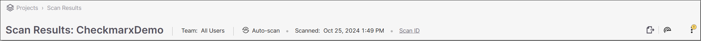
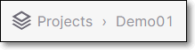

# Viewing the Project Page

The Project page shows detailed results for a specific Project.

By default all tabs show data for the most recent scan of the Project. You can click on a previous scan in the Scans section to show historical data for that particular scan.

The Project page is opened for a specific Project by clicking on the row of the desired Project in the Project pane on the Dashboard **(Home page)**.

<figure></figure>

Hiding Dev &amp; Test Dependencies

Checkmarx SCA is able to distinguish between development dependencies and production dependencies for several package managers. On the Scan Results page, the number in parenthesis next to the Hide Dev & Test Dependencies toggle indicates the number of dev & test dependencies in the Project. Toggle the Hide Dev & Test Dependencies switch ON if you would like to hide vulnerable packages that were identified as dev and test dependencies.


This filter can also be applied to the following REST APIs: [Results Summary](https://checkmarx.stoplight.io/docs/checkmarx-one-api-reference-guide/branches/main/510ldapufb6ns-retrieve-summary-of-scan-results) and [All Scanners Results](https://checkmarx.stoplight.io/docs/checkmarx-one-api-reference-guide/branches/main/bf7eab3023aac-retrieve-scan-results-all-scanners).


### Identifying Dev Dependencies

The following table shows how dev dependencies are identified for specific package managers.

<table>
<thead>
<tr><th>
<strong><strong>Package Manager</strong></strong>
</th><th>
<strong><strong>Dev Dependency Specification</strong></strong>
</th></tr>
</thead>
<tbody>
<tr><td>
NPM
</td><td rowspan="3">
In the manifest file (package.json or bower.json), using the devDependencies attribute. For example,
<pre><code>"devDependencies" : {
  "my_test_framework": "^3.1.0".
  "another_dev_dep": "1.0.0 - 1.2.0"
}</code></pre></td></tr>
<tr><td>
Yarn
</td></tr>
<tr><td>
Bower
</td></tr>
<tr><td>
Composer
</td><td>
Packages under the require-dev section in the composer.json file.
</td></tr>
</tbody>
</table>

### Identifying Test Dependencies

Any package with the word "test" in the file path is identified as a test dependency.

## Header Bar

The Header bar shows general info about the Project and scan that is currently displayed on the page.

<figure></figure>

The following tables describe the info shown in the Header bar and the action buttons that are available.

Header Bar Info

| Item | Description | Possible Values |
| --- | --- | --- |
| Breadcrumbs Navigation | Click on the breadcrumbs to navigate back to the HOME page. | e.g.,  |
| Project Name | The name of the Project. | e.g., Demo01 |
| Team | The teams that are assigned to the Project. | e.g., All users, Team01 |
| Scan Method | The method that was used to scan the Project. | <ul><li>
<strong><strong>Zip</strong></strong> – zip file, specified in the Project configuration
</li><li>
<strong><strong>CLI</strong></strong> – the scan was run from the Command Line Interface
</li><li>
<strong><strong>Recalculated</strong></strong> - user clicked the <strong><strong>Recalculate</strong></strong> button for an existing scan. This causes the Risks to be recalculated based on current data without re-scanning the project. See <a href="/document/preview/202168#UUID-e285b9ca-3c74-ce89-4af7-cedd9802298f">Recalculating SCA Scan Results</a>
</li><li>
<strong><strong>Auto-scan</strong></strong> - a scan recalculation was triggered automatically because new vulnerabilities were identified in your packages.
</li><li>
<strong><strong>Github</strong></strong> - GitHub repository, specified in the Project configuration
</li><li>
<strong><strong>Jenkins Plugin</strong></strong> – the scan was run as part of Jenkins CI/CD process
</li></ul> |
| Last Scanned | The complete date that the last scan was performed on your project. | e.g., Jan 28, 2021 11:22 AM |
| Scan ID | When you hover over Scan ID, the unique identifier of the scan generated by Checkmarx SCA is shown. There is a button to copy the ID to your clipboard. | e.g., 95fc1f60-a4aa-4835-acfd-95aa315d4890 |

Header Bar Actions

<table>
<thead>
<tr><th>
<strong><strong>Icon</strong></strong>
</th><th>
<strong><strong>Action</strong></strong>
</th><th>
<strong><strong>Description</strong></strong>
</th><th>
<strong><strong>Options</strong></strong>
</th></tr>
</thead>
<tbody>
<tr><td rowspan="3"></td><td>
<strong><strong>Scan Report</strong></strong>
</td><td>
Click on this button to download a file containing an overview of the security of your project as well as specific vulnerabilities, legal risks, and outdated versions identified by the scan.
</td><td>
<strong><strong>Report sections:</strong></strong>
<ul><li>
All data tables (Default)
</li><li>
Packages
</li><li>
Vulnerabilities
</li><li>
Licenses
</li><li>
Policy Violations
</li></ul>
<strong><strong>File formats:</strong></strong>
<ul><li>
PDF (Default)
</li><li>
XML
</li><li>
JSON
</li><li>
CSV
</li></ul></td></tr>
<tr><td>
<strong><strong>Software Bill of Materials</strong></strong>
</td><td>
Click on this button to download a file containing detailed info about each of the open source packages used by your program and the associated risks, using <a href="https://cyclonedx.org/docs/1.3/#SchemaProperties">CycloneDX v1.3</a> standard.
</td><td>
<strong><strong>File formats:</strong></strong>
<ul><li>
XML (Default)
</li><li>
JSON
</li></ul></td></tr>
<tr><td>
<strong><strong>Remediation Manifest</strong></strong>
</td><td>
Click on this button to start the process of remediating the Project’s manifest files. For more information see <a href="remediation-using-a-manifest-file.md">Remediation using a Manifest File</a>.
</td><td>
-
</td></tr>
<tr><td rowspan="2"></td><td>
<strong><strong>Scan Project</strong></strong>
</td><td>
Click on this button to run a new scan on the Project. For more information, see <a href="scanning-a-project.md">Scanning a Project</a>.
</td><td>
-
</td></tr>
<tr><td>
<strong><strong>Recalculate Last Scan</strong></strong>
</td><td>
Click on this button to send the list of project dependencies from the last scan to the risk generator. This can be used to re-evaluate a "static" Project where no significant changes have been made. For more information, see <a href="recalculating-scan-results.md">Recalculating Risk</a>.
</td><td>
-
</td></tr>
<tr><td rowspan="5"></td><td>
<strong><strong>Resolving Info</strong></strong>
</td><td>
Display info about the package resolution process.
<ul><li>
<em><em>Manifest</em></em> – identified by resolving the manifest file
</li><li>
<em><em>Binary</em></em> – identified by analyzing hashes and fingerprints of files in the Project
</li></ul><ul><li>
Package Identified By - Shows the number of packages identified, broken down by how they were identified:
</li><li>
Manifests -

Lists the manifest files in the Project. For each file, an icon indicates whether or not Checkmarx SCA was able to resolve the dependencies from the file.

There is a <strong><strong>Hide Successful</strong></strong> switch that enables you to hide the manifest files that were successfully resolved. Toggle this switch ON (to the right) in order to hide successfully resolved files.
</li></ul>

</td><td>
-
</td></tr>
<tr><td>
<strong><strong>Scan Details</strong></strong>
</td><td>
Display details of the scan process. For each step in the scan run, the start time and duration are shown.
</td><td>
-
</td></tr>
<tr><td>
<strong><strong>Project Settings</strong></strong>
</td><td>
Edit the settings for the Project.
</td><td>
-
</td></tr>
<tr><td>
<strong><strong>Delete Project</strong></strong>
</td><td>
Delete a Project and its associated scans.
</td><td>
-
</td></tr>
</tbody>
</table>

## Project Page Elements

This screen includes a Header bar with general info about the Project and scan and action buttons. It also shows detailed results for the Project, divided into the following tabs.


Detailed info about the content of each tab is shown in [Project Page Tabs](project-page-tabs.md).


- Project Overview – shows the overall status of the project. This page has two sections.

  - Overview Widgets - shows a graphical dislplay of key Project data.
  - Scans - shows a list of scans run on the Project.

- Packages – shows info about the open-source packages used by your project and the risks associated with those packages, including security vulnerabilities, license violations, and outdated versions. This tab includes two types of pages:

  - All Packages – shows a list of all packages containing vulnerabilities identified by this scan.
  - Package Details – shows detailed info about the risks associated with a specific package.

- Risks – shows info about all of the security vulnerabilities identified in the open-source packages used by your project, including severity level, CVE references, remediation recommendations, etc. This tab includes two types of pages:

  - All Risks– lists all vulnerabilities identified in your open-source dependencies.
  - Risk Details – shows detailed info about a specific vulnerability.

- Container (for projects with container images) – shows info about packages identified in your container images and the vulnerabilities associated with those packages.

  - Container Packages – lists all packages identified in the container images.
  - Container Vulnerabilities – lists all the vulnerabilities associated with the container packages.

- Licenses - shows info about all of the licenses that are associated with the open source packages used by your project.

  - All Licenses – shows a list of all licenses associated with the open source packages identified in this scan.
  - License Details – shows detailed info about a specific license. Click on a row in the All Licenses tab to access this page.

- Remediation Tasks - shows detailed information about specific remediation tasks that Checkmarx recommends implementing for your Project.

  - All Remediation Tasks – shows a list of remediation tasks for this Project, with general info about each task.
  - Task Details – shows detailed info about a specific task. The task details tab is opened by clicking the How to Fix button in a task row in the All Remediation Tasks sub-tab.

- Policy Violations – shows info about any security Policies applied to this Project for which vulnerabilities were identified that violated the Policy.
