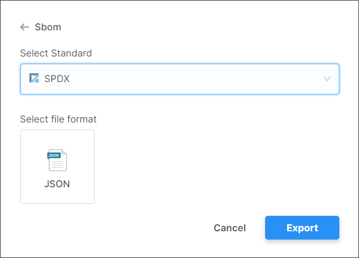
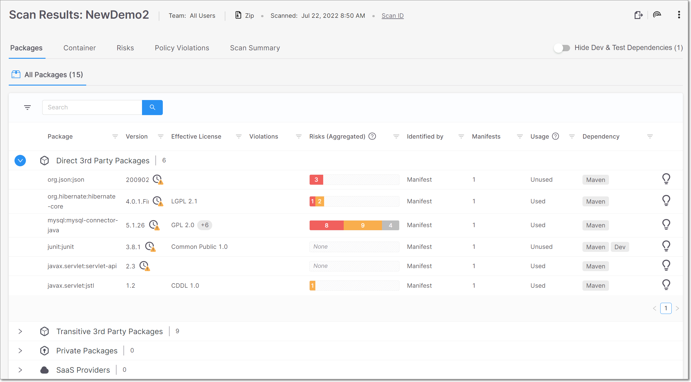
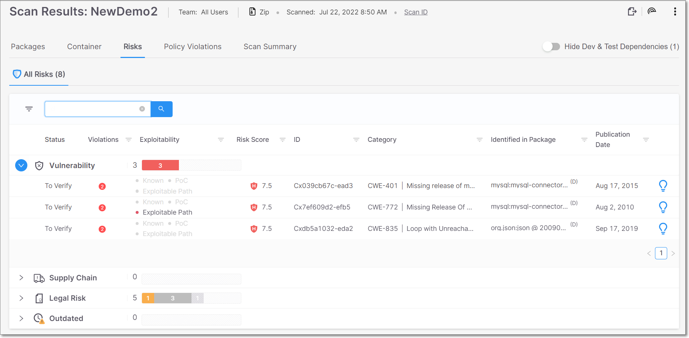

# Checkmarx SCA Release Notes January 2023

We are excited to announce important improvements in our Checkmarx SCA web application…


This document relates to the Checkmarx SCA standalone platform. There may be a slight delay until these updates become available for users who are consuming SCA via Checkmarx One.


## Key improvements

### SBOM Improvements

We have added support for generating SBOM using [SPDX v2.2](https://spdx.github.io/spdx-spec/v2.2.2/) format. SPDX SBOMs are output in JSON file format.

<figure></figure>

In addition, we have improved the quality of the [CycloneDX v1.4](https://cyclonedx.org/docs/1.4/#SchemaProperties) SBOMs, making them more complient with SBOM specifications.

These improvements are based on usage of a new Export Service API in place of the previous `risk-reports` API. See [Export Service API Documentation](https://app.gitbook.com/s/XSPACE_REST_API/checkmarx-sca--rest--api---export-service)

### Exploitable Path Support for C#

We now support the Exploitable Path feature for C# when running scans via the SCA Cloud. Previously, this was only supported for scans run using SCA Resolver. For more information about Exploitable Path, see [here](https://app.gitbook.com/s/XSPACE_USER_GUIDE/exploitable-path).

### Identifying SaaS Provider Packages

We now determine which packages are used for providing access to SaaS services. This gives better visibility into potential threats posed by accessing vulnerable SaaS services.

### UI Improvements

We have improved the UI display for the following elements.

#### Scan Results - Packages Tab

The results shown in the **All Packages** sub-tab of the Scan Results screen are now divided by category.

<figure></figure>

The section heading for each category shows the number of packages identified as well as the number of policy violations for that category. Click on a category to expand the display for the results in that category. The following categories are shown:

- **Direct 3rd Party Packages** - Shows all 3rd party packages called directly by your source code.
- **Transitive 3rd Party Packages** - Shows all 3rd party packages called indirectly by your project.
- **Private Packages** - Shows all private packages identified in your project.
- **SaaS Providers** - Shows all packages used for accessing SaaS services.

#### Scan Results - Risk Tab

The results shown in the **All Risks** sub-tab of the Scan Results screen are now divided by category.

<figure></figure>

The section heading for each category shows the total number of risks identified as well as a breakdown by severity level. Click on a category to expand the display for the results in that category. The following categories are shown:

- **Vulnerability** - shows a list of vulnerabilities in your open source packages that can be exploited by an attacker. This includes vulnerabilities that have been published as CVEs as well as vulnerabilities identified by the Checkmarx Vulnerability Research Team (i.e., Cx). The summary graph shows the total number of vulnerabilities and a breakdown by severity level.
- **Supply Chain** - shows various types of supply chain risks that affect the packages in your project, such as packages that are Malicious by design and packages that are vulnerable to ChainJacking attacks etc. The summary graph shows the total number of supply chain risks and a breakdown by severity level.
- **Legal Risk** - shows all of the Legal Risks relating to the licensing of the packages used in your project. The summary graph shows the total number of legal risks and a breakdown by severity level.
- **Outdated** - shows a list of all packages that have vulnerabilities or supply chain risks, for which a more recent package version is available.

## Checkmarx SCA Resolver Updates

We have released several new versions of Resolver with a wide range of improvements and bug fixes. Download the latest version of SCA Resolver [here](https://app.gitbook.com/s/XSPACE_RESOLVER/checkmarx-sca-resolver-download-and-installation).

### Improvements in Version 1.15.6

- For Sbt, fixed an issue that led Sbt package resolution to fail when the plugins file exists and has content.
- For Go, fixed an issue that led Go package resolution to fail when there was a vendor folder present.
- User permissions are now checked before updating the project.
