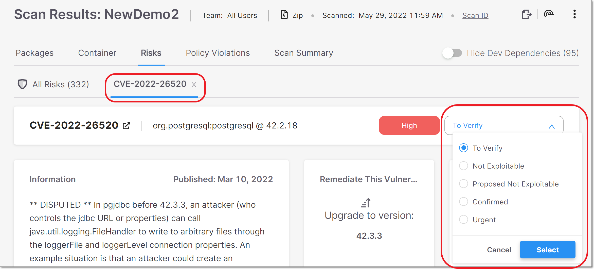

# Checkmarx SCA Release Notes June 2022

We are excited to announce important improvements in our Checkmarx SCA web application…

## Key improvements

### New Options for Managing Risk State

We have adjusted the options for managing the “state” of vulnerabilities and supply chain risks. The previous options of “Ignored” or “Not Ignored” have been replaced by the following options:

- **To Verify** - This is the initial state of all vulnerabilities and supply chain risks, indicating that it is a new finding that hasn’t yet been assessed by your AppSec team.
- **Not Exploitable** (replaces “Ignored”) - Select this state if your team has determined that this risk doesn’t pose a threat to your application (and isn’t expected to cause a risk at any time in the future).
- **Proposed Not Exploitable** - Select this state if your team has suggested tentatively that this risk doesn’t pose a threat to your application.
- **Confirmed** - Select this state if your team has confirmed that this risk **does** pose a threat and requires mitigation.
- **Urgent** - Select this state if your team has determined that this risk poses an imminent threat and requires urgent mitigation.


For Legal Risks, the options for state remain “Effective License” or “No Effective License”.


In addition to giving your AppSec team more flexibility in accurately defining the state, this new set of options also brings Checkmarx SCA in line with other Checkmarx products, enabling smoother integration across products.

**To change the state of a vulnerability or a supply chain risk:**


Only users with the SCA role **manage-risk** are authorized to change the state of a risk.


1. Go to the **Scan Results** page and select a vulnerability or a supply chain risk, opening a new tab for that risk.
2. In the tab’s header bar, click on the **State** field and select the radio button for the desired state.

   
<figure></figure>

3. Click on the **Select** button.

   The change is applied. If the state was set as Not Exploitable, then the page is grayed out and the risk is marked with a strikethrough line on the **All Risks** tab.

## Checkmarx SCA Resolver Updates

We have released several new versions of Resolver with a wide range of improvements and bug fixes. The most recent release is 1.9.8.

The following are some highlights from the recent releases:

- For Ivy, added the option to specify the `target name` and `todir`, which determine where the reports are written to when resolving dependencies in Ivy.
- For NPM, added support for NPM 8.
- Added the ability to skip file analysis when the file is in use.

Download the latest version of Resolver [here](https://app.gitbook.com/s/XSPACE_RESOLVER/checkmarx-sca-resolver-download-and-installation).

## Improvements and Bug Fixes

| **Status** | **Item** | **Description** |
| --- | --- | --- |
| UPDATE | UI changes | In the **Scan Results** \> **Risk Details** tab, the severity indicator was moved to the right side of the header bar, and the publication date was moved to the **Information** card. |
| UPDATE | NPM Workspaces | For NPM versions 7 and 8, added support for NPM Workspaces. |
| UPDATE | NPM versions | Added support for NPM versions 7 and 8. |
| FIXED | Maven configuration | Fixed issues caused by Maven default config. |
| FIXED | Dotnet resolution | Fixed performance issues for Dotnet resolution. |
| FIXED | Yarn resolution | Fixed performance issues for Yarn resolution. |
