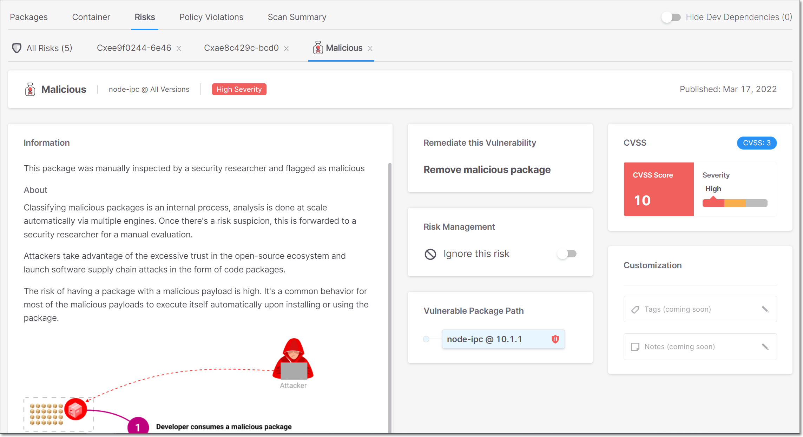
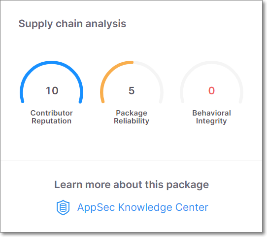
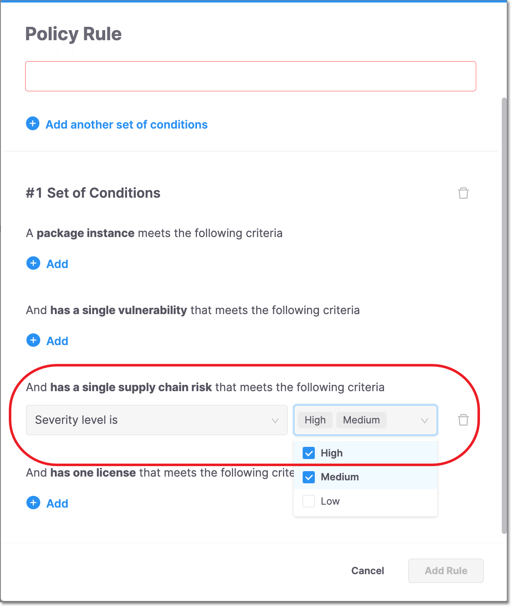
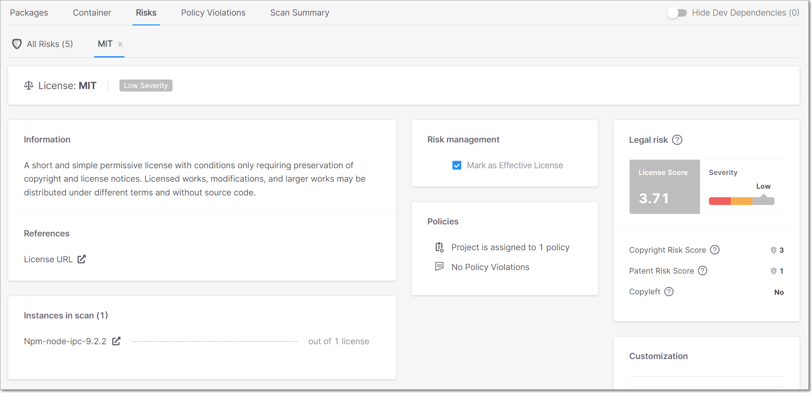
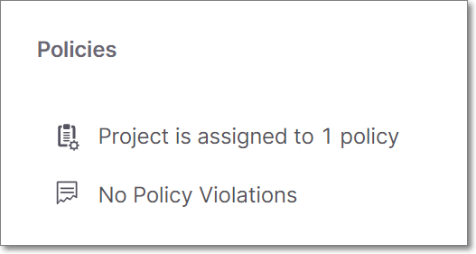
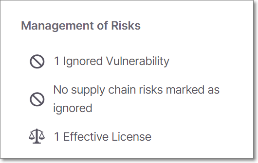

# Checkmarx SCA Release Notes March 2022

We are excited to announce important improvements in our Checkmarx SCA web application…

## Key improvements

### Supply Chain Risks

We have added the following functionality to our capabilities for identifying Supply Chain Risks.

- Checkmarx SCA now identifies a wide range of supply chain risks (e.g., New User, Typosquating, Data Exfiltration etc.)

- You can now manage supply chain risks by marking them as “ignored”, in the same way that you manage vulnerabilities.

- Clicking on a Supply Chain Risk on the Scan Results page now opens a Supply Chain Details page which is similar to the Vulnerability Details page, but with customized sections relevant specifically for Supply Chain Risks. See [Suspected Malware Details](https://app.gitbook.com/s/XSPACE_USER_GUIDE/viewing-results/viewing-the-project-page/project-page-tabs#UUID-07a21b5d-72d7-69da-9320-fc8d5e505317_UUID-0504d65c-06e7-8468-3463-4db738645014)

  
<figure></figure>

- We have added a Supply Chain Analysis section to the Package Details page. This section shows gauge widgets representing three risk categories (Reputation, Reliability and Behavior). The scores are given on a scale of 0-10, with 10 indicating the highest level of security.

  
<figure></figure>

### Supply Chain Policies

Checkmarx SCA Policy Management enables you to apply customized security rules to the open source packages in your Projects. This makes it easy to identify Projects that are non-compliant with your self-defined security policies.


Learn more about [Policy Management](https://app.gitbook.com/s/XSPACE_USER_GUIDE/policy-management).


We have added the ability to create specialized Policy conditions for Supply Chain risks. You can now add a condition specifying that if a supply chain risk of a particular severity level/s is detected in your project, this will trigger a Policy violation. Supply chain conditions can be combined with other conditions to create complex Policy rules. For example, you can create a Policy that is triggered only when a supply chain risk is identified in a package that is not a Dev or Test Dependency.

<figure></figure>

### UI Improvements

We have improved how the scan results data shown in the UI, as follows:

- Created a new type of details page that opens when you click on a Legal Risk. This page includes the license info that was previously shown on the Package Details page, as well as additional info.

  
<figure></figure>

- Added a Policies section to the Package Details page, showing assigned policies and policy violations.

  
<figure></figure>

- Added a Management of Risks section to the Package Details page, showing how many vulnerabilities and supply chain risks have been marked as ignored and how many licenses have been marked as effective.

  
<figure></figure>

Checkmarx SCA Resolver Updates

We have released version 1.8.3.

This release includes the following improvements:

- Added support for SAML authentication when using Checkmarx SCA Resolver. See [SAML Authentication for Checkmarx SCA Resolver](https://app.gitbook.com/s/XSPACE_RESOLVER/saml-authentication-for-checkmarx-sca-resolver)
- Container Scan - added support for container images on AWS ECR repository. See [Container Scans](https://app.gitbook.com/s/XSPACE_PRODUCT_INFO/container-scans)
- For Yarn, general improvements in sub-module resolution

Download the latest version of Resolver [here](https://app.gitbook.com/s/XSPACE_RESOLVER/checkmarx-sca-resolver-download-and-installation).

## Improvements

| Status | Item | Description |
| --- | --- | --- |
| UPDATE | Exploitable Path display | The Exploitable Path column on the Risks page, is now contextualized according to the configuration. If the project is in an unsupported language and Exploitable Path is disabled in the Project, then the column is hidden. If no results are returned, then the tooltip explains why there are no results. |
| UPDATE | Npm potential private packages | For Npm packages, we now return potential private packages. Meaning that, if a package has been removed from the public registry, we will nonetheless give the version that is in the manifest in order to try resolving it locally. |
| FIXED | Exploitable Path results | Fixed issue that sometimes scan returned without Exploitable Path results. The feature was stabilized by sending retries to alternative instances. |
| FIXED | Yarn resolution | Yarn now maps submodule dependencies to the correct file. |
| FIXED | CVE-2022-23221 remediation | We now, correctly, show that CVE-2022-23221 does have a suggested remediation. |
