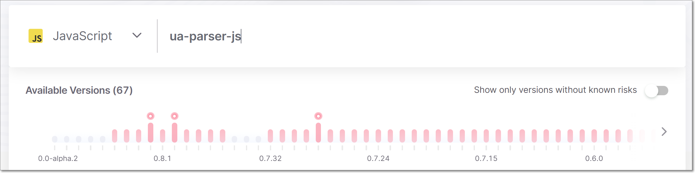
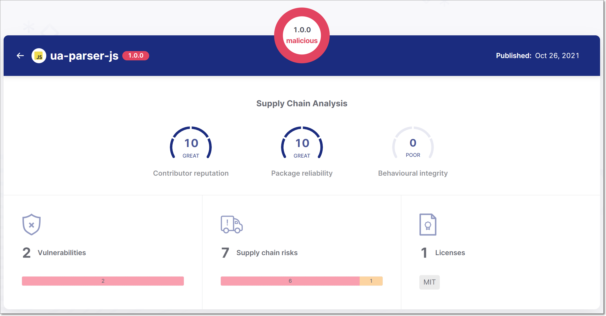
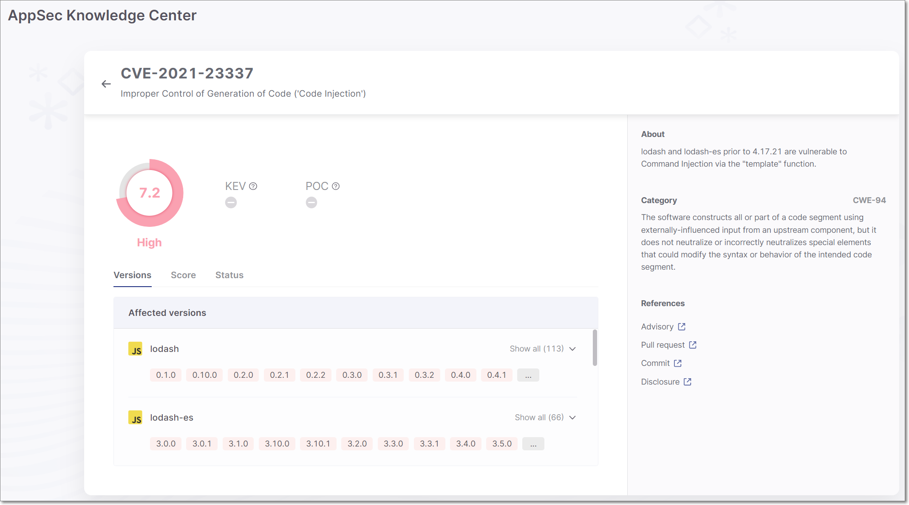
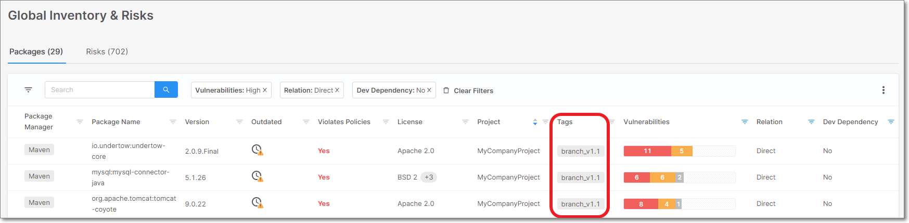

# Checkmarx SCA Release Notes May 2023





## New Version of AppSec Knowledge Center

We have released a new version of the AppSec Knowledge Center. The new version maintains the same core functionality as the previous version. However, the look and feel has been completely redone and many improvements have been introduced.

The following are some of the main improvements:

- The Package page now shows Supply Chain risks, and Licenses associated with the package (in addition to vulnerabilities).

- Package selection is now done by entering the package name and then clicking on a marker for a specific version.

  
<figure></figure>

  The markers representing the package versions are now color coded as follows:

  - Red with dot - malicious package
  - Red - high severity
  - Yellow - medium severity
  - Gray - low severity or no risk

- When you select a package version for viewing, a summary page is shown which gives data for [Supply Chain Analysis](urn:resource:component:151242), as well as aggregated risks.

  
<figure></figure>

  You can then drill down to view a list of vulnerabilities, supply chain risks and licenses. For vulnerabilities, you can drill down further to show the vulnerability details screen.

- The vulnerability details screen has been redesigned.

  
<figure></figure>

  The info is now divided into the following elements:

  - Overview - gives general info about the vulnerability including the CVSS score.

  - Info Pane - shows the description of the vulnerability and CWE and gives references for further research.

    - Notes - Within the info pane, we have added a section for notes. This section shows notes that were added to a vulnerability by the Checkmarx AppSect team. These notes may explain discrepancies between our data and data shown in NVD, such as when we have confirmed the disputation of a vulnerability. They may also suggest specific mitigation actions such as changing configurations, or offer other helpful insights from our AppSec team.

  - Detail Tabs - The bottom section gives additional details about the vulnerability and the packages affected by the vulnerability. The info is divided into tabs for Affected Versions, Score and Status.

## Tags in Global Inventory

We added a Tags column to the Packages table on the Global Inventory screen. This shows both the scan tags and project tags associated with the most recent scan in which the package was identified.


This can be useful for tracking which project branch uses the package.


<figure></figure>

## SCA Resolver Releases

We released the following new versions of SCA Resolver:


The complete changelog, and links to download SCA Resolver are available [here](https://app.gitbook.com/s/XSPACE_RESOLVER/checkmarx-sca-resolver-changelog).


### Version 2.2.2

- Syft is now used automatically whenever the `--scan-container` flag is used. The `--use-syft` flag is no longer in use.

  
  This is a breaking change. If you have pipelines that use the `--use-syft` flag, it needs to be removed.
  

  
  For syft to run on your scans, you need to have it installed on the machine that is running Resolver, see [Prerequisites](https://app.gitbook.com/s/XSPACE_PRODUCT_INFO/container-scans#UUID-5d68d9be-7702-23c0-3672-a8272906267c_UUID-a7f59a84-5455-7950-1cde-7e93df54b8ed).
  

- For PIP:

  - Added a new argument for including custom manifest files for resolution.
  - Improved detection of the Python version installed on the system.

- For Gradle, dependencies that were ignored by the package manager are now ignored by Resolver.

- For NPM, the problem with the decision to run commands for NPM6 or NPM7 has been fixed.

- Fixed "out of memory" issues that were occurring in some edge cases.

### Version 2.1.9

- For Gradle, added support for dynamic submodule declaration.
- ImageResolver updated to version 2.0.47.
