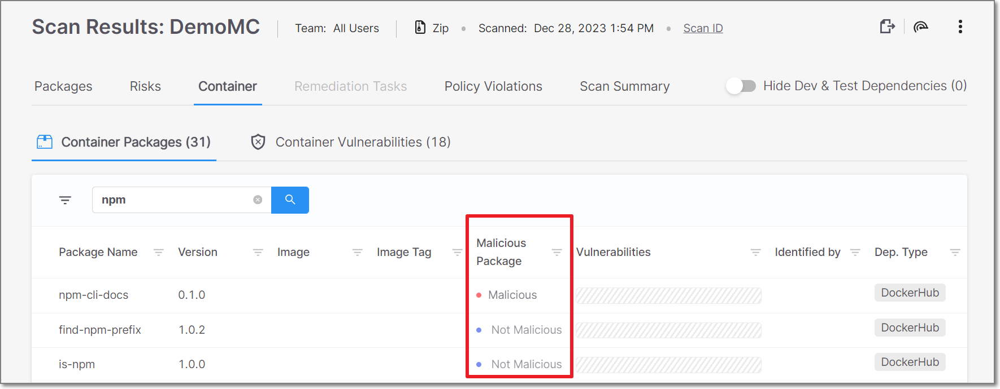

# Checkmarx SCA Release Notes December 2023






For the SCA JFrog plugin, version 1.1.9 and below will stop working on Feb. 29. To continue using this plugin, make sure to upgrade to version 1.1.10 before that date.

For the SCA Nexus plugin, version 1.1.5 and below will stop working on Feb. 29. To continue using this plugin, make sure to upgrade to version 1.1.6 before that date.


## Malicious Packages in Container Scans

We now identify malicious packages in container scans. This is done by checking the container packages against our proprietary database of know malicious packages.


We currently identify malicious packages only among non-OS related packages.


A new column was added to the Container Packages screen indicating whether or not the package is malicious. For unsupported package types, "Unknown" is shown in the "Malicious" column.

<figure></figure>

Also, for vulnerabilities associated with malicious packages, the Container Vulnerabilities screen shows "Malicious" as a "Risk Factor".

## SCA Resolver Version 2.5.15

We released a new version of SCA Resolver with the following improvements:

- For Gradle, the processing of wildcards on Gradle multi-module scans has been improved.
- For Python, pip is no longer presented as a dependency for all Python projects.

Download the new version [here](checkmarx-sca-resolver-changelog.md).
