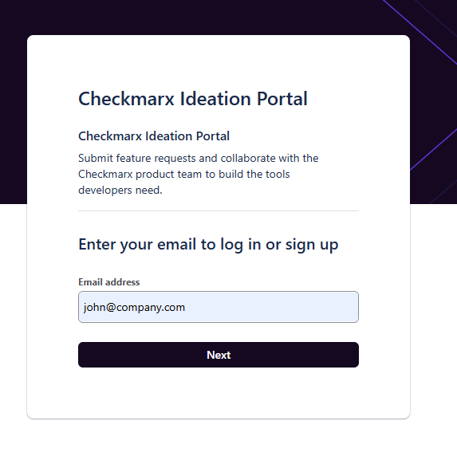
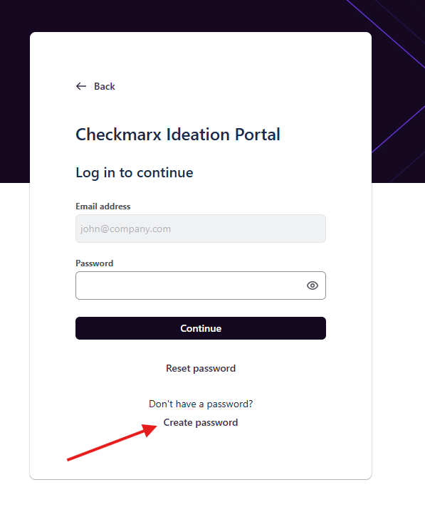
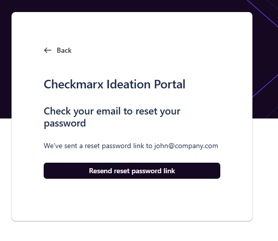
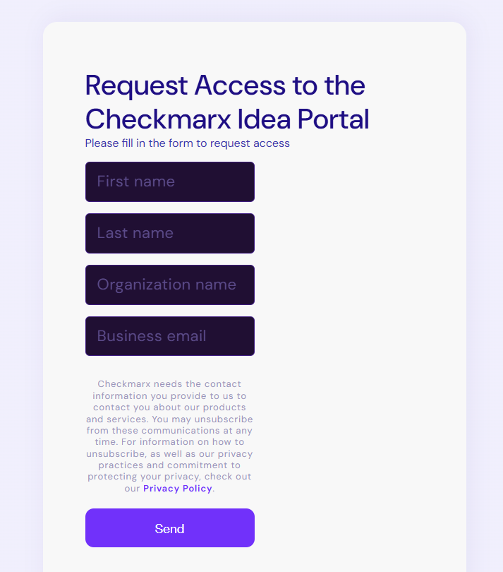

# Registering for the Checkmarx Idea Portal

## Existing Aha! Portal Users

If you previously had access to the Aha! Ideas Portal, you can use the same email address to access the new portal.

1. Open the portal login page:

   `https://checkmarx.atlassian.net/servicedesk/customer/portal/1003`
2. Enter the **email address you used to log in** and click **Next**.
3. Click **Create password**.
4. You'll receive an email with a link to set your password.
5. Once your password is set, return to the login page and sign in to access the new Idea Portal.

<figure></figure>

<figure></figure>

<figure></figure>

## New Users

If you have **not** previously used the Aha! Idea Portal, you'll first need to register for access.

1. Complete the self-registration form:

   `https://checkmarx.com/ideas-portal-registration/`
2. Provide the required information:

   - First name
   - Last name
   - Organization name
   - Business email address
3. After submitting the form, we'll review your request and verify your eligibility against our customer records.
4. If approved, you'll receive an email with instructions to activate your account and access the Checkmarx Idea Portal.

<figure></figure>

## Not Sure if You Already Have Access?

If you're unsure whether you've previously used the Aha! Idea Portal, simply complete the [form](https://checkmarx.com/ideas-portal-registration/).

If an account already exists for your email address, we'll send you a reminder with your login details and password reset instructions (if required). Otherwise, we'll process your registration as a new access request.


If you have not received your invitation after approval, please check your spam folder or contact your Checkmarx CSM or SE.


## Navigating the Idea Portal

The main portal page includes:

● A search bar at the top - use this to search community ideas shared by other customers

● Submit an idea - the primary action to submit a new product idea or feature request

● An explanation of the ideation process and idea statuses - so you always know where your idea stands

### Tracking your ideas

To track the ideas you have submitted:

Click on your profile picture in the top right corner of the portal.

Click Requests from the dropdown menu.

Use the filters to find the idea or request you are looking for.

## Adding a New Idea

Click Submit an idea from the portal home page to open the idea submission form. Fill in the following fields and click Submit when done:

● **Category \\ Subcategory** - select the product area in which your request is most relevant

● **Summary** - a short, clear title for your idea

● **Description** - explain the problem you are solving and the value it would bring to your team or organization

● **Attachments** - optionally attach screenshots, documents, or examples to support your idea

● **Share with** - choose who can see your idea (see visibility options below)

### Choosing who can see your idea

When submitting, choose the visibility of your idea from the Share with field:

| **Visibility Option** | **Who can see it** | **When to use it** |
| --- | --- | --- |
| **Shared with no one** (default) | Only you (the submitter) and Checkmarx employees | Sensitive or confidential feedback you want only Checkmarx to review |
| My Org + Checkmarx | Your company colleagues + Checkmarx team | Ideas you want your organization to see and comment on |
| Share with all organizations | All portal users across all customer organizations | Ideas you want broad community support on |


The Checkmarx Product team can always see your idea regardless of the visibility setting you choose.


## Idea Statuses, Workflow, and Definitions

The following list includes the statuses and their definitions for ideas in the portal:

| **Status** | **Definition** |
| --- | --- |
| New Idea | The starting point. Your idea has been received and will soon be reviewed by the Product team. |
| Pending Review/ Under Evaluation/ Candidate | Internal evaluation. Product Management and Engineering teams are reviewing the idea. You will receive an update within 4 weeks. |
| Planned | Accepted. The idea is in the planning stage for the next 2 quarters. |
| In Development | Building. Our engineering teams are actively working on bringing the idea to life. |
| Shipped | Complete! The idea is now part of the Platform. Check the Release Notes for implementation details. |
| Already Exists | Our Product team identified this as an existing feature. Please see the documentation links or references in the comments. |
| Not Planned | A good idea that fits our long-term vision but will not be developed in the next ~2 quarters due to capacity. It can be reevaluated in 6 months. |
| Rejected | The idea does not fit the current roadmap or cannot be implemented within a reasonable timeframe. |
