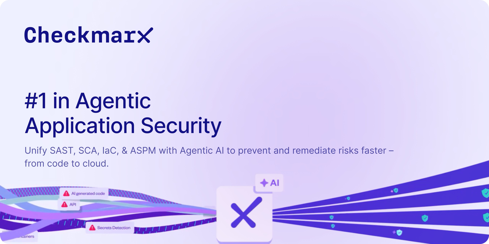

---
metaLinks:
  alternates:
    - https://app.gitbook.com/s/Upiv3KOTza7CaZSrBSOL/
---

# SCA Scanner Overview

<figure><figcaption></figcaption></figure>

## Overview

Software developers are relying more and more on open source components to expedite the software development process. Projects often use numerous open source libraries, each of which calls on numerous direct and transitive dependencies. No matter how secure your proprietary code is, these open source dependencies can expose you to a broad range of security and legal risks.

The SCA scanner is Checkmarx's proprietary Software Composition Analysis (SCA) solution for detecting risks associated with your open source dependencies. Checkmarx SCA enables you to easily identify, prioritize, and remediate the risks posed by your open source packages. These risks may include security vulnerabilities, license requirements and outdated open source packages. SCA addresses all of these issues, providing highly accurate, relevant, and actionable insights.

## Key Features

### Exploitable Path

Prioritizing remediation of the many open source vulnerabilities identified by Checkmarx SCA can be a challenging task. It isn’t always apparent whether the vulnerable packages are actually being called by your project and whether the vulnerable methods are actually being used by your code. The key question is: Is there a path from your project code into the vulnerable package code, whereby the vulnerable packages could be exploited in your project? If not, then remediation is a much lower priority.

This is where the _Exploitable Path_ feature is essential. Checkmarx SCA leverages SAST’s ability to scan the actual project code itself in parallel with scanning the manifest file, in order to validate whether the vulnerable open source packages are called from your proprietary code and whether the vulnerable methods are actually used by your code. This enables you to focus on the remediation of actively exploitable vulnerabilities.

Exploitable Path also identifies which lines in your project code actually reach the vulnerable method in the vulnerable package and shows you the full path to the vulnerability.

#### **Key Benefits**

* Verify whether the vulnerable methods in the open source packages are being called by your proprietary code.
* Prioritize remediation of exploitable vulnerabilities.
* See the full path from the project code to the vulnerable method.

#### **Current Limitations**



Supported languages: Python, Java, JavaScript and C#.



Using the Exploitable Path feature might cause scans to take longer time.



We find exploitable paths only for packages that are called directly in the code and where the vulnerable method is in the called package itself.



Exploitable paths created by reflection are not supported.



Not all open source packages have been scanned for Exploitable path yet. However, once the user scans a project with a particular package, the package gains priority and will be scanned in the next 48 hours.



Exploitable Path feature is limited to the Checkmarx SAST engine capabilities, such as languages and types of runtime loads.



Exploitable Path is based on results from the most recent full SAST scan of the project, results from incremental scans aren't considered.



Packages exceeding 100Mb are not scanned.



Exploitable Path information is not updated when Risk Recalculation is run on a scan. You need to run the scan again to get the Exploitable Path results.



For JavaScript projects, Exploitable Path doesn’t identify:

* packages using anonymous exports, e.g., `module.exports = function(options) {....}`.
*   constructor patterns in the source code, e.g.,

    `const someObject= Requier("jwt")`

    `someObject(options)`



#### **Enabling Exploitable Path**

Exploitable path can be activated on the account level under **Acccount Settings** > **SCA**, or on the project level under the **Project Settings** > **Rules** > **SCA** rule. When activating Exploitable Path on the account level, you can configure whether or not results from previous SAST scans will be used for identifying Exploitable Path (and for how long they will be considered valid).

### SCA Resolver

Checkmarx SCA Resolver is an on-prem utility that enables you to resolve and extract dependencies and fingerprints from your source code and send them to the Checkmarx One platform for risk analysis. The Resolver uses command line interface (CLI) commands to configure and scan your Projects.

Checkmarx SCA Resolver enables you to run a comprehensive SCA scan without the need to send your actual source code to the cloud. It also enables you to scan private (local) dependencies that aren’t accessible to the Checkmarx One platform.

For Checkmarx One accounts, Resolver is run via the Checkmarx One CLI, by adding the relevant flags to the `scan create` command. Resolver runs in Offline mode and the results are automatically sent to the Checkmarx One cloud for analysis.

* Learn more about downloading and installing SCA Resolver [here](https://docs.checkmarx.com/en/34965-19197-checkmarx-sca-resolver-download-and-installation.html).
* Learn about running scans via Checkmarx One CLI using SCA Resolver [here](https://docs.checkmarx.com/en/34965-68643-scan.html#UUID-a0bb20d5-5182-3fb4-3da0-0e263344ffe7_id_scancreate-CheckmarxSCAResolver).

What data is sent to the Checkmarx One Cloud?

After the File Analysis and Dependency Resolution are completed on-prem, the output of the analysis, the “evidence files”, are sent to the cloud for the final process of Evidence Analysis.

* The project name
* List of all file names and relative paths (except the ones that were excluded from the scan)
* Various checksums of the files (SHA-1, SHA-1 on content without spaces, etc.)
* Manifest files (except for scans run via Resolver with the `--no-upload-manifest` flag)


The complete list of files that are sent to the cloud can be seen in [Files Used for Manifest Resolution](https://docs.checkmarx.com/en/34965-19111-files-used-for-manifest-resolution.html).


* Names of dependencies extracted from manifest files
* Scan errors and warnings such as “Failed resolving dependencies”. Each warning message may contain a file path as an argument.
* SAST Exploitable Path Query result (for Exploitable Path scans)

### Delta Scans

The Delta scan feature dramatically cuts the time of SCA scans when rescanning an existing project., if the manifest files haven’t been changed since the last scan, then we skip the dependency resolution process. This can cut scan times by up to 95% without detracting from the accuracy of the scan.

Once a week a full scan is enforced even if no changes were detected in the manifest files. This is intended to identify version changes caused by use of ranged versions.


A failed scan won't be used as the basis for a subsequent Delta scan. However, if a partially successful scan identified the manifest files and they did not change, this will be used as the basis for a Delta scan.


When a scan runs as a Delta scan, an indication is shown in the Resolving Info dialog in the SCA scan results viewer.

#### **Current Limitations**

* Only applies to scans run in the cloud, not to scans using SCA Resolver.
* Supported for all languages and package managers for which dependency resolution is done using manifest files except for C and C++.
* Does not apply to languages for which dependency resolution is done by file analysis (fingerprint method).
* Currently available only in Multi-Tenant environments, not for Single-Tenant.

### SCA Auto Pull Request&#x20;

For Code Repository Integration projects, **SCA Auto Pull Request** automatically submits pull requests with suggested remediation for SCA vulnerabilities. When code is pushed to a protected branch, triggering an SCA scan, Checkmarx identifies vulnerable packages for which a remediated version is available and sends an automatic PR to adjust your manifest files to use the remediated versions. The PR is created with branch name `branch_auto_pr`, and once approved, it is merged into your protected branch.

This is supported for all supported SCMs (GitHub, GitLab, Bitbucket and Azure DevOps).

This feature can be activated on the project level by turning on the **SCA Auto Pull Request** toggle in the project settings.

#### **Limitations**

* Currently supported only for npm `package.json` manifest files.
* A single PR is sent with all of the suggested changes (i.e., no separate PR for each package).
* A PR is sent whenever a remediated package is available. It is not possible to set thresholds or filter conditions.
* For Bitbucket integrations, the user who sets up the integration must have an email associated with their Bitbucket user account in order for this feature to work.

### Export Remediated Manifest File

You can generate remediated manifest file/s that contain the recommended versions of your packages. You can download the remediated manifest files and use them to update your project.

You can export the remediated manifest file/s from the SCA scan results viewer page. The file/s is exported as a zip archive, which maintains your project's file structure.


Current limitations:

* Supported only for npm `package.json` manifest files
* Remediates only direct dependencies (not transitive)
* Because this method updates all vulnerable packages (sometimes changing a major version) it may break methods used in your code. You may need to refactor your code to avoid changes in functionality.


### Recalculating SCA Scan Results

Checkmarx enables scan **Recalculation** for the SCA scanner. This feature utilizes the dependencies identified in a previous scan and re-assesses the risks affecting your project based on the current data. There is no need to resubmit the source code in order to run scan recalculation since it uses the dependency resolution output from the previous scan. This method is useful for “static” projects, where no significant changes have been made to the source code since the previous scan.

Results from scan recalculation are shown in Checkmarx One as a separate scan.

The following factors will affect the recalculated scan results:

* If you changed the state of risks since the last scan of the project, those changes will be applied to the recalculated scan.


If you have made state changes since the last scan, a warning icon is shown next to the project name in the list of projects, indicating the need for a scan recalculation.


* Checkmarx has identified new vulnerabilities associated with the dependencies in your project since the previous scan.
* If you have changed the Policies that apply to your project since the last scan, the policy violations for the project will be updated.

### Scan Reports and SBOM Reports

Results from the SCA scanner are returned together with results from other scanners in Checkmarx One Scan Reports and Projects Reports. See [Checkmarx One Reports](https://docs.checkmarx.com/en/34965-146345-checkmarx-one-reports.html)

In addition, you can generate specialized [SCA scan reports](https://docs.checkmarx.com/en/34965-158449-sca-scan-reports.html) as well as [Software Bill of Materials (SBOM)](https://docs.checkmarx.com/en/34965-388392-checkmarx-one-sbom-reports.html) reports based on the packages identified by SCA.

### Scanning SBOMs

You can run an SCA scan on an SBOM file. The scan is run as a Checkmarx One project, with the source specified as an SBOM file. The SCA scanner returns comprehensive results of all risks associated with your open source packages. This enables customers who don’t want to submit their actual code, to obtain comprehensive SCA results for their project and manage the remediation via Checkmarx One.

SBOM scans can be run from the UI as well as via [CLI](https://docs.checkmarx.com/en/34965-350124-running-scans-via-the-cli.html#UUID-689db1a2-a612-dfff-c1d6-43cf12c8eef0_section-idm33512558139962) or [REST API](https://checkmarx.stoplight.io/docs/checkmarx-one-api-reference-guide/branches/main/3zac73jdvh6e8-scans-service-rest-api#scanning-from-an-sbom-for-sca).


This capability is distinct from the capability to analyze an SBOM using the POST /analysis/requests API. The new method shows SCA results in the context of an actual Checkmarx One project, as opposed to just returning a report with the enriched SBOM data.


Requirements:

* Supported file formats: json or xml following CycloneDX (v1.0-1.6) or SPDX (v2.2 or v2.3)
* It is mandatory to include the Package URL (purl) for each package in the SBOM. For more information about purl syntax, see [here](https://spdx.github.io/spdx-spec/v3.0/model/Software/Properties/packageUrl/).
* Only the SCA scanner can run on an SBOM
* Can only run on a “manual” project (not a code repository integration)

The procedure for running a scan on an SBOM is described [here](https://docs.checkmarx.com/en/34965-68557-scanning-projects.html#UUID-8432e3da-f51b-5bcd-ad1d-1f97420cb83f_section-idm33492341389672).

### AI Guided Package Remediation

When the SCA scanner identifies a vulnerable package in your project and there is no remediated version available, a button is shown that enables you to get AI generated suggestions for non-vulnerable replacement packages.

### Hiding Dev & Test Dependencies

Checkmarx SCA is able to distinguish between development dependencies and production dependencies for several package managers. On the **Scan Results** page, the number in parenthesis next to the **Hide Dev & Test Dependencies** toggle indicates the number of dev & test dependencies in the Project. Toggle the **Hide Dev & Test Dependencies** switch ON if you would like to hide vulnerable packages that were identified as dev and test dependencies.


This filter can also be applied to the following REST APIs: [Results Summary](https://checkmarx.stoplight.io/docs/checkmarx-one-api-reference-guide/branches/main/510ldapufb6ns-retrieve-summary-of-scan-results) and [All Scanners Results](https://checkmarx.stoplight.io/docs/checkmarx-one-api-reference-guide/branches/main/bf7eab3023aac-retrieve-scan-results-all-scanners).


#### **Identifying Dev Dependencies**

The following table shows how dev dependencies are identified for specific package managers.

<table data-header-hidden><thead><tr><th></th><th></th></tr></thead><tbody><tr><td><strong>Package Manager</strong></td><td><strong>Dev Dependency Specification</strong></td></tr><tr><td>NPM</td><td>In the manifest file (package.json or bower.json), using the devDependencies attribute. For example,</td></tr><tr><td>Yarn Bower</td><td>

<pre><code>"devDependencies" : {
  "my_test_framework": "^3.1.0".
  "another_dev_dep": "1.0.0 - 1.2.0"
}
</code></pre></td></tr><tr><td>Composer</td><td>Packages under the require-dev section in the composer.json file.</td></tr></tbody></table>

#### **Identifying Test Dependencies**

Any package with the word "test" in the file path is identified as a test dependency.

### Policy Management

Create customized policies with conditions relating to results from the SCA scanner. Conditions can relate to packages, vulnerabilities, malicious packages, and licenses.

For more information, see [SCA Policy Conditions](https://docs.checkmarx.com/en/34965-320944-creating-a-policy.html#UUID-627e7c7c-cf71-4872-497a-750c1e41af7b_UUID-2c063711-f8ec-d4cd-b13e-471f6aaa526f).
