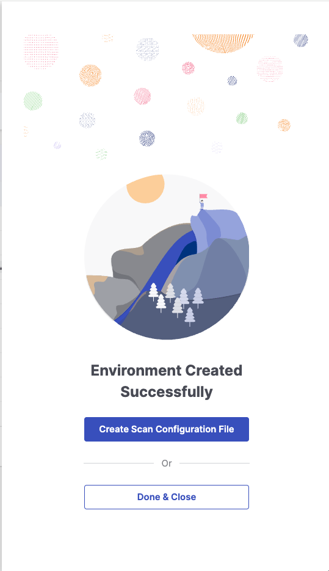
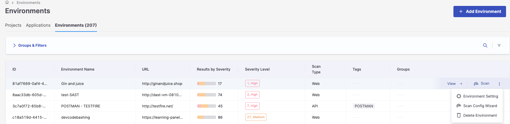
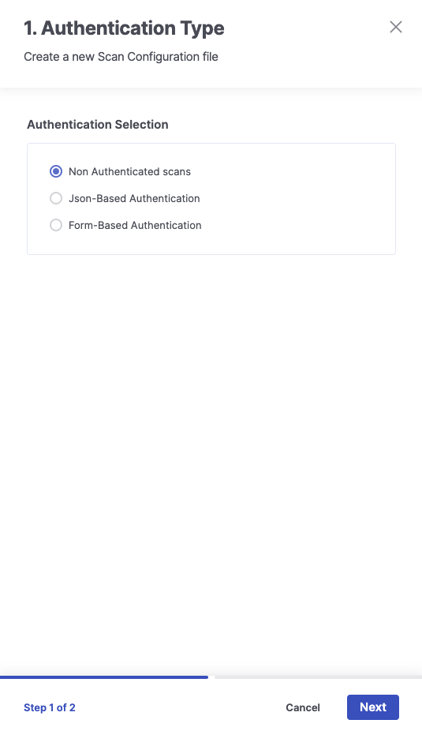
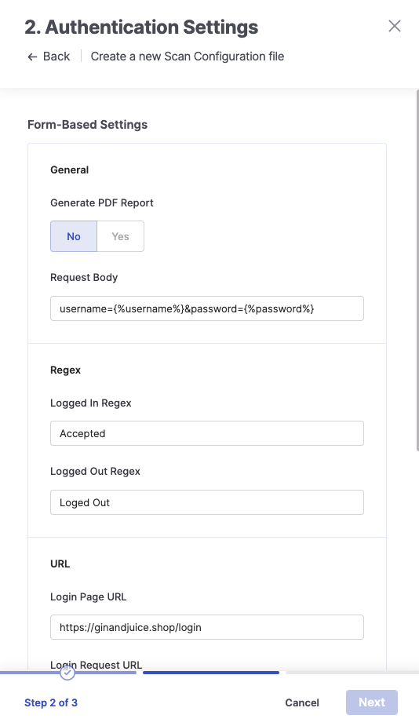
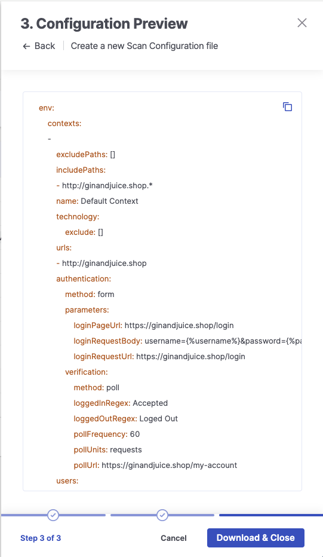

# Configuration File Wizard

This wizard allows you to generate the necessary configuration file to run a Checkmarx DAST scan from the Checkmarx One UI.

## Access

You can access the configuration file wizard in two different ways:

1.  After creating a new environment, the side panel will present you the option to Create a Scan Configuration File

    
<figure><figcaption></figcaption></figure>

2.  Through the ellipsis on the Environments page and selecting Scan Config Wizard

    
<figure><figcaption></figcaption></figure>

## Create a Configuration File

To create a configuration file, first, you must address the type of authentication associated with the file. The current options are:

* Non-Authenticated scans: No authentication mechanism will be used in the scan.
* JSON-Based Authentication: This method is used for websites and web apps where authentication is done by submitting a JSON object to a login URL using a username/password pair of authentication credentials. Re-authentication is possible. When using this authentication method, configuring a User for the scan requires setting up the username/password pair of credentials used for the authentication.
* Form-Based Authentication: This method is used for websites and web apps where authentication is done by submitting a form or performing a GET request to a login URL using a username/password pair of authentication credentials. Re-authentication is possible. Configuring a User for the scan requires setting up the username/password pair of credentials used for the form-based authentication when using this authentication method. If the application requires submitting the anti-CSRF token presented on the login page, the engine will handle it automatically.

<figure><figcaption></figcaption></figure>

After addressing the authentication type, extra mandatory fields must be populated depending on the option selected. For JSON and formed-based authentication types, the following fields will be displayed:


The wizard uses poll-based verification: it periodically requests the Login Poll URL and checks the response against the Logged In/Out Regex patterns to confirm session state.


* Generate PDF Report (default value No): This option addresses whether the wizard should include the report job in PDF format. It will be used when the scan is running locally to deploy the results report as an artifact.
* Request Body: The login request body - if not supplied, a GET request will be used
* Logged In Regex: The Regex pattern determines if the engine can successfully log in.
* Logged Out Regex: Regex pattern to determine if the engine was logged out.
* Login Page URL: The login page URL to read before making the request
* Login Request URL: The URL the login request is submitted to (may differ from Login Page URL)
* Login Poll URL: # String, the URL to poll, only for 'poll' verification
* Username: # String, the username to use when authenticating; vars supported
* Password: # String, the password to use when authenticating; vars supported

More details regarding the configuration file structure are available [here](configuration-file-structure/).

<figure><figcaption></figcaption></figure>

The last step will present a preview of the generated configuration file. Copy the file to the clipboard with the  button or click Download & Close to download the configuration file to your local machine and close the wizard.

<figure><figcaption></figcaption></figure>

## Output

The jobs associated with the configuration file depend on the environment type they are being generated for.

Web: For Web environments, the associated jobs are passiveScan-config, spider, spiderAjax, passiveScan-wait, activeScan, and report (depending on the selected option).

API: For Web environments, the associated jobs are passiveScan-config, openApi, passiveScan-wait, activeScan, and report (depending on the selected option).

More details about the jobs are available [here](configuration-file-structure/jobs-supported/).
