# Generate a ZAP Configuration File

In this section, we explain how a ZAP configuration file can be generated.

1. Install ZAP on your local machine. Download ZAP from the following link: [https://www.zaproxy.org/download/](https://www.zaproxy.org/download/)
2. Open ZAP.
3.  In the hierarchy under Contexts, double-click Default Context.

    
<figure>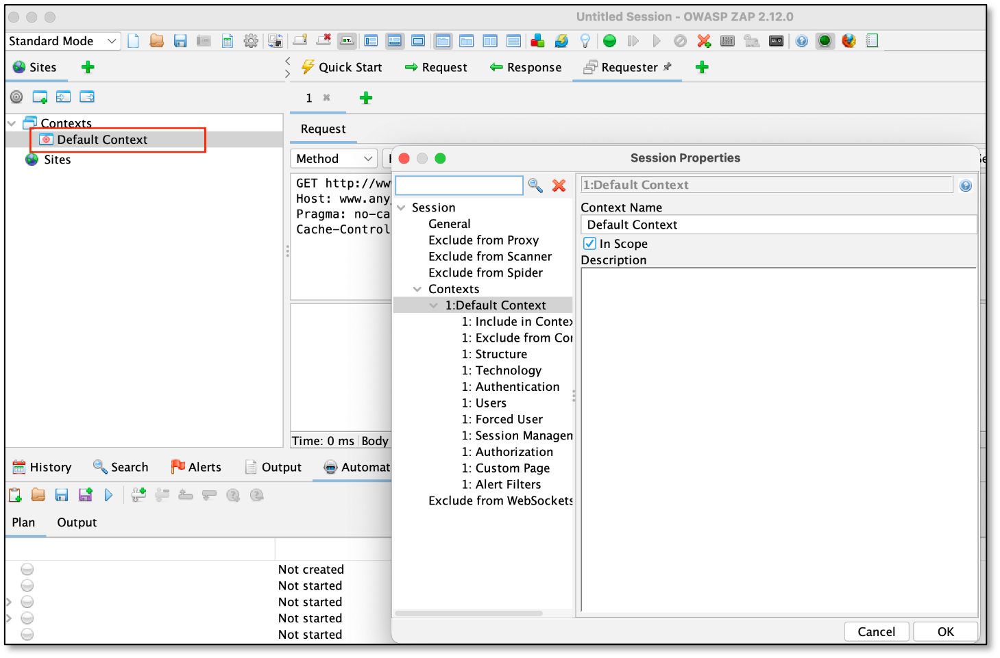<figcaption></figcaption></figure>

4.  Define the URL to do the test. Select the Include in Context option, click Add, enter the URL, and click Add.

    
<figure>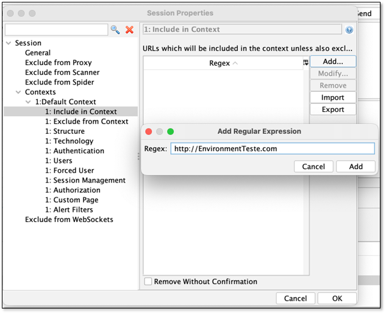<figcaption></figcaption></figure>

5.  Select Authentication and choose the method matching your target's login flow. The supported options are HTTP/NTLM Authentication and Form-based Authentication. The example below shows Form-based Authentication; for HTTP/NTLM, ZAP prompts for the realm, hostname, and credentials instead of a login form URL.

    
<figure>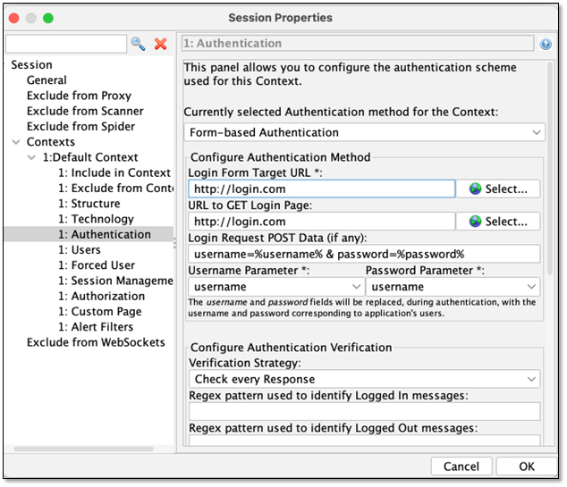<figcaption></figcaption></figure>

6.  Create the user(s) you want to use on the scans.

    
<figure>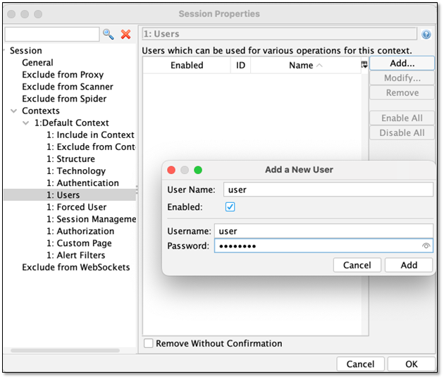<figcaption></figcaption></figure>

7.  Click the + button at the bottom of the window and then click Automation.

    
<figure>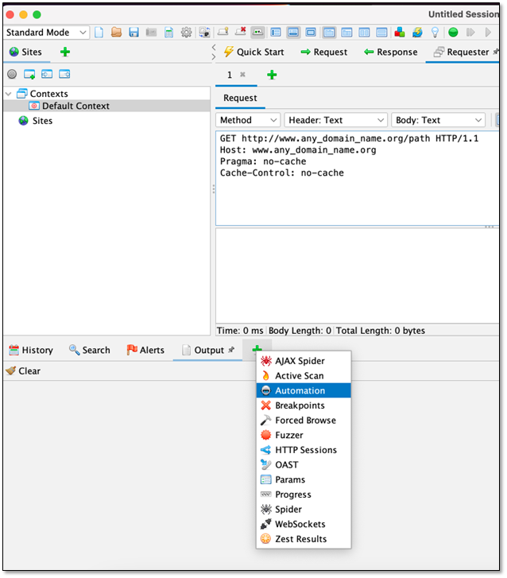<figcaption></figcaption></figure>

8.  Click the New Plan button.

    
<figure>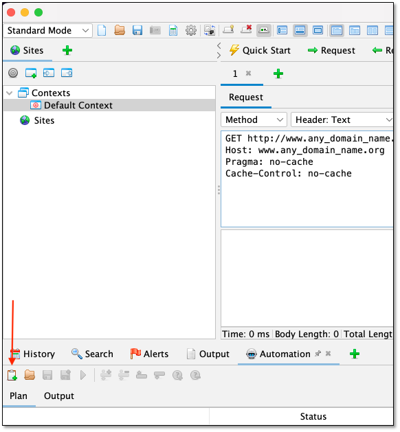<figcaption></figcaption></figure>

9.  Select one of the following profiles:

    Each job performs a specific task in the scan - for example, spider and spiderAjax crawl the target to discover URLs, openapi tests endpoints from an OpenAPI/Swagger spec, and report generates the results report. For the full list of supported jobs and what each configures, see [Jobs Supported](configuration-file-structure/jobs-supported/).

    *   For a web scan, select the Full Scan profile.

        
<figure>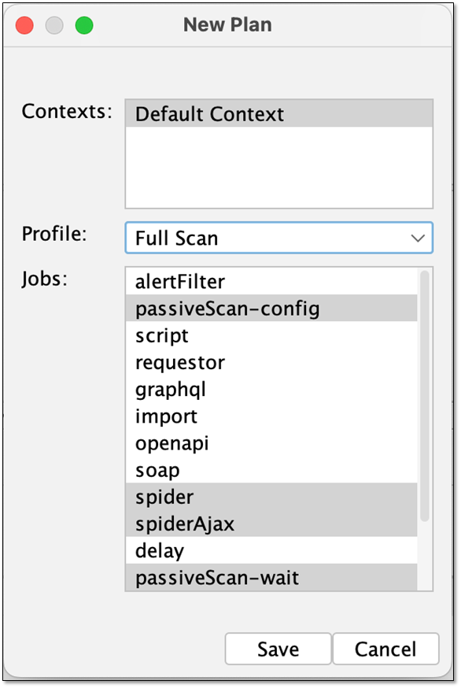<figcaption></figcaption></figure>

    *   For an API scan select the OpenAPI profile.

        
<figure>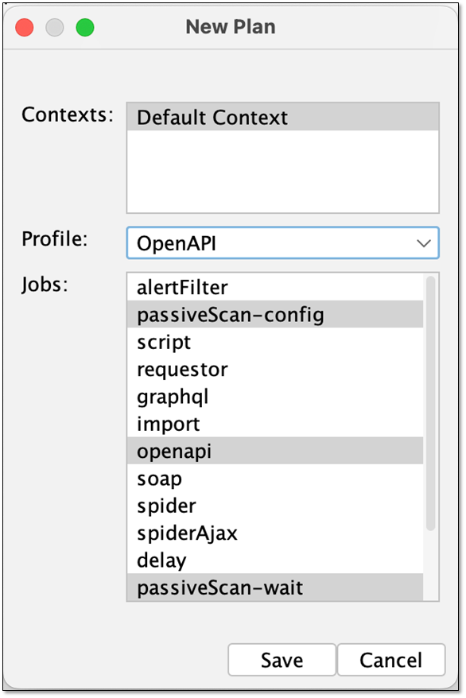<figcaption></figcaption></figure>

    

The type of jobs presented will depend on the add-ons installed. If some of the intended jobs don't appear go to the manage add-on option and install them.

    
<figure>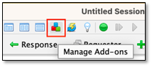<figcaption></figcaption></figure>

10. Click Save.
11. Double-click on each job if you want to change the context associate or in some cases (Spider Ajax for example) to determine the user to use in the job.

    
<figure>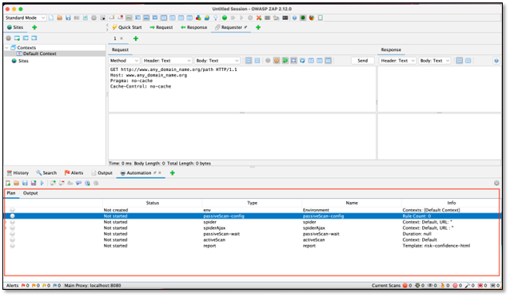<figcaption></figcaption></figure>

    
<figure>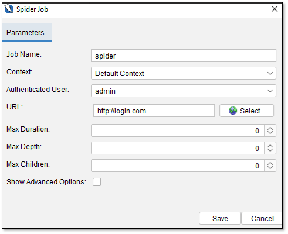<figcaption></figcaption></figure>

    
<figure>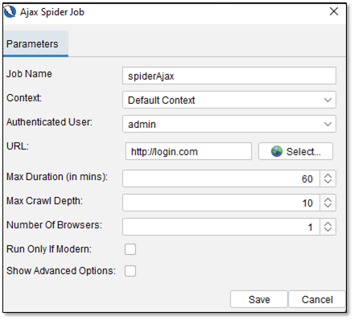<figcaption></figcaption></figure>

12. To save the plan, click the Save As button and then choose the folder.

    
<figure>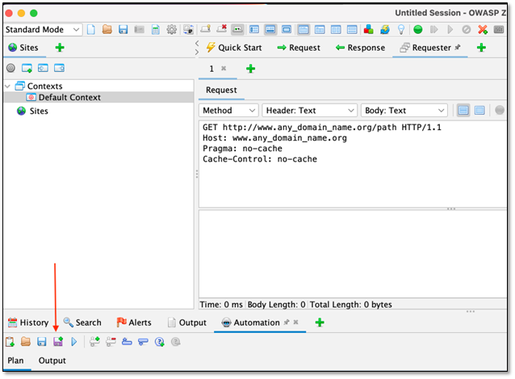<figcaption></figcaption></figure>

    
<figure>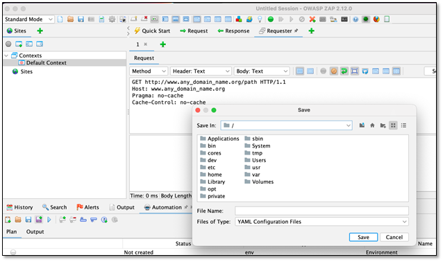<figcaption></figcaption></figure>


Large scans can hit a size limit if the crawler follows static assets. Exclude paths like \*.css, \*.js, \*.png, \*.svg, \*.woff to keep the scan efficient.



When running via the Checkmarx platform, start with 2–4 for numberOfBrowsers/threadPerHost/threadCount rather than higher values.


Here are two examples of configuration files. One for a web scan and the second for an API scan. They are viewable in a text editor like Notepad.

After saving the plan, this file is ready to use. To run a scan with it, see [Running a Scan](../running-a-scan/dast-running-a-scan.md): when creating a new scan for a Web environment, upload this file in the Upload Configuration file section (for an API environment, you'll also need to select a Swagger/Postman file).


You can also download the sample Web/API configuration files above and edit them directly instead of building a plan from scratch in the ZAP GUI.


[API SCAN](https://download.checkmarx.com/cxcustomersdocuments/api.yaml)

[WEB SCAN](https://download.checkmarx.com/cxcustomersdocuments/web.yaml)
