# Viewing Results - Overview

Checkmarx One shows data for all the environments in your tenant account as defined in Access Control. The Environments page (Applications and Projects → Environment tab) shows a table listing all of your environments.

You can also drill down to view the Environments page for an individual environment, which shows information about the scans currently running or that have finished. You can drill down further to view the All risks view, which shows detailed information about each risk identified in the last scan.

## Viewing DAST Results in the Risk Table


Please see [here](../../document/preview/378965/#UUID-c56c498b-6d12-96dd-54a8-430f36946bd0) for details on triaging your DAST results.


### Alerts and Paths

Before viewing your risk table, note that there are two ways Checkmarx organizes DAST results: Alerts and Paths. Checkmarx recommends using the Alerts view for organizing DAST results. Alerts are the default setting for new Checkmarx users. Alerts groups DAST results by vulnerability type, while Paths organize each vulnerability by the result's path. Perform the following to switch between the Alerts view and the Paths view:

1. Navigate to Global Settings.
2. Select DAST.
3. Select the display mode: By Vulnerability or By Path.
4. Click Save when done.

In the Alerts view, clicking a result's View opens a panel displaying all its related instances. Clicking on a specific instance will provide more details and the evidence of the vulnerability.


Scans run while the tenant is set to By Path mode will not appear on the Overview, Risk Management, or Applications screens.


### Overview Tab

Clicking  at the end of a result's row opens the result's overview. The overview tab displays an at‑a‑glance summary of an environment, including associated applications, groups, and users; scan dates and times; and high‑level dashboards of the discovered vulnerabilities and compliance postures. You can run a new scan for the environment by clicking Scan at the top of the page. Clicking  will open the settings for that environment. Clicking  will open a dropdown of all the other actions for the environment.

<figure>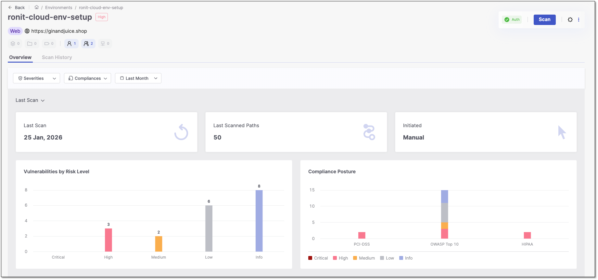<figcaption></figcaption></figure>


If the tenant's display mode is set to By Path, results from that scan will not appear in this overview. See the above [note](dast-viewing-results-overview.md#UUID-30427aa1-570e-611b-29b4-f58a8ace7f5e_section-id235387000509417).


### Results Table Tab

Click Results at the end of an environment row to open the Results Table tab alongside the Site Tree tab. The results table lists all vulnerabilities in your environment and organizes them by the following columns: Severity, Vulnerability Type, Instances, Compliance, State, Status, and Notes.

* Severity - the vulnerability severity level: Critical , High, Medium, Low, or Info
* Vulnerability Type - the vulnerability type.
* Instances - the number of instances the vulnerability appears
* Compliance - when marked, the results failed to comply with one of the following standards: HIPAA, OWASP Top 10, PCI-DSS
* State - the vulnerability state: To Verify, Confirmed, Urgent, Proposed Not Exploitable, Not Exploitable
* Status - the vulnerability status: New or Recurrent
* Notes - Any notes on the vulnerability.

By default, the table displays 10 rows, but you can change this to 20 or 50 in the dropdown. The table is paginated, and you can save your preferred view by selecting Set as Default.

You can also group or filter the data. To group results, add a grouping category such as Severity or Vulnerability Type. To filter results, hover over a column header, select , and choose your filter options from the drop‑down menu. Columns can also be sorted in ascending or descending order by clicking the header.

<figure>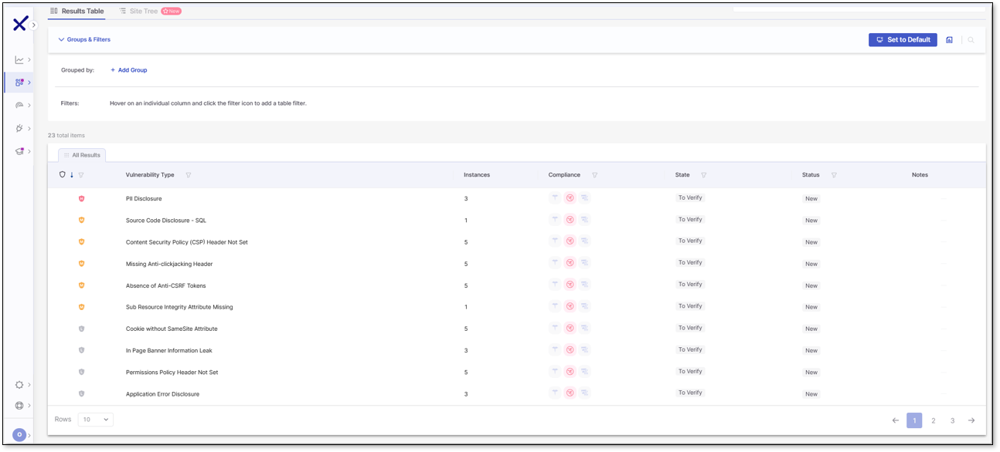<figcaption></figcaption></figure>

#### Columns Management

Use the Columns Management panel  to tailor your table view. You can show or hide columns, pin key ones to lock their place in the table, and drag others to reorder them for better visibility.

<figure><figcaption></figcaption></figure>

* Show/Hide Columns: Toggle columns on or off to display or remove them from the table.
  * Hiding columns clears any filters applied to them.
  * If you hide a column that was part of a sorting rule, that sorting will be cleared, and the table will revert to its default sort order. This ensures the table view remains consistent, displaying only visible data.
  * Hiding a column updates the counter (ex: 4)
* Pin Columns: Pin up to 3 columns to lock their position in the table. Pinned columns move to the top of the list, just below the default pinned columns.
* Reorder Columns: Drag columns up or down in the list to change their position. Columns listed from top to bottom will appear from left to right in the table.

Click the Apply button to confirm and apply your adjustments in the table.

To further tweak the table view, hover your mouse over the line between columns until an arrow icon appears, then drag to adjust the column width.

### Accessing Risk Details

To access the risk details, click on the row for the risk you need details on. A new window will open, presenting a brief description of the risk and its resolution.

<figure>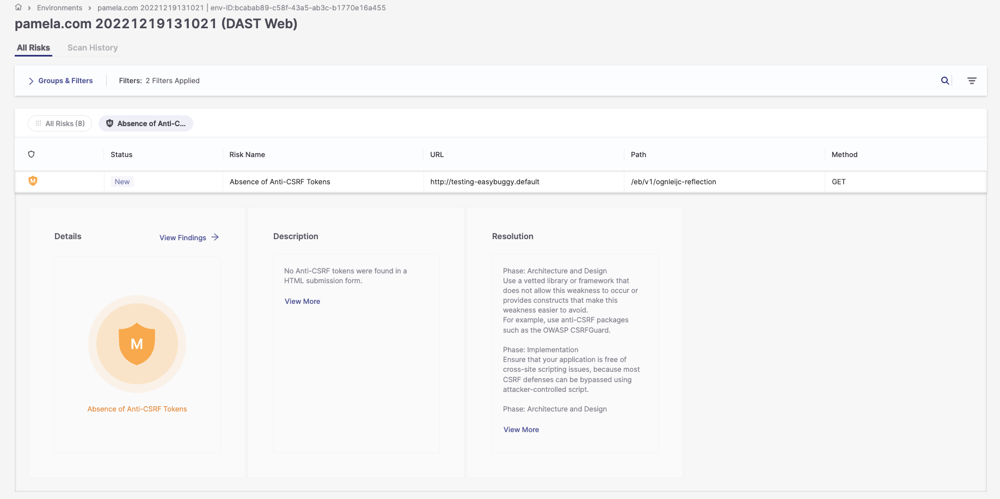<figcaption></figcaption></figure>

To access more information regarding the risks:

1\. Click on the Severity button.

<figure>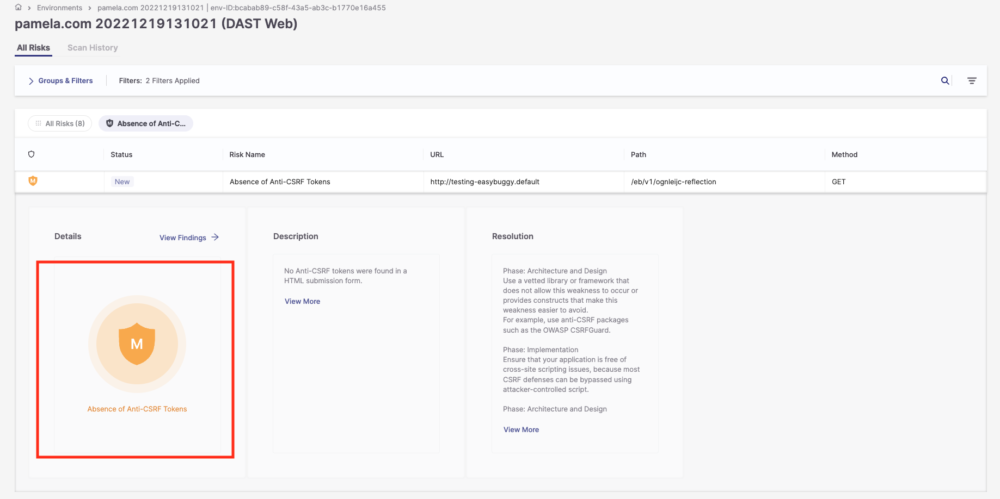<figcaption></figcaption></figure>

The following additional fields are displayed:

* State
* Risk level
* Compliance
* Confidence
* Method
* Param
* URI
* Evidence
*   Attack

    | State                    | Meaning                                                                                             |
    | ------------------------ | --------------------------------------------------------------------------------------------------- |
    | To Verify                | Default state for new or unreviewed findings.                                                       |
    | Confirmed                | You've verified the finding is a real, exploitable vulnerability.                                   |
    | Urgent                   | Confirmed and flagged for immediate remediation.                                                    |
    | Proposed Not Exploitable | You believe the finding isn't exploitable, but this is a provisional judgment pending final review. |
    | Not Exploitable          | You've determined the finding is not exploitable in your environment.                               |

    States can affect policy enforcement (for example, build-breaking rules) in your account. For details on changing a state and the note requirements involved, see [Triaging DAST Vulnerabilities](../../document/preview/378965/#UUID-c56c498b-6d12-96dd-54a8-430f36946bd0).

    

Changing a result's state to Not Exploitable or Proposed Not Exploitable requires you to add a note confirming the change.

<figure>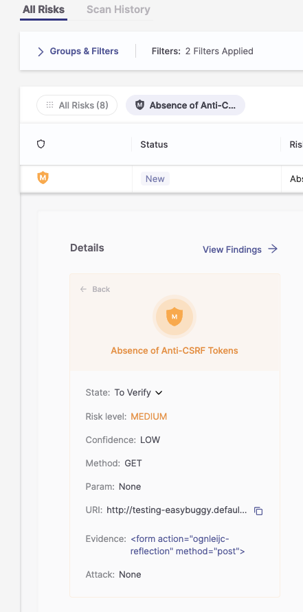<figcaption></figcaption></figure>

2\. In the Description pane, click View More to display a full explanation of the risk.

<figure>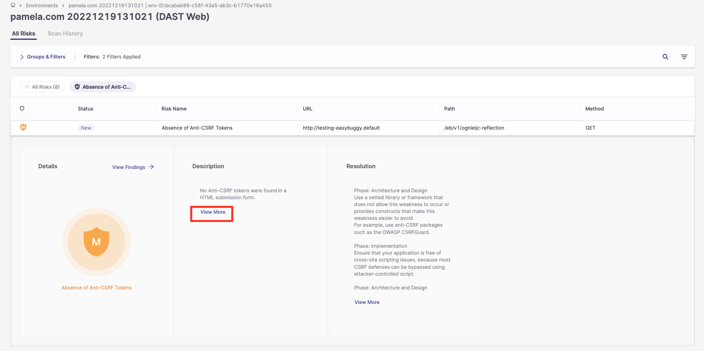<figcaption></figcaption></figure>

<figure>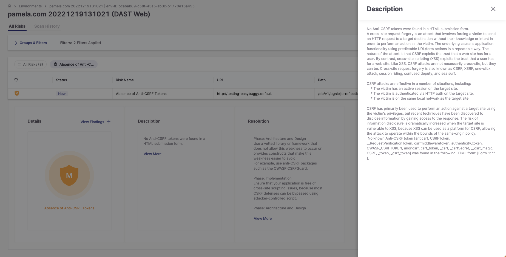<figcaption></figcaption></figure>

3\. In the Resolution pane, click View More to display a full explanation of how to resolve the risk.

<figure>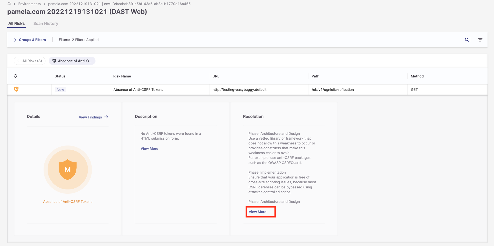<figcaption></figcaption></figure>

4\. Click View Findings to open a side panel with the following information:

* Risk Level
* Risk State
* Request Headers
*   Response Body and Headers

    This panel also lets you update the risk's Severity and State directly; click Save to apply your changes or Cancel to discard them. For guidance on choosing the right state and any note requirements, see [Triaging DAST Vulnerabilities](../../document/preview/378965/#UUID-c56c498b-6d12-96dd-54a8-430f36946bd0).

<figure>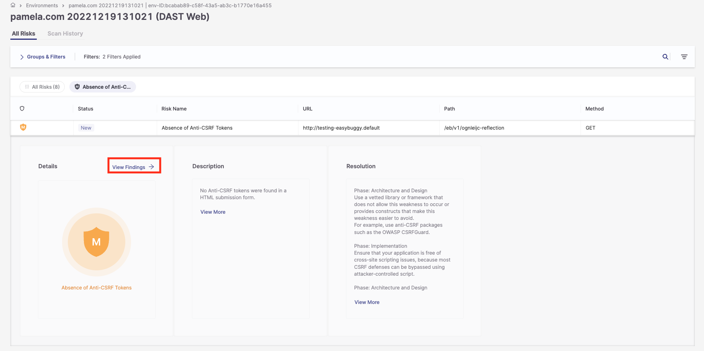<figcaption></figcaption></figure>

<figure>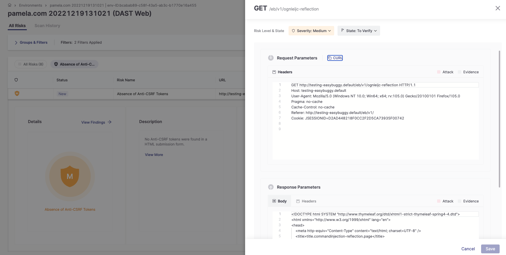<figcaption></figcaption></figure>

### Site Tree View Tab

The Site Tree visually maps your application's structures and scanned paths. It helps you visualize the hierarchy of URLs and their scans, so you can see which parts of the web application were scanned and how they are organized. A new Site Tree is created for each successful scan and appears in the Site Tree tab, separate from the Results Table.

The Site Tree is displayed in a resizable panel, enabling you to adjust the view according to your preference or screen size. Any paths where vulnerabilities are detected are visually marked with severity indicators.

Clicking on a path in the Sites Tree reveals detailed information about that node.

<figure>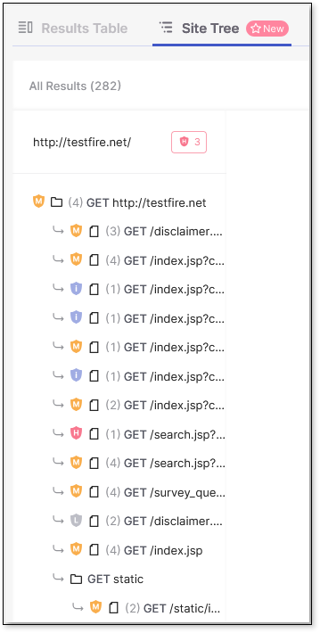<figcaption></figcaption></figure>

## Scan History

The Scan History tab provides access to the results of all successful scans. Similar to adjusting results on the Results Table, you can adjust the severity or status of results in Scan History, and any changes will automatically affect other related scans.

<figure>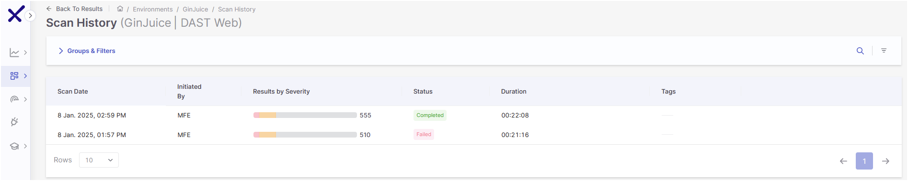<figcaption></figcaption></figure>

After completing a scan, the latest results are displayed in the Results Table, while previous results are moved to and can be viewed in the Scan History tab. No specific role is required to access scan history, and you can access it through the Environment by selecting View on a scan with results. This opens the environment's scan results page, where you can access Scan History via the top-right menu.

<figure>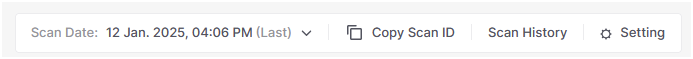<figcaption></figcaption></figure>

There are three statuses for scans: Completed, Failed, and Partial Scans. Completed scans are successful scans, while Failed scans are those scans that failed to run. Partial scans are scans that have been completed but contain errors. Download the scan logs to see what went wrong in the scan by clicking  at the end of the result's row and then Download Scan Log.

### Insights in DAST Scans

An insight is information generated by ZAP that is highly relevant to the scan but not classified as a vulnerability. Insights highlight conditions that may affect the accuracy, reliability, or validity of the scan, and they can even point to issues unrelated to the target application itself. They help you understand how the application behaves, whether the scan is progressing effectively, and whether external factors- such as authentication failures, blocking mechanisms, or repeated server errors- are interfering with the process. When a High‑level insight is detected, DAST immediately stops the scan and marks it as Failed because continuing would produce misleading or incomplete results. Hovering over the scan result reveals the specific reason, and selecting Learn More redirects to the documentation on the ZAP site. A full list of available insights is available [here](https://www.zaproxy.org/docs/desktop/addons/insights/insights-list/).

<figure>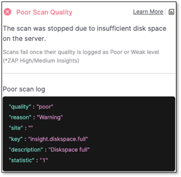<figcaption></figcaption></figure>

