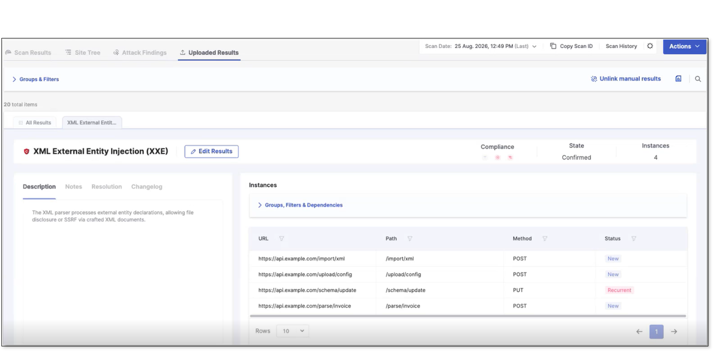
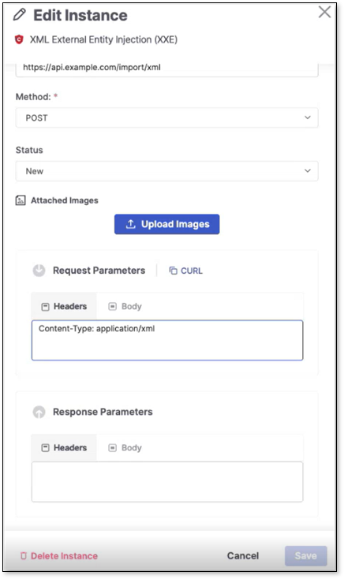

# Importing Manual Testing Results

Importing manual testing results lets you attach manually identified vulnerabilities to an existing DAST scan, giving you a single, unified view of automated and manual findings for that scan.

## Prerequisites

Scan status: You can only upload manual results against scans that have already completed - either a regular or a partial scan. Manual results can't be attached to a scan that is still running.

Permissions: Uploading requires the import-findings-external-platforms role.

## Supported File Formats

| Item                           | Limit/Format                             |
| ------------------------------ | ---------------------------------------- |
| Image formats (for Instance)   | PNG, JPEG, GIF, WEBP                     |
| Max files per upload request   | 10                                       |
| Max files per finding instance | 10 cumulative (existing + new - deleted) |
| Max file size                  | 10 MB per file                           |
| Manual results upload file     | JSON only                                |

## Uploading Manual Results


For the CLI commands see [Manual Results (CLI)](../using-the-dast-cli/using-the-dast-cli-overview.md#UUID-dbaec061-a2c5-ebfd-fc9c-9281e892763b_section-idm373579268746974).


Perform the following to upload manual results:

1. Go to the Scan Results page.
2. Open Actions > Upload manual results.
3. Choose which scans the results should apply to: The current scan only or all future scans.
4. Select and upload your JSON file. Click Apply when done.
5. Once uploaded, the results appear under the newly added Uploaded Results tab.

Clicking on a result in the Uploaded Results opens the vulnerability result view page. Clicking Edit Results opens the result for editing, including fields under Advanced Settings that aren't editable on regular scan results.


The change log only tracks edits to the Severity, State, and Notes fields. Edits made via Advanced Settings are not reflected in the change log.


<figure><figcaption></figcaption></figure>

In the Instances table of the result view, you can click View → at the end of an instance's row to view the instance data - Path, URL, Method, Status, and both Request and Response Parameters (headers and body). Use the CURL tab to copy the request as a curl command.

In the Instance table, click Edit to edit the instance to adjust any of the fields as well as upload images. Click Save when done. To delete the instance, click Delete Instance.

<figure><figcaption></figcaption></figure>

Above the results table, click Unlink manual results to unlink the results from the current scan or future scans or both. Unlinked results are removed from the result view and aren't included in the scan history.

## Deleting Manual Findings

To permanently remove a manual finding, open it from the Uploaded Results tab > Edit Results and click Delete Alert. Deleting a finding removes it - and all its instances - from the scan entirely.


Deleting a finding is permanent. If you only want to remove it from this scan while keeping the data, use Unlink manual results instead.

