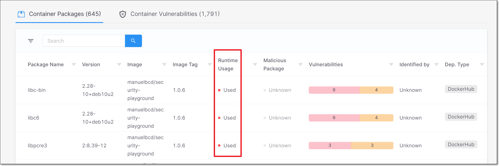
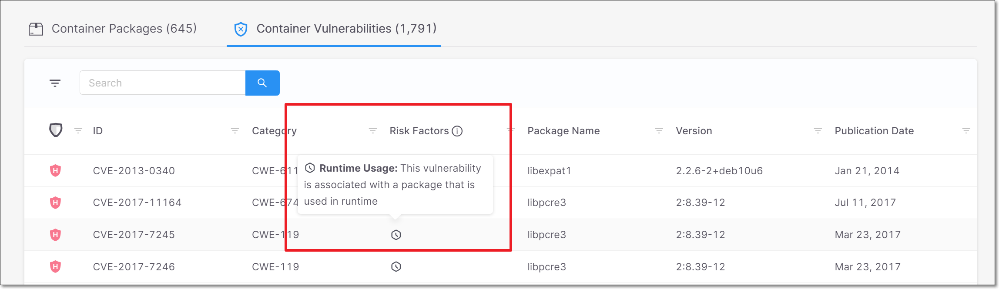
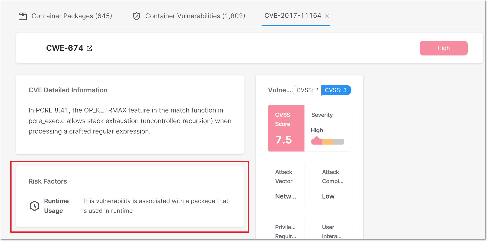

# Checkmarx SCA Sysdig Integration - Runtime Usage


This document relates to the SCA standalone platform. Users who consume SCA through Checkmarx One should refer to [Checkmarx One Sysdig Integration - Runtime Usage](../document/preview/202076/#UUID-bf59bb38-742c-2184-8ad2-7392c642da00).


## Overview

We have implemented a new integration with [Sysdig Risk Spotlight](https://docs.sysdig.com/en/docs/sysdig-secure/vulnerabilities/runtime/risk-spotlight/), which identifies runtime usage of container packages. Once the integration is configured, the runtime usage data that was identified by Sysdig is shown as part of the Checkmarx scan results. This provides important insights for prioritizing remediation activities based on actual risk of exploitation.

### Prerequisites

* You need to have a Sysdig license and you need to obtain a Sysdig Risk Spotlight Token for your account.
* Make sure that your Sysdig agents are configured to cover all images that you will be scanning in Checkmarx.

### Limitations

Sysdig doesn't provide runtime data for base-images.

## Setting up the Integration

The integration needs to be configured by Checkmarx personnel. Please contact your Checkmarx account agent and provide them with:

* The base URL for your Sysdig region (e.g., https://us2.app.sysdig.com)
* Your Sysdig Risk Spotlight token
* Cluster name (optional)

## Preparing the Tools

In order to get results for runtime usage you need to scan the built image created from the docker file in your local environment. This is done using the [SCA Resolver](../checkmarx-sca-resolver/checkmarx-sca-resolver-overview.md) tool.

1.  Download and install the SCA Resolver tool as described [here](../checkmarx-sca-resolver/checkmarx-sca-resolver-download-and-installation/).

    <div data-gb-custom-block data-tag="hint" data-style="info" data-icon="pencil" class="hint hint-info"><p>Make sure that all relevant package managers are installed on your local environment, see <a href="../checkmarx-sca-resolver/checkmarx-sca-resolver-download-and-installation/installing-supported-package-managers-for-resolver.md">Installing Supported Package Managers for Resolver</a>.</p></div>
2. Download and install [Syft](https://github.com/anchore/syft/blob/main/README.md) version 0.83.1 from [here](https://github.com/anchore/syft/releases/tag/v0.83.1).


It is generally preferable to install both tools in the same folder. Make sure that the user running the scans has write privileges to the folder/s in which these tools are located.


## Scanning Images Using the SCA Resolver

<details>

<summary>Prerequisites</summary>

* You need to have the name and tag for each of the images that you would like to scan.
*   If you are using a private repo, you need to be authenticated for your registry.

    <div data-gb-custom-block data-tag="hint" data-style="info" data-icon="pencil" class="hint hint-info"><p>Authentication can be done via Docker or Podman.</p><p>Alternatively, you can use the syft login command, as follows: <code>syft login &#x3C;private_registry_domain> -u &#x3C;your_username> -p &#x3C;your_password></code></p><p>Before running the scan, it is recommended to verify that you are able to access the image on your local machine.</p></div>
*   You need to have the following info about your Checkmarx SCA account: **account name**, **username** and **password**.

    <div data-gb-custom-block data-tag="hint" data-style="info" data-icon="pencil" class="hint hint-info"><p>If you authenticate via a SAML provider, then providing user credentials is not necessary. See <a href="../checkmarx-sca-resolver/saml-authentication-for-checkmarx-sca-resolver.md">SAML Authentication for Checkmarx SCA Resolver</a>.</p></div>

</details>

The following procedure explains the standard procedure for running a container scan using SCA Resolver in Online mode. To learn about running scans in Offline mode as well as other scanning options, see [Running Scans Using Checkmarx SCA Resolver](../checkmarx-sca-resolver/running-scans-using-checkmarx-sca-resolver.md).

For more info about Checkmarx container scans, see [Container Scans](../checkmarx-sca-product-info/container-scans.md).

1.  Create a run command `ScaResolver.exe` (Windows) or `ScaResolver` (Linux) with the following mandatory arguments.

    -s : path to the folder to scan

    <div data-gb-custom-block data-tag="hint" data-style="info" data-icon="pencil" class="hint hint-info"><p>This must be the path to a local folder that contains the source code, not to a zip archive or a code repository.</p></div>

    <div data-gb-custom-block data-tag="hint" data-style="info" data-icon="pencil" class="hint hint-info"><p>If you want to scan only specific images (not an entire project), do the following:</p><ol><li>Create a "dummy" folder in your project (for use in the <code>-s</code> parameter) and give it a name that indicates that it is used for scanning images, e.g., scan_ecr_image.</li><li>In the Resolver scan command, for the <code>-s</code> parameter give the path to the "dummy" folder that you created, e.g., <code>/Users/DemoUser/scan_ecr_image</code>.</li></ol></div>

    -n : to scan an existing Project, enter the name of the Project. OR,

    to create a new Project, enter a new name to assign to the Project

    -a : your Checkmarx SCA account name

    -u : your username

    -p : your password

    <div data-gb-custom-block data-tag="hint" data-style="info" data-icon="pencil" class="hint hint-info"><p>If you authenticate via a SAML provider, then providing user credentials is not necessary. See <a href="../checkmarx-sca-resolver/saml-authentication-for-checkmarx-sca-resolver.md">SAML Authentication for Checkmarx SCA Resolver</a>.</p></div>

    The following example shows a run command using the mandatory arguments:
2. You can add additional arguments to specify the desired scan configuration, see [Checkmarx SCA Resolver Configuration Arguments](../checkmarx-sca-resolver/checkmarx-sca-resolver-configuration-arguments.md).
3. Add the `--scan-containers` flag to the SCA Resolver scan command.
4. Add the `--images` flag followed by a comma separated list of images. Specify each image using the following syntax {image\_name}:{image\_tag}.

The following example shows a command to run a container scan on specific images.



```
./ScaResolver -s /Users/DemoUser/scan_ecr_image -n DemoImageScan -a Checkmarx -u jack -p 'demo123!' --scan-containers --images “debian:11, alpine:latest”
```



```
./ScaResolver.exe -s C:\Users\DemoUser\scan_ecr_image -n DemoImageScan -a Checkmarx -u jack -p "demo123!" --scan-containers --images “debian:11, alpine:latest”
```



## Viewing Runtime Data

Once the integration has been configured for your account, whenever you run a scan on an image that is covered by your Sysdig deployment, the Checkmarx scan results will be supplemented with the runtime data.

### Container Packages Tab

In the Container Packages tab, there is a column Runtime Usage which indicates which packages are used in runtime.

<div align="left"><figure><figcaption></figcaption></figure></div>

Possible values for Runtime Usage are:

* Used - Runtime usage of this package was identified.
* Not Used - No runtime usage of this package was identified.
* Not Eligible - Runtime analysis isn’t supported for this package (for example, base-images aren't scanned by Sysdig).
* Not Found - We couldn’t identify runtime usage because this package isn’t covered by your runtime security integration. Try adjusting the configuration of your runtime security integration so that all relevant clusters are covered.

### Container Vulnerabilities Tab

In the Containers Vulnerabilities tab, runtime usage is shown as a Risk Factor for vulnerabilities that are associated with used packages.

<div align="left"><figure><figcaption></figcaption></figure></div>

Also, when you drill-down to open the details page for a specific vulnerability, runtime usage is shown as a Risk Factor.

<div align="left"><figure><figcaption></figcaption></figure></div>
