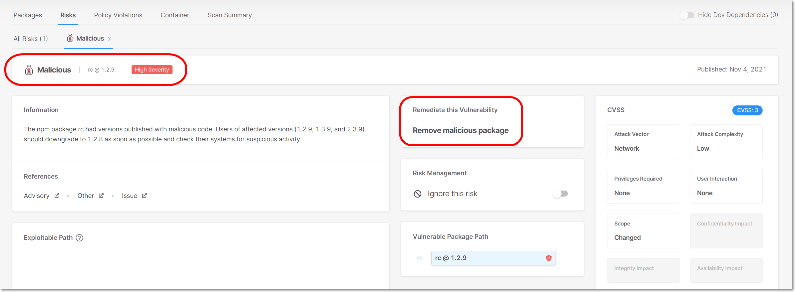

# Malicious Packages

Our AppSec team is constantly updating our database of known malicious packages. We identify packages that are malicious for all versions, as well as packages for which only specific versions are malicious. The Checkmarx SCA scanner identifies these packages when they are used in your projects and lists them among your Project’s risks. Checkmarx flags these packages as having a Suspected Malware risk and labels the category as Malicious in order to call attention to the extreme risk posed by these packages. For packages that have non-malicious versions, we give remediation recommendations.

Click on a Suspected Malware risk to view detailed info about the risk.

<figure><figcaption></figcaption></figure>

