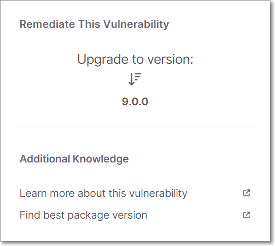
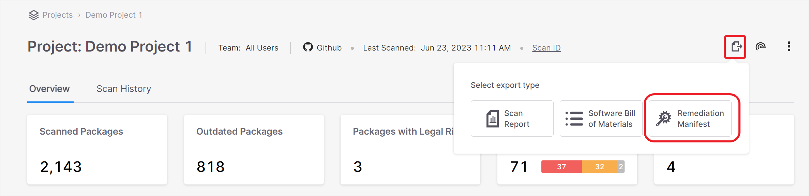
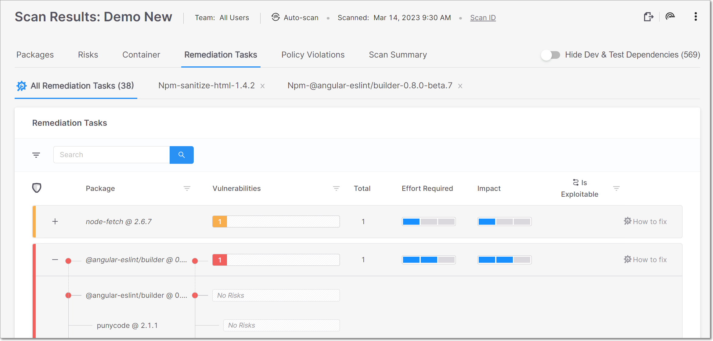

# Remediating SCA Risks

The goal of SCA remediation is to ensure that your project isn't using vulnerable package versions either directly or transitively. In some cases, this can be done by simply upgrading to a different version of the same package which is more secure. However, this needs to be done with caution because changing the package version (especially to a different major version) may break some of the methods used in your code. If there is no simple fix for the risk, than you can consider the following options:

* If the risk is acceptable to you (low severity) then you may choose to leave the vulnerable package in place
* If the vulnerable package isn't used, or if there is no Exploitable Path to the vulnerable method, then you may choose to leave the vulnerable version in place
* You can replace the package with a newer version and make the required adjustments in your source code to fix the broken methods
* You can replace the package with an alternative package that has similar functionality but is more secure

## Prioritizing Remediation Tasks

Checkmarx SCA helps you to prioritize (triage) remediation activities by providing important info about the steps required for the remediation, and the impact that the remediation task will have. The following are some of the factors that you should consider when triaging results, and an explanation of how Checkmarx SCA helps with this process.


While you triage the results, you can mark the status of each vulnerability as **To Verify**, **Not Exploitable**, **Proposed Not Exploitable**, **Confirmed** or **Urgent**. See [Risk Management](../checkmarx-sca-user-guide/risk-management-beta.md)


* Severity - On the Scan Results > Packages tab, the risk level of the package is shown, as well the number of vulnerabilities of each severity level that affect the package. This inf is also available in the AppSec Knowledge Center > Package page.
* Exploitability - Checkmarx provides info for three factors that affect exploitablility. This info is shown in the Scan Results > Risks tab for each vulnerability in the scan. (KEV and POV are also shown in the AppSec Knowledge Center > Vulnerabilities page.)
  * Exploitable Path - If your project has been scanned with the the Exploitable Path feature activated, then the scan results indicate whether the vulnerable method is actually called in your source code.
  * KEV - A vulnerability that is cataloged by CISA as a Known Exploited Vulnerability (KEV), indicating that it poses a severe and imminent threat.
  * POC - A Proof of Concept (POC) for exploiting this vulnerability is available in the wild, making it easy for threat actors to implement an exploitation of this vulnerability.
*   Usage - On the Scan Results > Packages tab, Checkmarx indicates whether or not the package is used by your source code. For transitive dependencies, we indicate whether it is "Potentially Used", i.e., if it is a dependency of a package that is used.

    

Usage info is only provided for scans that were run with the Exploitable Path feature activated.

    

The fact that a vulnerable package is used doesn't necessarily indicate that the vulnerable method itself is called. That is only known when SCA indicates that there is an Exploitable Path to the vulnerability.

* Number of references - if a vulnerable transitive package is referenced by several different paths, these vulnerabilities can be remediated by simply adding the non-vulnerable version to the manifest file. This info is shown in the Scan Results > Packages tab.

## Checkmarx SCA Remediation Recommendations

Checkmarx SCA offers recommendations for effective remediation actions. Checkmarx offers this information in various formats throughout the webapp. The following sections describe the various methods and explain the advantages as well as the limitation of each method.

### Method 1 - Upgrade to Version

While viewing Scan Results, the Vulnerability details screen shows a section Remediate this Vulnerability. If Checkmarx is aware of an alternative version of the package that doesn't have this particular vulnerability, then the Upgrade to version section shows the next version up from the current version that doesn't have this vulnerability.


If you would like to find a version that doesn't have any vulnerabilities, click on the Find best package version link, which takes you to the AppSec Knowledge Center.


<figure><figcaption></figcaption></figure>

#### Advantages

* Broad Support - This info is provided for packages associated with any platform/package manager supported by SCA.

#### Limitations

*   Vulnerability Specific - This recommendation relates only to remediation of the specific vulnerability that is being viewed. The recommended version may still have other vulnerabilities associated with it.

    

You can click on Find best package at the bottom of the Upgrade to version section to open the AppSecKnowledge Center where you can find info about all vulnerabilities associated with each version of the package.

*   Manual Implementation - Changes must be made manually. The Vulnerable package path is shown at the bottom of the screen, enabling you to identify where the change needs to be made.

    

For Checkmarx One customers using the VS Code or JetBrains plugin, there is a one-click method for implementing the recommendation in your code.

### Method 2 - Remediation Manifest

Checkmarx enables you to generate a remediated manifest file for your project. Checkmarx provides a new manifest file that contains the recommended versions for your packages. You can download the remediated manifest file and use it to update your project.

This feature is accessed from the Scan Results screen by clicking on the  icon and selecting Remediation Manifest. For more info, see [Remediation using a Manifest File](../checkmarx-sca-user-guide/remediation-using-a-manifest-file.md).

<figure><figcaption></figcaption></figure>

#### Advantages

* Easy to implement, just download the file and place it in the proper file path
* Remediates multiple vulnerable packages with one action

#### Limitations

* Supported only for npm `package.json` manifest files
* Remediates only direct dependencies (not transitive)
* Because this method updates all vulnerable packages (sometimes changing a major version) it may break methods used in your code. You may need to refactor your code to avoid changes in functionality.

### Method 3 - Remediation Tasks Tab

The Remediation Tasks tab shows detailed information about specific remediation tasks that Checkmarx recommends implementing for your Project. These tasks involve replacing vulnerable packages in your project with non-vulnerable versions of those packages. For more info, see [Remediation Tasks Tab](../checkmarx-sca-user-guide/viewing-results/viewing-the-project-page/project-page-tabs.md#UUID-4838541d-dfbc-58bb-cef1-5e9c58de543c).

<figure><figcaption></figcaption></figure>

The Remediation Tasks tab contains sub-tabs that show two types of pages:

* All Remediation Tasks – shows a list of remediation tasks that are recommended for this Project, with general info about each task, including an assessment of the Effort Required and Impact for each task.
* Task Details – shows detailed info about a specific task, including the Developer Walkthrough which gives clear instructions for each step in the remediation process. The task details tab is opened by clicking on the How to fix button in a task row in the All Remediation Tasks sub-tab.

#### Advantages

* Facilitates triage by showing assessment of Effort Required and Impact (based on proprietary algorithms) for each task
* Gives detailed steps for remediating each vulnerable package
*   Gives recommendations for remediating both direct and transitive packages

    

Recommended steps for remediating transitive packages are given for each package independently. Checkmarx recommends a secure version of the package, which can be added to the manifest file in order to ensure that only that version will be used.

In some cases, it may be possible to remediate transitive dependencies by upgrading the direct dependency to a version that references newer versions of the transitive packages. For Maven packages, the Maven repository shows the transitive package versions referenced by each package.

*   Identifies broken methods caused by upgrading packages

    

Broken methods are only identified in scans for which the Exploitable Path feature is run.

#### Limitations

* Supported only for JavaSript npm packages and for Nuget packages with .csproj manifest files.
* Because this method updates all vulnerable packages to the next suitable version (sometimes changing a major version) it may break methods used in your code. You may need to refactor your code to avoid changes in functionality.
