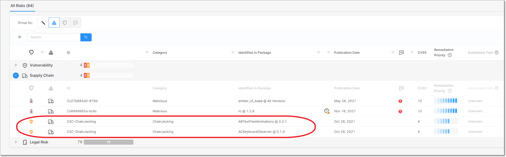

# Checkmarx SCA Release Notes January 2022

We are excited to announce important improvements in our Checkmarx SCA web application…

## Key improvements

### ChainJacking Risks

Checkmarx SCA now identifies Supply Chain risks for packages that are vulnerable to ChainJacking.

ChainJacking is when an attacker takes control of a renamed GitHub repository and hijacks its open-source packages in order to serve malicious code through those packages. Any package that stores its code in a renamed GitHub repository is vulnerable to this type of attack. See full documentation here.

<figure><figcaption></figcaption></figure>

### Plugin Support for Checkmarx SCA Resolver

The Checkmarx plugins for Jenkins and Azure DevOps now support integration with Checkmarx SCA Resolver.


Checkmarx SCA Resolver is a Checkmarx tool that enables you to resolve and extract dependencies and fingerprints from your source code locally and send the data to the Checkmarx SCA cloud platform for risk analysis.


For Jenkins integration procedures, see “Configuring the Jenkins Plugin for Scanning” [here](../../../document/preview/8157/#UUID-4f3bc676-dae6-9685-acd1-f131d4f3b4f3).

For Azure DevOps integration procedures, see “Adding a Checkmarx SCA Scan Project” [here](../../../document/preview/8190/#UUID-26d4e2d4-da3f-f72c-4042-c459c95300bc).

### Checkmarx SCA Resolver Updates

We released Resolver version 1.5.71 with the following improvements:

* When Checkmarx SCA Resolver runs a scan with Exploitable Path, the Project settings are automatically updated to activate Exploitable Path on the Project level. (Previously, EP needed to be activated for the Project before it could be run in Checkmarx SCA Resolver.)
* For sbt, we no longer change the `.sbtopts` file in order to force dependency resolution through Ivy. Dependencies will be resolved using the customer’s sbt resolver.

Download the latest version of Resolver [here](../../../checkmarx-sca-resolver/checkmarx-sca-resolver-download-and-installation/).

## Improvements

| Status | Item                | Description                                                      |
| ------ | ------------------- | ---------------------------------------------------------------- |
| UPDATE | Pip dependency tree | Pip now uses a new tree converter to create the dependency tree. |
| UPDATE | Exploitable Path    | Improved scan times for large Exploitable Path scans.            |
| UPDATE | Unresolved packages | Improved handling of unresolved packages.                        |

## Bug Fixes

| Status | Item                         | Description                                                                     |
| ------ | ---------------------------- | ------------------------------------------------------------------------------- |
| FIXED  | Vulnerability identification | Removed mistaken matches for log4j vulnerabilities.                             |
| FIXED  | iOS package release dates    | Fixed issue that release dates for some cocoa pod packages had been inaccurate. |
