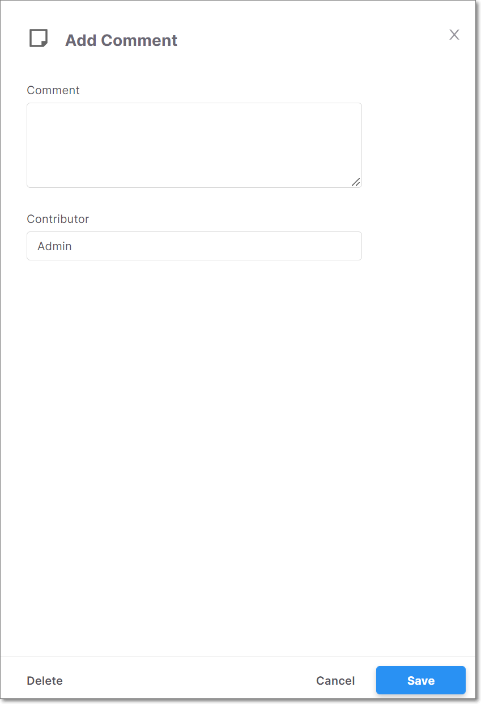

# Checkmarx SCA Release Notes May 2022

We are excited to announce important improvements in our Checkmarx SCA web application…

## Key improvements

### Adding Comments to Risks

You can now add comments to Risks (vulnerability, supply chain or legal risk). This can be useful for planning remediation steps, assigning responsibility, and explaining decisions to mark/unmark a risk as “ignored”. Comments are applied on the Project level, so that if a risk is identified on a subsequent scan of that Project, the comment is shown.

Comments can be added by opening the Scan Results > Risk Details page and clicking on the Comments button.

<figure><figcaption></figcaption></figure>

The Add Comment form is shown on the side of the screen, with fields for entering the comment and the name of the contributor (by default the name of the current user).

<figure><figcaption></figcaption></figure>

Comments are shown on the details page for that vulnerability. In addition, an icon is shown in the row of that vulnerability on the All Risks page. When you hover over the icon, the comment is shown.

<figure><figcaption></figcaption></figure>

Whenever you mark a Risk as ignored, the Add Comments form opens automatically, enabling you to add a comment explaining your action. The same thing occurs when you unmark an ignored Risk.

## Checkmarx SCA Resolver Updates

We have released several new versions of Resolver with a wide range of improvements and bug fixes. The most recent release is 1.8.15.

The following are some highlights from the recent releases:

* We now provide a sha256sum file for each SCA Resolver download, enabling users to verify the integrity and authenticity of the SCA Resolver.
* Container Scan - Added support for build arguments in Dockerfile FROM statements using a `.env_cxsca-container-build-args` file . For more information, see [Build Arguments Configuration](../../../checkmarx-sca-product-info/container-scans.md#UUID-5d68d9be-7702-23c0-3672-a8272906267c_id_ContainerScans-BuildArgumentsConfiguration).
* Performance improvements for Pip, Sbt, Maven, Bower, Gradle.
* Added support for resolving Git repositories in Carthage.
* Added support for Yarn lock version 2.

Download the latest version of Resolver [here](../../../checkmarx-sca-resolver/checkmarx-sca-resolver-download-and-installation/).

## Improvements and Bug Fixes

| Status | Item                | Description                                                                           |
| ------ | ------------------- | ------------------------------------------------------------------------------------- |
| UPDATE | Carthage resolution | Added support for resolving Git repositories in Carthage.                             |
| UPDATE | Package Resolution  | General improvements in package resolution.                                           |
| UPDATE | Yarn lock           | Added support for Yarn lock version 2                                                 |
| FIXED  | Gradle multi module | Fixed problem that KTS files weren’t being resolved for Gradle multi module projects. |
