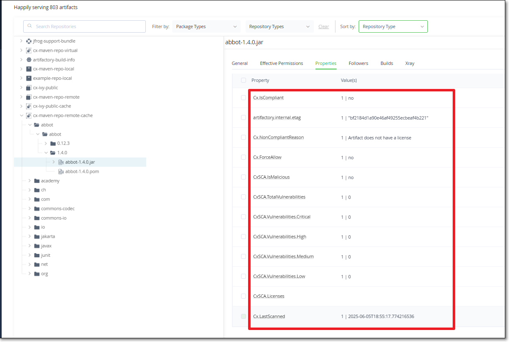

# Checkmarx SCA Release Notes February 2023



## JFrog Plugin

We have released a new plugin for running Checkmarx SCA scans on the artifacts in your JFrog Artifactory. This integrates scanning of artifacts into your DevOps workflow, providing easy visibility into possible risks that could make your applications vulnerable.

The plugin uses the scan results to enrich the attributes shown in the JFrog UI.

<figure><figcaption></figcaption></figure>

When you install the plugin, Checkmarx scans all artifacts currently in your repository. In addition, each time that an artifact is downloaded, the plugin runs a Checkmarx SCA scan on that artifact.

You can set a risk threshold so that artifacts with risks of a specified severity level will automatically be blocked from download. You can also set license limitations to block download of artifacts that have licenses that aren't on your "allowed" list.


This is a FREE tool. No Checkmarx account required.


## Nexus Plugin - New Release

We have released a new version of the Checkmarx SCA plugin for Nexus Repository Manager.

The new version enables you to block download of artifacts that have licenses that aren't included in your "allowed" list.


This is a FREE tool. No Checkmarx account required.


## Checkmarx SCA Resolver Updates

We have released several new versions of Resolver with a wide range of improvements and bug fixes. Download the latest version of SCA Resolver [here](../../../checkmarx-sca-resolver/checkmarx-sca-resolver-download-and-installation/).

### Improvements in Version 2.0.2

*   We have stopped supporting `Configuration.ini`. It is a requirement to use the `Configuration.yml` file when running the new version of Resolver.

    

This is a breaking change which makes the new version of Resolver incompatible with installations that still rely on a <code>Configuration.ini</code> file.

* When submitting your SAST password using `--cxpassword`, you can now use an Environment Variable. This is preferable to including a password in clear text in the config file.
* Users can now specify a custom path to the NetRc file to be used for authentication.
* For Java, improved the Java version detection for openjdk11 on Windows.
* For Bower:
  * We now support JFrog artifactory.
  * We now identify Dev dependencies.

## Improvements and Bug Fixes

| Status | Item                | Description                                                                                                                                                                |
| ------ | ------------------- | -------------------------------------------------------------------------------------------------------------------------------------------------------------------------- |
| FIXED  | Sorting scan result | On the Scan Results screen, the All Risks and All Packages tabs are now sorted accurately. All Risks is sorted by Risks severity and All Packages is sorted by Risk Score. |
