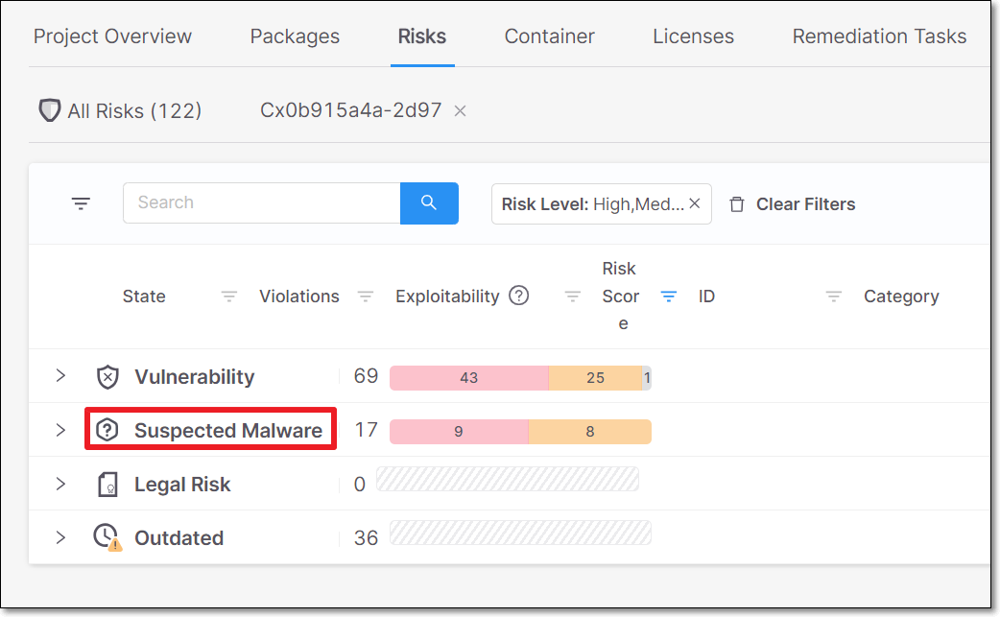
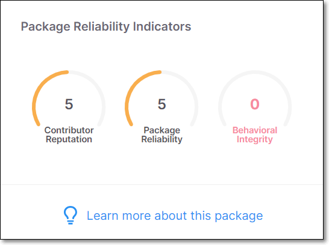

# Checkmarx SCA Release Notes May 2024







## Scan Reports

We made the following improvements in the SCA scan reports:

* Reports generated via the web application are now generated in the background so that the user can continue working. When the report is ready, the user is prompted to download the report.
* We improved the content of the scan reports for all formats (PDF, CSV, XML, JSON). The reports now include all relevant data that is available via the web portal, including [exploitability indicators](https://checkmarx.com/resource/documents/en/34965-19192-searching-by-vulnerability.html#UUID-12ad9e63-9eac-a458-8710-1f218615e424_id_SearchingbyVulnerability-InfoPane) and the transitive package paths.
* You can now generate reports from the Global Inventory screen and filter the report data based on the filters that are applied to the Global Inventory.

## Support for .NET 8

Added support for .NET 8 for the SCA scanner

## Changed Name of "Supply Chain" Risks

The category of risks that had been referred to as "Supply Chain" are now referred to as "Suspected Malware", which more accurately expresses the nature of the risk. This is reflected in the section title and icon on the All Risks page as well as in all places that the category name is used.

<figure><figcaption></figcaption></figure>

In addition the package metrics that had been titled "Supply Chain Analysis" are now titled "Package Reliability Indicators".

<figure><figcaption></figcaption></figure>

## SCA Resolver Version 2.7.4 (May 13, 2024)

* Added support for the Cpan package manager for Perl projects. For more information, see [here](../../../checkmarx-sca-resolver/checkmarx-sca-resolver-download-and-installation/installing-supported-package-managers-for-resolver.md#UUID-6a56714b-6836-a1e0-3c21-d1fbb411cf4d_section-idm4583877397297634314243695355).
* For Maven, added support for omitted package versions.
* For Go, fixed an issue that Go packages weren't being scanned when executing on Windows.

Download the new version [here](../../../checkmarx-sca-resolver/checkmarx-sca-resolver-changelog.md).
