# Configuring Exploitable Path Queries for Checkmarx SCA Resolver

This article explains how to set up your system for running Exploitable Path using Checkmarx SCA Resolver.


To use Exploitable Path for scans that are run via the Checkmarx SCA web portal, no prior configuration is required. A cloud instance of SAST is automatically used to analyze your proprietary code.



You can configure the Exploitable Path queries using either the method described in this section OR the alternative method described below. This section describes the recommended method for configuring the Exploitable Path queries in SAST. To use this method you need to have a Checkmarx SAST installation that includes CxAudit with the default set of privileges.

The alternative method is simpler to implement but less reliable, as it does not validate the queries in SAST. If you don’t have CxAudit, then use the alternative method.


## Resources

The following links can be used to download the Exploitable Path custom queries for the relevant languages:

## Exploitable Path Queries in ZIP Archive



* [Java\_Exploitable\_Path.zip (5KB)](https://download.checkmarx.com/cxcustomersdocuments/ExploitablePath/Java_Exploitable_Path-C%236.zip)
* [Python\_Exploitable\_Path.zip (6KB)](https://download.checkmarx.com/cxcustomersdocuments/ExploitablePath/Python_Exploitable_Path-C%236.zip)
* [JavaScript\_Exploitable\_Path.zip (5KB)](https://download.checkmarx.com/cxcustomersdocuments/ExploitablePath/JavaScript_Exploitable_Path-C%236.zip)
* [CSharp\_Exploitable\_Path (3KB)](https://download.checkmarx.com/cxcustomersdocuments/ExploitablePath/CSharp_Exploitable_Path-C%236.zip)



* [Java\_Exploitable\_Path.zip (5KB)](https://download.checkmarx.com/cxcustomersdocuments/ExploitablePath/Java_Exploitable_Path-C%237.zip)
* [Python\_Exploitable\_Path.zip (6KB)](https://download.checkmarx.com/cxcustomersdocuments/ExploitablePath/Python_Exploitable_Path-C%237.zip)
* [JavaScript\_Exploitable\_Path.zip (5KB)](https://download.checkmarx.com/cxcustomersdocuments/ExploitablePath/JavaScript_Exploitable_Path-C%237.zip)
* [CSharp\_Exploitable\_Path (3KB)](https://download.checkmarx.com/cxcustomersdocuments/ExploitablePath/CSharp_Exploitable_Path-CS7.zip)

<details>

<summary>Java Queries for systems using SAST version 9.6.1 and above</summary>

* [Java\_Exploitable\_Path.zip (5KB)](https://download.checkmarx.com/cxcustomersdocuments/ExploitablePath/Java_Exploitable_Path.zip)


If you are using this zip archive, you will also need to download the `Java_Exploitable_Path` archive for C# v7 and extract the `Java_Find_Imports` file for use in the configuration procedure.


</details>



## Exploitable Path Queries in XML Format



* [Java QueriesC#6](https://download.checkmarx.com/cxcustomersdocuments/ExploitablePath/Java_Queries+C%236.xml)
* [Python QueriesC#6](https://download.checkmarx.com/cxcustomersdocuments/ExploitablePath/Python_Queries+C%236.xml)
* [JavaScript QueriesC#6](https://download.checkmarx.com/cxcustomersdocuments/ExploitablePath/JS_Queries+C%236.xml)
* [CSharp QueriesC#6](https://download.checkmarx.com/cxcustomersdocuments/ExploitablePath/CSharp_Queries+C%236.xml)



* [Java QueriesC#7](https://download.checkmarx.com/cxcustomersdocuments/ExploitablePath/Java_Queries+C%237.xml)
* [Python QueriesC#7](https://download.checkmarx.com/cxcustomersdocuments/ExploitablePath/Python_Queries+C%237.xml)
* [JavaScript QueriesC#7](https://download.checkmarx.com/cxcustomersdocuments/ExploitablePath/JS_Queries+C%237.xml)
* [CSharp QueriesC#7](https://download.checkmarx.com/cxcustomersdocuments/ExploitablePath/CSharp+Queries+C%237.xml)



## Configuring SAST Queries

You must add the Queries and execute a SAST scan of the project, before you run the SCA scan of the Project. This should be done no more than 24 hr prior to running the SCA scan. This is because the Exploitable Path feature does not actually run a scan. Instead, it utilizes the relevant results from the last available SAST scan.

### Prerequisite - Query Security Configuration

If you are using SAST version 9.2 HF9+ you need to configure the query security settings. For **JavaScript** projects, `query_security_type` (in \[CxDB].\[Config].\[CxEngineConfigurationKeysMeta]) must be set to “none” (not to "application\_security"). For **Java**, **Python**, or **C#** projects, `query_security_type` can be set to “application\_security”, but in that case you will need to configure your system to allow the Exploitable Path queries, using one of the following methods:

* The preferred method is to connect to your CxDB database and execute the following .sql statements.
* An alternative method is to add the .xml config snippet given below to the **Config.xml** file under Checkmarx Engine Service > Engine Server for each of your installed engines. After adding the snippet you will need to restart the Windows service CxEngineService. For more info about query security, Checkmarx personnel can see the following internal documentation, [New Engine Security Mechanism - Overview](https://checkmarx.atlassian.net/wiki/spaces/EKB/pages/1824194726/New%2BEngine%2BSecurity%2BMechanism%2B-%2BOverview).

All values must not have spaces or blanks and must be “;” separated. If the attached configuration keys already exist, the new values need to be added to the existing values.



```
update [Config].[CxEngineConfigurationKeysMeta] set DefaultValue =DefaultValue + 'Checkmarx.Dom.Comment;' where KeyName = 'ADDITIONAL_ALLOW_LIST_OBJECTS'
update [Config].[CxEngineConfigurationKeysMeta] set DefaultValue =DefaultValue + 'Checkmarx.Query.DynamicQuery_Runner.Python.Cx.CxPythonQueryGroup.GetAllFiles;System.StringSplitOptions.None;SymbolTable.IDefinition.FullName;' where KeyName = 'ADDITIONAL_ALLOW_LIST_MEMBER_ACCESS'
update [Config].[CxEngineConfigurationKeysMeta] set DefaultValue =DefaultValue + 'Checkmarx.Query.DynamicQuery_Runner.Python.Cx.CxPythonQueryGroup.GetAllFiles;Checkmarx.Query.DynamicQuery_Runner.Python.Cx.CxPythonQueryGroup.GetAllFiles;Checkmarx.Query.DynamicQuery_Runner.Python.Cx.CxPythonQueryGroup.GetImportsNamesAndPaths;Checkmarx.Query.DynamicQuery_Runner.Python.Cx.CxPythonQueryGroup.FindOptimalRootDirectory;Checkmarx.Query.DynamicQuery_Runner.Python.Cx.CxPythonQueryGroup.IsBuiltInModule;Checkmarx.Query.DynamicQuery_Runner.Python.Cx.CxPythonQueryGroup.GetDirname;Checkmarx.Query.DynamicQuery_Runner.Python.Cx.CxPythonQueryGroup.GetFilePath;Checkmarx.Query.DynamicQuery_Runner.Python.Cx.CxPythonQueryGroup.LocalPackageExists;Checkmarx.Query.DynamicQuery_Runner.Python.Cx.CxPythonQueryGroup.GetFilePath;Checkmarx.Query.DynamicQuery_Runner.Python.Cx.CxPythonQueryGroup.ImportStringToPath;Checkmarx.Query.DynamicQuery_Runner.Python.Cx.CxPythonQueryGroup.GetDirname;Checkmarx.Query.DynamicQuery_Runner.Python.Cx.CxPythonQueryGroup.GetFilePath;Checkmarx.Query.DynamicQuery_Runner.Python.Cx.CxPythonQueryGroup.LocalPackageExists;' where KeyName = 'ADDITIONAL_ALLOW_LIST_METHODS'
```



```
<Configuration>
    <Key>ADDITIONAL_ALLOW_LIST_OBJECTS</Key>
    <Value>Checkmarx.Dom.Comment;</Value>
</Configuration>
<Configuration>
    <Key>ADDITIONAL_ALLOW_LIST_MEMBER_ACCESS</Key>
    <Value>Checkmarx.Query.DynamicQuery_Runner.Python.Cx.CxPythonQueryGroup.GetAllFiles;System.StringSplitOptions.None;SymbolTable.IDefinition.FullName</Value>
</Configuration>
<Configuration>
    <Key>ADDITIONAL_ALLOW_LIST_METHODS</Key>
    <Value>Checkmarx.Query.DynamicQuery_Runner.Python.Cx.CxPythonQueryGroup.GetAllFiles;Checkmarx.Query.DynamicQuery_Runner.Python.Cx.CxPythonQueryGroup.GetAllFiles;Checkmarx.Query.DynamicQuery_Runner.Python.Cx.CxPythonQueryGroup.GetImportsNamesAndPaths;Checkmarx.Query.DynamicQuery_Runner.Python.Cx.CxPythonQueryGroup.FindOptimalRootDirectory;Checkmarx.Query.DynamicQuery_Runner.Python.Cx.CxPythonQueryGroup.IsBuiltInModule;Checkmarx.Query.DynamicQuery_Runner.Python.Cx.CxPythonQueryGroup.GetDirname;Checkmarx.Query.DynamicQuery_Runner.Python.Cx.CxPythonQueryGroup.GetFilePath;Checkmarx.Query.DynamicQuery_Runner.Python.Cx.CxPythonQueryGroup.LocalPackageExists;Checkmarx.Query.DynamicQuery_Runner.Python.Cx.CxPythonQueryGroup.GetFilePath;Checkmarx.Query.DynamicQuery_Runner.Python.Cx.CxPythonQueryGroup.ImportStringToPath;Checkmarx.Query.DynamicQuery_Runner.Python.Cx.CxPythonQueryGroup.GetDirname;Checkmarx.Query.DynamicQuery_Runner.Python.Cx.CxPythonQueryGroup.GetFilePath;Checkmarx.Query.DynamicQuery_Runner.Python.Cx.CxPythonQueryGroup.LocalPackageExists;</Value>
</Configuration>
```



### Step 1 - Configuring Exploitable Path Groups and Queries in SAST

Use the following procedure for each of the languages for which you want to configure Exploitable Path.

1. Download and extract the Custom Queries (provided above) for the relevant languages (according to the system type).
2. Log in to the CxAudit console.
3.  Click Edit Queries in the header bar.

    <div align="left"><figure>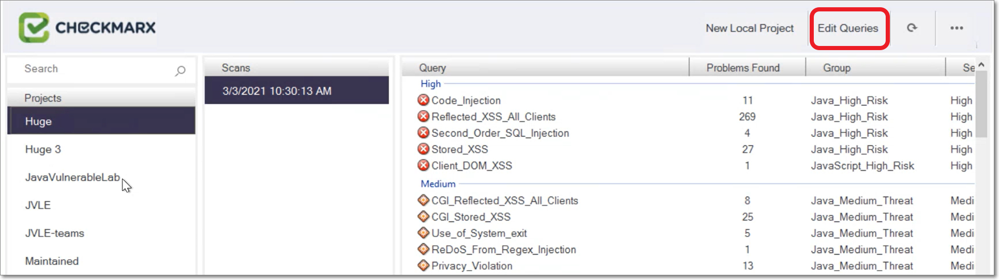<figcaption></figcaption></figure></div>

    The Edit Queries dialog opens.
4.  Under Choose a Programming Language, select the desired language and then click Edit Queries at the bottom of the dialog.

    <div align="left"><figure>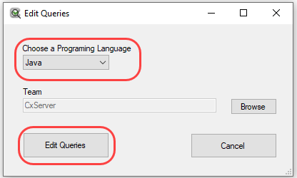<figcaption></figcaption></figure></div>

    The list of existing queries is shown.
5.  Right-click the Corp category and click on Add Group.

    <div align="left"><figure>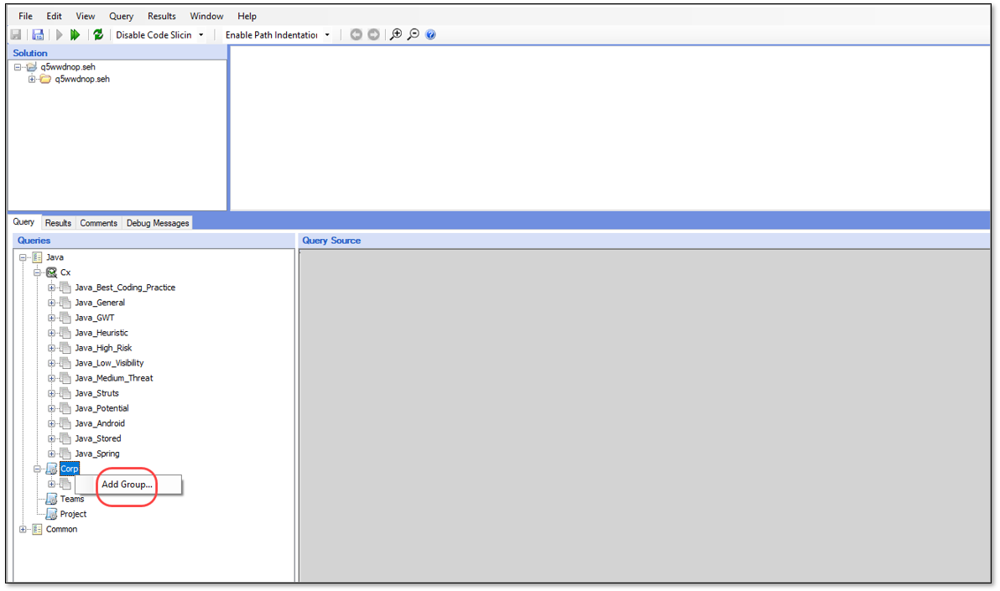<figcaption></figcaption></figure></div>
6.  In the New Group dialog, enter a name for the group. Name the groups `Java_Exploitable_Path`, `Python_Exploitable_Path`, `JavaScript_Exploitable_Path`, and `CSharp_Exploitable_Path` respectively. Then, click OK.

    <div align="left"><figure>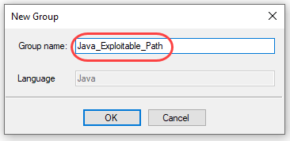<figcaption></figcaption></figure></div>
7.  Right-click on the group that you created in the Query navigation pane and select Add Query….

    <div align="left"><figure>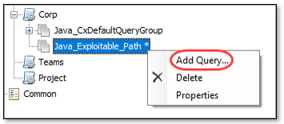<figcaption></figcaption></figure></div>

    The New Query dialog opens.
8.  For the Query name, enter `Find_Imports`.

    <div align="left"><figure>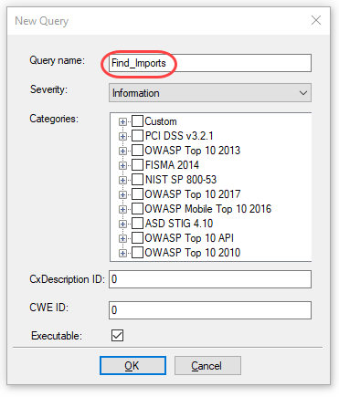<figcaption></figcaption></figure></div>
9.  Under Categories, expand Custom and select the checkboxes next to Custom and Optional, and then click OK.

    <div align="left"><figure>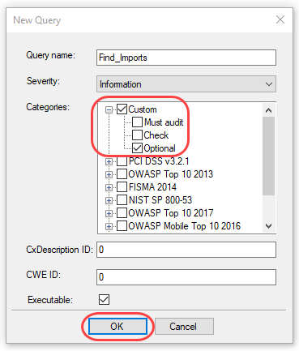<figcaption></figcaption></figure></div>
10. In the Queries navigation, select the `Find_Imports` query under the specified language.

    <div align="left"><figure>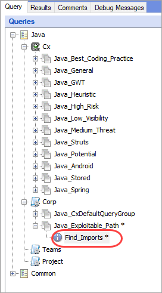<figcaption></figcaption></figure></div>
11. Copy the source code from the `Find_Imports` file that you extracted from the zip file and paste it in the Query Source window.

    <div align="left"><figure>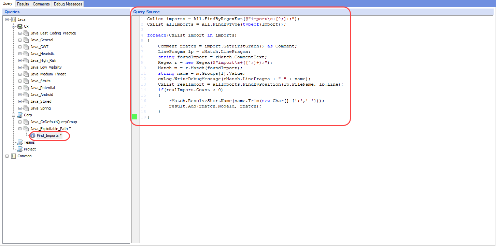<figcaption></figcaption></figure></div>
12. Repeat steps 8-11 for the `Find_Unresolved_Methods` query.
13. Repeat the above procedure for each additional language that you would like to configure.
14. When you have finished configuring all required groups and queries, click on the Query tab and select Save All Queries.

    <div align="left"><figure>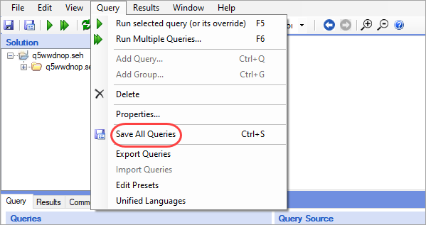<figcaption></figcaption></figure></div>

### Step 2 - Verifying Query Installation

1. Log in to your Checkmarx SAST console.
2. Go to Settings > Scan Settings > Query Viewer.
3. In the Query pane, navigate to the Exploitable Path queries and select a query.
4.  Verify that the source code of the query is displayed in the Source pane.

    <div align="left"><figure>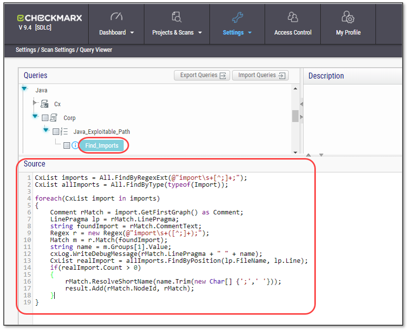<figcaption></figcaption></figure></div>
5. Select each of the queries and verify that the source code is in place.

### Step 3 - Adding Exploitable Path Queries to Presets

You need to add the Exploitable Path queries to each of the presets that you will use for Projects on which you want to run Exploitable Path.

1. In the SAST console, go to Settings > Scan Settings > Preset Manager.
2.  Select the desired preset and then click Edit at the bottom of the right hand pane.

    <div align="left"><figure>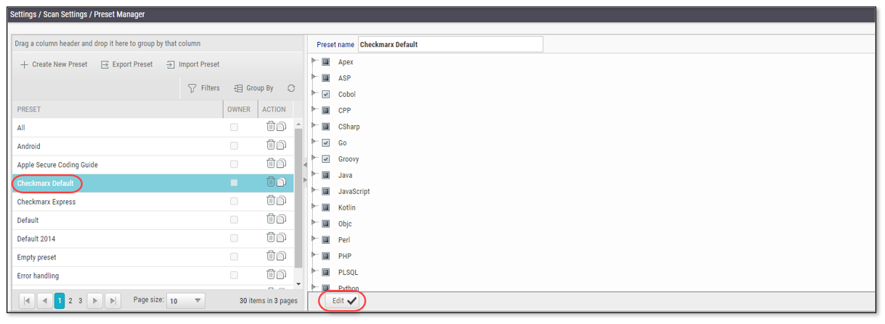<figcaption></figcaption></figure></div>
3.  In the right hand pane, navigate to the Exploitable Path queries and select the checkbox next to each query.

    <div align="left"><figure>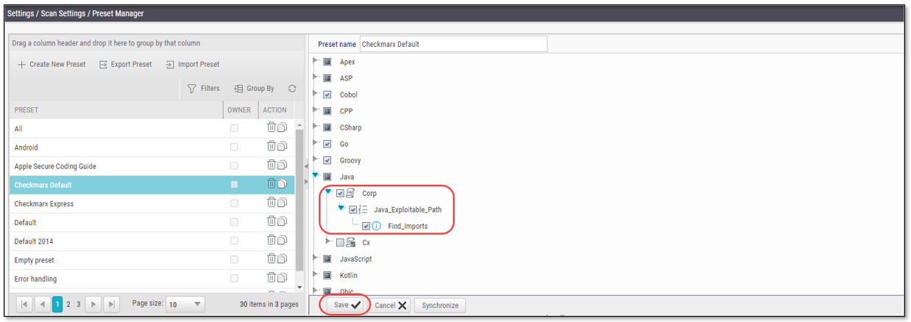<figcaption></figcaption></figure></div>
4. Click Save at the bottom of the screen.
5. Repeat the above procedure for each preset that you would like to use with Exploitable Path.

### Step 4 - Run a SAST Scan of the Project

In your Checkmarx SAST console, run a scan of the desired Project using a preset that contains the Exploitable Path queries. This should be done no more than 24 hours prior to running the scan in Checkmarx SCA.

You can now run the SCA scan with Exploitable Path using the Checkmarx SCA Resolver, see [Running Exploitable Path Scans Using Resolver](./).

## Alternative Configuration Method for Exploitable Path Queries

This article explains how set up your system for running Exploitable Path using Checkmarx SCA Resolver.


You can configure the Exploitable Path queries using either the method described here OR the method described above Configuring Exploitable Path Queries. The method described here is simpler. However, it doesn’t validate the queries in SAST. Therefore, we recommend using the other, more reliable, method.


### Exploitable Path Queries in XML Format

Download the relevant xml query files.



* [Java QueriesC#6](https://download.checkmarx.com/cxcustomersdocuments/ExploitablePath/Java_Queries+C%236.xml)
* [Python QueriesC#6](https://download.checkmarx.com/cxcustomersdocuments/ExploitablePath/Python_Queries+C%236.xml)
* [JavaScript QueriesC#6](https://download.checkmarx.com/cxcustomersdocuments/ExploitablePath/JS_Queries+C%236.xml)
* [CSharp QueriesC#6](https://download.checkmarx.com/cxcustomersdocuments/ExploitablePath/CSharp_Queries+C%236.xml)



* [Java QueriesC#7](https://download.checkmarx.com/cxcustomersdocuments/ExploitablePath/Java_Queries+C%237.xml)
* [Python QueriesC#7](https://download.checkmarx.com/cxcustomersdocuments/ExploitablePath/Python_Queries+C%237.xml)
* [JavaScript QueriesC#7](https://download.checkmarx.com/cxcustomersdocuments/ExploitablePath/JS_Queries+C%237.xml)
* [CSharp QueriesC#7](https://download.checkmarx.com/cxcustomersdocuments/ExploitablePath/CSharp+Queries+C%237.xml)



### Configuring SAST Queries

You must add the Queries and execute a SAST scan of the project, before you run the SCA scan of the Project. This should be done no more than 24 hr prior to running the SCA scan. This is because the Exploitable Path feature does not actually run a scan. Instead, it utilizes the relevant results from the last available SAST scan.

#### Prerequisite - Query Security Configuration

If you are using SAST version 9.2 HF9+ you need to configure the query security settings. For **JavaScript** projects, `query_security_type` (in \[CxDB].\[Config].\[CxEngineConfigurationKeysMeta]) must be set to “none” (not to "application\_security"). For **Java**, **Python** ,or C# projects, `query_security_type` can be set to “application\_security”, but in that case you will need to configure your system to allow the Exploitable Path queries, using one of the following methods:

* The preferred method is to connect to your CxDB database and execute the following .sql statements.
* An alternative method is to add the .xml config snippet given below to the **Config.xml** file under Checkmarx Engine Service > Engine Server for each of your installed engines. After adding the snippet you will need to restart the Windows service CxEngineService. For more info about query security, Checkmarx personnel can see the following internal documentation, [New Engine Security Mechanism - Overview](https://checkmarx.atlassian.net/wiki/spaces/EKB/pages/1824194726/New%2BEngine%2BSecurity%2BMechanism%2B-%2BOverview).

All values must not have spaces or blanks and must be “;” separated. If the attached configuration keys already exist, the new values need to be added to the existing values.



```
update [Config].[CxEngineConfigurationKeysMeta] set DefaultValue =DefaultValue + 'Checkmarx.Dom.Comment;' where KeyName = 'ADDITIONAL_ALLOW_LIST_OBJECTS'
update [Config].[CxEngineConfigurationKeysMeta] set DefaultValue =DefaultValue + 'Checkmarx.Query.DynamicQuery_Runner.Python.Cx.CxPythonQueryGroup.GetAllFiles;System.StringSplitOptions.None;SymbolTable.IDefinition.FullName;' where KeyName = 'ADDITIONAL_ALLOW_LIST_MEMBER_ACCESS'
update [Config].[CxEngineConfigurationKeysMeta] set DefaultValue =DefaultValue + 'Checkmarx.Query.DynamicQuery_Runner.Python.Cx.CxPythonQueryGroup.GetAllFiles;Checkmarx.Query.DynamicQuery_Runner.Python.Cx.CxPythonQueryGroup.GetAllFiles;Checkmarx.Query.DynamicQuery_Runner.Python.Cx.CxPythonQueryGroup.GetImportsNamesAndPaths;Checkmarx.Query.DynamicQuery_Runner.Python.Cx.CxPythonQueryGroup.FindOptimalRootDirectory;Checkmarx.Query.DynamicQuery_Runner.Python.Cx.CxPythonQueryGroup.IsBuiltInModule;Checkmarx.Query.DynamicQuery_Runner.Python.Cx.CxPythonQueryGroup.GetDirname;Checkmarx.Query.DynamicQuery_Runner.Python.Cx.CxPythonQueryGroup.GetFilePath;Checkmarx.Query.DynamicQuery_Runner.Python.Cx.CxPythonQueryGroup.LocalPackageExists;Checkmarx.Query.DynamicQuery_Runner.Python.Cx.CxPythonQueryGroup.GetFilePath;Checkmarx.Query.DynamicQuery_Runner.Python.Cx.CxPythonQueryGroup.ImportStringToPath;Checkmarx.Query.DynamicQuery_Runner.Python.Cx.CxPythonQueryGroup.GetDirname;Checkmarx.Query.DynamicQuery_Runner.Python.Cx.CxPythonQueryGroup.GetFilePath;Checkmarx.Query.DynamicQuery_Runner.Python.Cx.CxPythonQueryGroup.LocalPackageExists;' where KeyName = 'ADDITIONAL_ALLOW_LIST_METHODS'
```



```
<Configuration>
    <Key>ADDITIONAL_ALLOW_LIST_OBJECTS</Key>
    <Value>Checkmarx.Dom.Comment;</Value>
</Configuration>
<Configuration>
    <Key>ADDITIONAL_ALLOW_LIST_MEMBER_ACCESS</Key>
    <Value>Checkmarx.Query.DynamicQuery_Runner.Python.Cx.CxPythonQueryGroup.GetAllFiles;System.StringSplitOptions.None;SymbolTable.IDefinition.FullName</Value>
</Configuration>
<Configuration>
    <Key>ADDITIONAL_ALLOW_LIST_METHODS</Key>
    <Value>Checkmarx.Query.DynamicQuery_Runner.Python.Cx.CxPythonQueryGroup.GetAllFiles;Checkmarx.Query.DynamicQuery_Runner.Python.Cx.CxPythonQueryGroup.GetAllFiles;Checkmarx.Query.DynamicQuery_Runner.Python.Cx.CxPythonQueryGroup.GetImportsNamesAndPaths;Checkmarx.Query.DynamicQuery_Runner.Python.Cx.CxPythonQueryGroup.FindOptimalRootDirectory;Checkmarx.Query.DynamicQuery_Runner.Python.Cx.CxPythonQueryGroup.IsBuiltInModule;Checkmarx.Query.DynamicQuery_Runner.Python.Cx.CxPythonQueryGroup.GetDirname;Checkmarx.Query.DynamicQuery_Runner.Python.Cx.CxPythonQueryGroup.GetFilePath;Checkmarx.Query.DynamicQuery_Runner.Python.Cx.CxPythonQueryGroup.LocalPackageExists;Checkmarx.Query.DynamicQuery_Runner.Python.Cx.CxPythonQueryGroup.GetFilePath;Checkmarx.Query.DynamicQuery_Runner.Python.Cx.CxPythonQueryGroup.ImportStringToPath;Checkmarx.Query.DynamicQuery_Runner.Python.Cx.CxPythonQueryGroup.GetDirname;Checkmarx.Query.DynamicQuery_Runner.Python.Cx.CxPythonQueryGroup.GetFilePath;Checkmarx.Query.DynamicQuery_Runner.Python.Cx.CxPythonQueryGroup.LocalPackageExists;</Value>
</Configuration>
```



#### Configuring SAST for Exploitable Path

To configure your SAST instance to support Exploitable Path SCA scans:

1. In the SAST console, go to Settings > Scan Settings > Query Viewer.
2. In the Queries selection pane, click on the desired language (**Java**, **Python** , **JavaScript**, or **C#**) to expand the view.
3.  Select the Corp checkbox, and then click on the Import Queries button.

    <div align="left"><figure>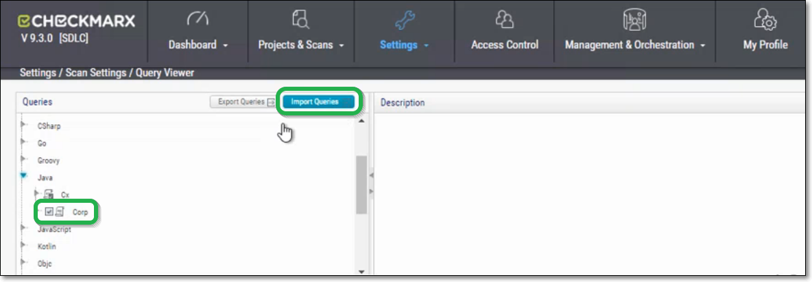<figcaption></figcaption></figure></div>
4. In the Import Queries dialog, click Select and navigate to the desired .xml file, then click Import.
5. If you would like to add queries for another language (**Java**, **Python** , **JavaScript**, or **C#**), repeat the above procedure for the other language.
6.  Add the Queries that you imported to the relevant presets.

    You can now run the SAST scan of the project and then run the SCA scan using Resolver, see [Running Exploitable Path Scans Using Resolver](./).
