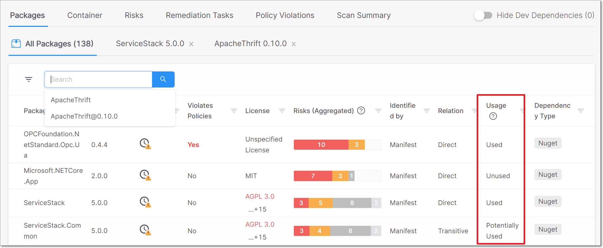
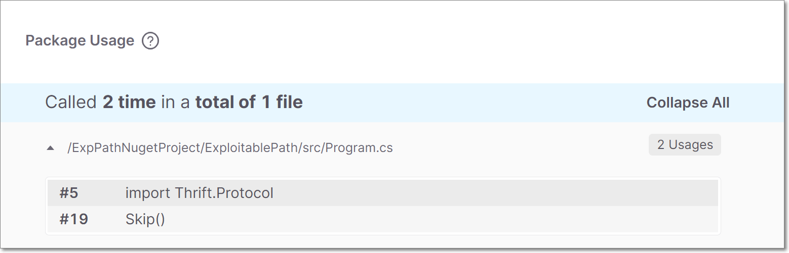
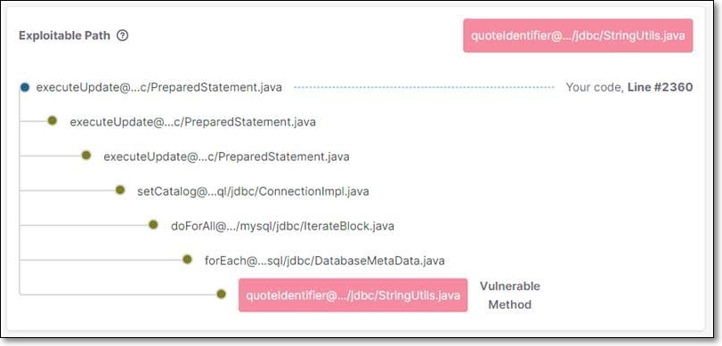

# Exploitable Path

Prioritizing remediation of the many open source vulnerabilities identified by Checkmarx SCA can be a challenging task. It isn’t always apparent whether the vulnerable packages are actually being called by your project and whether the vulnerable methods are actually being used by your code. The key question is: Is there a path from your project code into the vulnerable package code, whereby the vulnerable packages could be exploited in your project? If not, then remediation is a much lower priority.

This is where the **Exploitable Path** feature is essential. Checkmarx SCA leverages SAST’s ability to scan the actual project code itself in parallel with scanning the manifest file, in order to validate whether the vulnerable open source packages are called from your proprietary code and whether the vulnerable methods are actually used by your code. This enables you to focus on the remediation of actively exploitable vulnerabilities.

Exploitable Path also identifies which lines in your project code actually reach the vulnerable method in the vulnerable package and shows you the full path to the vulnerability.


An additional benefit of the Exploitable Path is that, since it scans the entire code, it identifies the actual usage of the packages in your project’s code. You may find that some of the packages listed in the manifest file are no longer being used and you can remediate your project with a more streamlined manifest file and project.


## Key Benefits

* Verify whether the vulnerable methods in the open source packages are being called by your proprietary code.
* Prioritize remediation of exploitable vulnerabilities.
* See the full path from the project code to the vulnerable method.

## Prerequisites for Using Exploitable Path


To use Exploitable Path for scans that are run via the Checkmarx SCA web portal, simply activate Exploitable Path for your account or for a specific Project. No prior configuration is required since a cloud instance of SAST is automatically used to analyze your proprietary code.


To use Exploitable Path for scans run using Checkmarx SCA Resolver, you need the following:

* Checkmarx SCA Resolver v1.4.14+
* CxServer version 9.0+
* Your Checkmarx SCA Resolver is running on a network where it can communicate with your CxServer instance (preferably via HTTP protocol).
* You have completed the Query Configuration, as described in [Configuring Exploitable Queries for Checkmarx SCA Resolver](../checkmarx-sca-resolver/running-exploitable-path-scans-using-resolver/configuring-exploitable-path-queries-for-checkmarx-sca-resolver.md).

## Enabling Exploitable Path

The Exploitable Path feature will only run on Projects for which it has been activated. This can be done via the Checkmarx SCA web portal either during the [Project Creation](creating-and-configuring-projects/creating-a-project---project-types/) or by editing the [Project Settings](creating-and-configuring-projects/editing-project-settings.md). You can also set your account's global settings to activate Exploitable Path by default for all subsequent Projects created in your account, [Configuring Account Settings](configuring-account-settings.md).


Activating the feature globally does not activate Exploitable Path for Projects that were created prior to the activation.


If Exploitable Path is activated in your global settings, then it will run automatically on any Projects that you create via Checkmarx SCA Resolver or a supported plugin. If it is not activated globally, then in order to run Exploitable Path via Checkmarx SCA Resolver or a plugin, you need to first create a Project with Exploitable Path via the web console and then scan that Project via the Checkmarx SCA Resolver or a plugin.


Before you run a scan with Exploitable Path using **Checkmarx SCA** **Resolver** or a plugin, you need to first run a scan of that project in SAST.


## Viewing the Exploitable Path Results

On the Scan Results > Packages tab, next to each package in the list there is an indication of whether or not the package is used by your project code.

<figure><figcaption></figcaption></figure>

In the Package Usage card, in the package details sub-tab, you can see how many times and in what way the vulnerable package is used by your project code.

<figure><figcaption></figcaption></figure>

In the Exploitable Path card, in the vulnerability details sub-tab, the path from your code to the code in the open source project, and from there to the vulnerable method, is visually displayed. You can clearly see which lines in your project code actually reach the vulnerable method in the vulnerable package, giving you an excellent idea of how best to remediate your project.

<figure><figcaption></figcaption></figure>

## Current Limitations

1. Supported languages: Python, Java, JavaScript and C#.
2. Using the Exploitable Path feature might cause scans to take longer time.
3. Supported plugins: Checkmarx CLI plugin and Jenkins plugin.
4. We find exploitable paths only for packages that are called directly in the code and where the vulnerable method is in the called package itself.
5. Exploitable paths created by reflection are not supported.
6. Not all open source packages have been scanned for Exploitable path yet. However, once the user scans a project with a particular package, the package gains priority and will be scanned in the next 48 hours.
7. Exploitable Path feature is limited to the Checkmarx SAST engine capabilities, such as languages and types of runtime loads.
8. Exploitable Path is based on results from the most recent full SAST scan of the project, results from incremental scans aren't considered.
9. Packages exceeding 100Mb are not scanned.
10. Exploitable Path information is not updated when Risk Recalculation is run on a scan. You need to run the scan again to get the Exploitable Path results.
11. For JavaScript projects, Exploitable Path doesn’t identify:
    * packages using anonymous exports, e.g., `module.exports = function(options) {....}`.
    *   constructor patterns in the source code, e.g.,

        `const someObject= Requier("jwt")`

        `someObject(options)`
