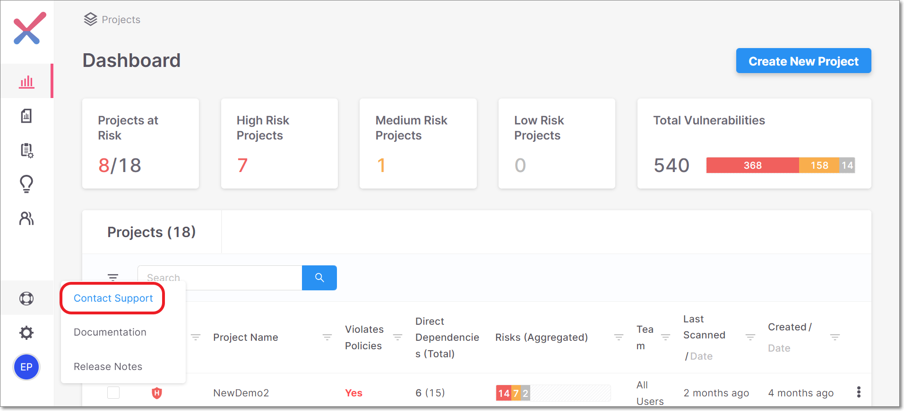
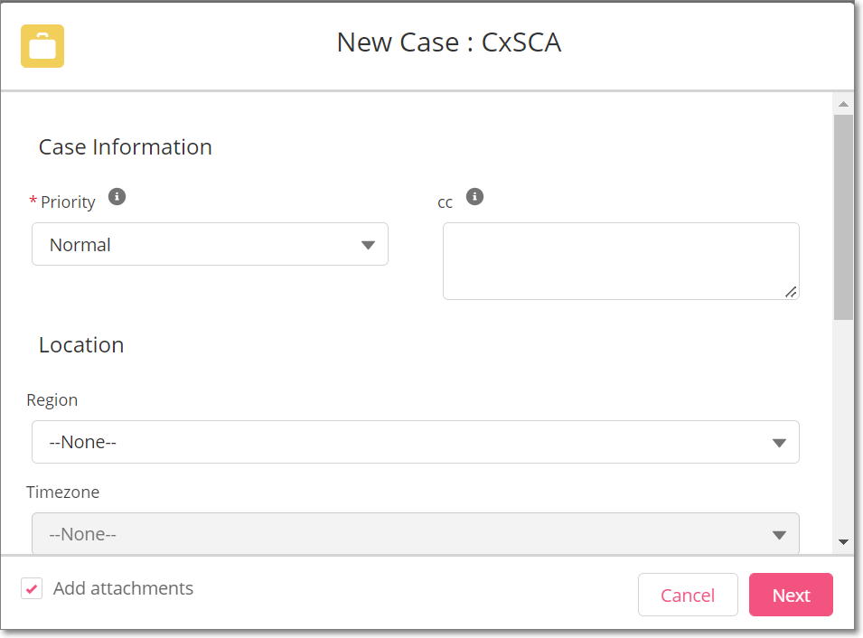
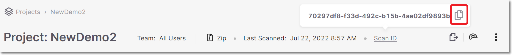

# Getting Help and Submitting a Support Ticket

If you encounter issues running scans or with other aspects of your Checkmarx SCA account, you can search for relevant articles in our [documentation portal](https://checkmarx.com/resource/documentation/?lang=en).

If you have a user account in our Customer Portal (e.g., a Checkmarx account administrator), then you can access additional help articles or submit a support ticket via the [Customer Portal](https://support.checkmarx.com/CheckmarxCustomerServiceCommunity/s/login).


If you don't have access to the Customer Portal, contact your organization's Checkmarx account administrator and ask them to submit the support ticket on your behalf. Alternatively, the Customer Portal login page has a Contact Us button that enables non-users to submit an issue to our support agents.


You can access the Customer Portal directly from the Checkmarx SCA web portal, by clicking on , and selecting Contact Support.

<figure><figcaption></figcaption></figure>

## Customer Portal

1.  Log in to the [Customer Portal](https://support.checkmarx.com/CheckmarxCustomerServiceCommunity/s/login) using your username (e.g., myemail.domain.com.cx) and password.

    
<figure><figcaption></figcaption></figure>

2.  Search for relevant articles by entering search text on the home page, or by clicking CxSCA and browsing for relevant content.

    After taking one of the above actions, a button is shown at the bottom of the screen for opening a support ticket.

    
<figure><figcaption></figcaption></figure>

3.  If you haven't found the info needed to resolve your issue, then open a support ticket as follows:

    1. Click on the Create Support Ticket button.
    2.  For the case type, select the radio button next to CxSCA.

        

If you were on the CxSCA page, then the selection is made automatically and this step is skipped in the wizard.

        The New Case form opens for submitting a CxSCA support ticket.

        
<figure><figcaption></figcaption></figure>

    3.  Fill in, at a minimum, all required fields. Provide as much detail as possible about the issue, including the relevant project and scan.

        

Once you enter the Product Area and Subject, the interface will suggest relevant articles that may have info that can help you to resolve your issue. Click on an article to open it.

    4.  If the issue relates to a specific scan, copy the Scan ID from the header bar on the Project page and include it in the Description field.

        
<figure><figcaption></figcaption></figure>

    5. Click Next.
    6. To add screenshots or other attachments, add them in the dialog that opens, and then click Submit. Otherwise, click Skip and Submit.

    A support ticket is opened. Our support agents will contact you shortly.
