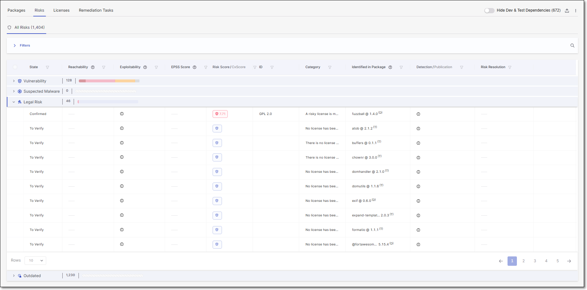

# Legal Risks

## Overview

Checkmarx identifies all of the licenses associated with the open source packages used in your project. The complete list of licenses is shown in the Scan Results > Licenses tab.


The License Score represents the level of risk associated with using a package under that license. However, the license doesn't pose an actual risk to your project unless you are actually using the package under that license (i.e., it is your Effective license).


In addition, Checkmarx identifies actual risks to your project based on legal issues related to improper usage of open source packages. These risks are shown in the Scan Results > Risks tab in the Legal Risk section.

<figure><figcaption></figcaption></figure>

### Marking Licenses as Effective or Not Effective

Packages often have several different licenses associated with them. This gives users the option to choose which license to consider "effective" for that package, i.e., which set of license restrictions they would like to follow. As long as you are abiding by the terms of the effective license, the other licenses don't constitute a legal risk.

Initially, the state of most licenses is set as To Verify. However, when there is a sole license for a package and it was identified in a reliable source, that license is automatically marked as Effective. You can then review the licenses and mark each license as Effective or Not Effective based on your assessment of the package usage. Changing the state of a license is done via the Checkmarx One web application, on the Risk Details page.

Whether or not a license is marked as Effective impacts on the determination of whether it constitutes a Legal Risk, as described in the following section.

### Types of Legal Risks

We currently identify the following types of legal risks.

* Risky effective license - A license has a high severity License Score and is also marked as Effective for this package.
* Package with no effective license - There is an open source package in your project for which no license has been marked as Effective.
* Package with no license - Checkmarx didn't identify any licenses associated with this package.

## Recommended Workflow

The following E2E workflow explains how you can leverage the legal risk functionality provided by Checkmarx to get results that accurately reflect the security posture of your project from a legal perspective.

1. Create a project and run a scan.
2. Go to the Risks tab > Legal Risks and check for packages with no license associated.
3. If you aware of the relevant licenses for these packages, add them via API, using [POST /management-of-risk/package-licenses](../checkmarx-sca-rest-api-documentation/checkmarx-sca-management-of-package-licenses.md).
4. Go to the Scan Results > Licenses tab. Review each license and mark whether or not it is the Effective license for the specified package (via the web application).
5. On the Scan Results page, click on > Recalculate Last Scan.
6. After the recalculation is complete, go to the Risks tab > Legal Risks and check what Legal Risks were identified in your project.
7. Take the required steps to remediate these risks.
