# User Accounts

Access to the Checkmarx SCA Console (UI) is controlled by user accounts which are assigned to roles and Teams. Each user within your organization is assigned a role which determines what privileges the user has in the system. In addition, users are added to Teams. Project can be assigned to specific Teams, so that only members of the designated Teams (or their parent Teams) can view data and take actions for that Project (alternatively, Projects can be left open to “All users”).

Admin users can view the existing user accounts, edit the user details and create new user accounts. User management can be done via the SCA Access Control app as described in the following sections or via the Master Access Control as described in [Using Master Access Control (Replica Mode)](using-master-access-control-replica-mode.md).

The Access Control > Users tab shows a list of all users within the organization and their account details.

<figure>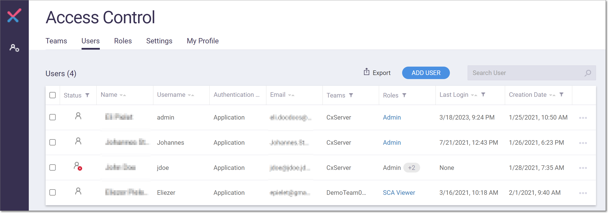<figcaption></figcaption></figure>

The following methods can be used for finding users in the list:

* Search - enter search text in the **Search User** box.
* Sort - click on a column header to sort by that header.
* Filter - click on the Filter icon next to a header to set a filter for that column.

The following table describes the info shown for each user on the Users tab.

| **Parameter**           | **Description**                                              | **Possible values**                                                                                                                                                                                                                                                                   |
| ----------------------- | ------------------------------------------------------------ | ------------------------------------------------------------------------------------------------------------------------------------------------------------------------------------------------------------------------------------------------------------------------------------- |
| Status                  | Indicates whether the user’s account is enabled or disabled. | 
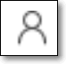

- enabled

- disabled
                           |
| Name                    | The first and last name of the user.                         | e.g., John Doe                                                                                                                                                                                                                                                                        |
| Username                | The username of the user. This is the name used for login.   | e.g., JohnDoe                                                                                                                                                                                                                                                                         |
| Authentication Provider | The method used for assigning login credentials.             | <ul><li><em>Application -</em> credentials configured in the web platform</li><li><em>LDAP server</em> <em>(name of server</em>) - credentials assigned via the LDAP server</li></ul>                                                                                                 |
| Email                   | The user’s email.                                            | e.g., JohnDoe@example.com                                                                                                                                                                                                                                                             |
| Teams                   | The team(s) assigned to the user.                            | e.g., CxServer, DevTeam01                                                                                                                                                                                                                                                             |
| Roles                   | The role(s) assigned to the user.                            | 
<em>Access Control Manager, Admin</em>, <em>SCA Admin</em>, <em>SCA External Platform User</em>, <em>SCA Manager</em>, <em>SCA Scanner</em>, <em>SCA Viewer</em>, <em>User Manager</em>

Note: For an explanation of the various roles, see <a href="roles.md">Roles</a>.
 |
| Last Login              | The date and time of the user’s last login.                  | e.g., 1/28/2021 7:19 AM                                                                                                                                                                                                                                                               |
| Creation Date           | The date and time the user’s account was created.            | e.g., 1/25/2021 10:50 AM                                                                                                                                                                                                                                                              |

## Creating a User Account

An admin user can create new user accounts within your organization. As part of the account configuration, you will assign a role to the user, which determines what privileges that user has in the system. You will also assign each user to one or more Teams, which determines which Projects they can access.

To create a new user account:

1.  In the main navigation, click User Management.

    The Access Control screen opens in a new tab.
2. On the Access Control screen select the Users tab (default).
3.  On the Users tab, click on the Add User button.

    The Add New User window opens.

    
<figure>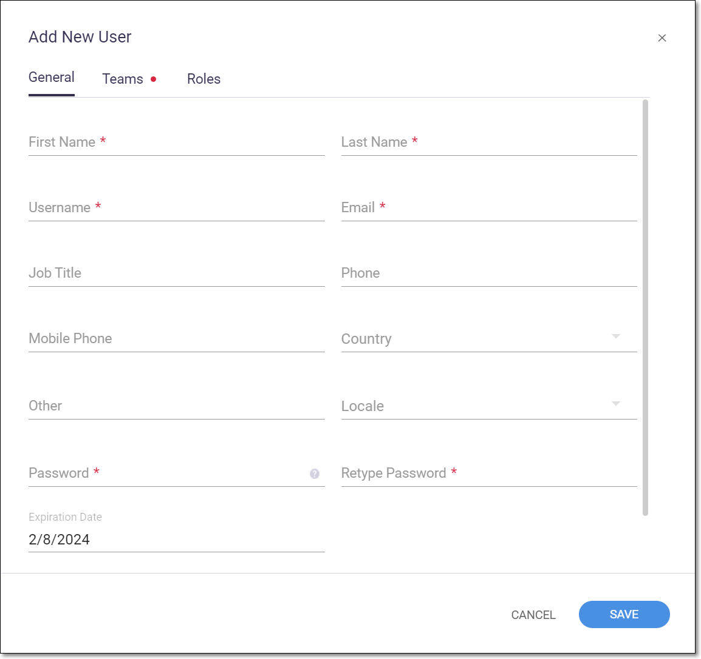<figcaption></figcaption></figure>

4.  In the General tab, fill in the following required fields: First Name, Last Name, Username, Email, Password, Retype Password.

    

You may need to scroll down to see the Password fields. These are required fields which must be filled in.

    

Make a note of the Username and Password, as you will need to provide these to the user for login.

    

Password Requirements:
<ul><li>Minimum 6 characters</li><li>At least one special symbol</li><li>At least one lowercase letter</li><li>At least one uppercase letter</li></ul>

5. Verify that Active User is toggled ON in order for this user to be activated (default). You can deactivate the user by sliding the toggle to the left.
6.  Click on the Teams tab, and select one or more Teams to which you would like to add the user, see [Teams](teams.md).

    
<figure>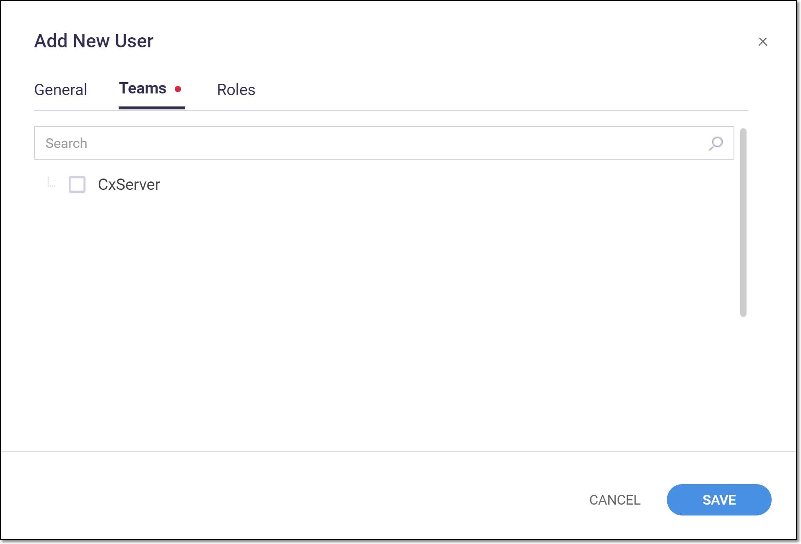<figcaption></figcaption></figure>

7.  Click on the Roles tab, and select one or more roles that you would like to assign to the user. For an explanation of the various roles, see [Roles](roles.md).

    
<figure>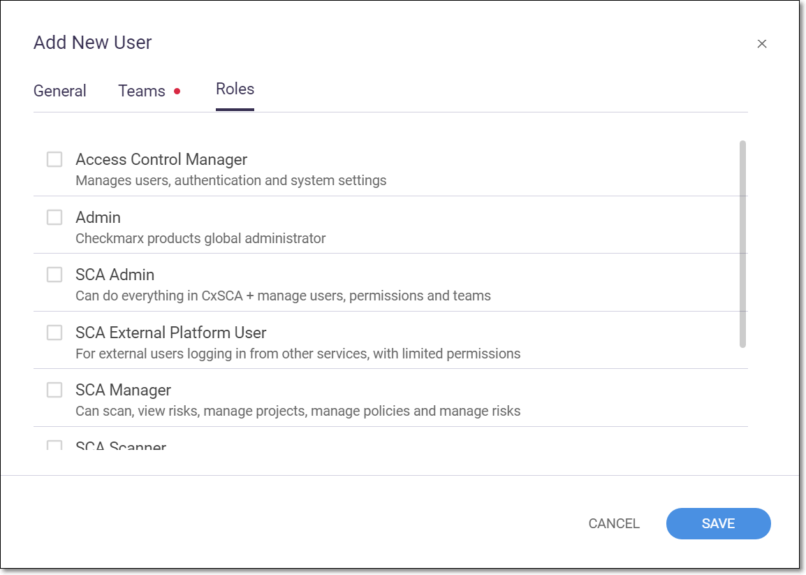<figcaption></figcaption></figure>

8.  Click Save.

    The new user account is created.


The system does not automatically send a welcome email, so you will need to notify the new user how to access the system. You should include the following info in the welcome email: **Login URL**, **Account Name**, **Username** and **Password**.


## Actions on User Accounts

An admin user can take the following actions on user accounts from the Access Control > Users tab.

### Editing a User Account

An Admin user can edit the account details of any user in the system. All fields can be edited aside from the Username and Authentication Provider which cannot be changed. The user’s role and Team membership can also be changed. You can also activate/deactivate the user account.


Alternatively, any user can edit their own account details or password (but not roles and Teams) by going to Access Control > My Profile.


To edit a user account:

1.  In the main navigation, click the User Management icon.

    The Access Control screen opens in a new browser tab.
2. On the Access Control screen select the Users tab (default).
3.  On the Users tab, click on the context menu at the end of the row for the desired user account.

    
<figure><figcaption></figcaption></figure>

4.  In the context menu, select Edit User.

    
<figure>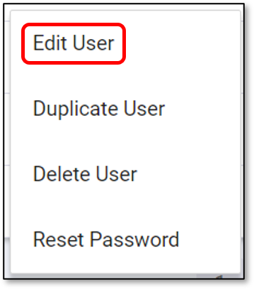<figcaption></figcaption></figure>

    The Edit User window opens, showing the current account details.
5.  In the General tab, adjust the user info as desired.

    

The Username and Authentication Provider fields cannot be edited.

6. If you would like to change the user’s Team, then in the Teams tab, select the checkbox for the desired Team or Teams.
7. If you would like to change the user’s role, then in the Roles tab, select the checkbox for the desired role or roles.
8.  Click Save.

    The new details are applied to the user account.

### Duplicating a User Account

An Admin user can create a new user account based on the set of permissions assigned to an existing account.


The only information that is copied from the initial user are the roles and Teams assigned to that user. You will need to enter the rest of the user’s information as if you were creating a new user account. See [Creating a User Account](user-accounts.md#UUID-de63681a-73c5-23bb-3edf-0cafab415919).


To duplicate a user account:

1.  In the main navigation, click the User Management icon.

    The Access Control screen opens in a new browser tab.
2. On the Access Control screen select the Users tab (default).
3.  On the Users tab, click on the context menu at the end of the row for the desired account.

    
<figure><figcaption></figcaption></figure>

4.  In the context menu, select Duplicate User.

    
<figure>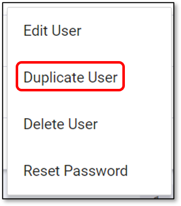<figcaption></figcaption></figure>

    The Add New User window opens.

    
<figure>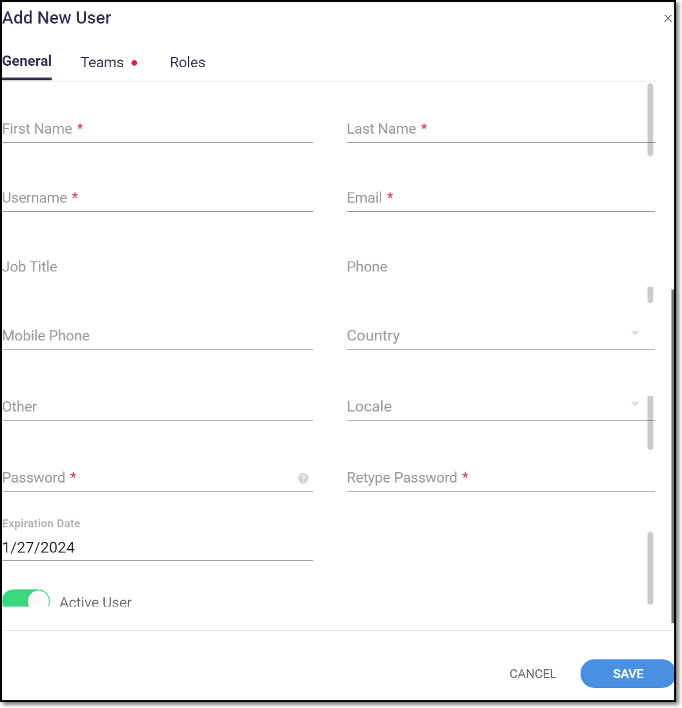<figcaption></figcaption></figure>

5. In the General tab (default), enter the information as if you were creating a new user account.
6. Click on the Teams tab and select/deselect the Teams to which you would like to add/remove the user.
7. Click on the Roles tab, and select/deselect the roles to which you would like to add/remove the user.
8.  Click Save.

    The new user account is created in addition to the original user which remains unchanged.


The system does not automatically send a welcome email, so you will need to notify the new user how to access the system. You should include the following info in the welcome email: **Login URL**, **Account Name**, **Username** and **Password**.


### Deleting a User Account

An Admin user can delete user accounts from the system.


Once an account has been deleted it cannot be re-activated. If you would like to temporarily deactivate the user you can edit the user details and toggle the activation switch to off.



The user who is designated as the original admin can’t be deleted. If you want to delete this admin you need to first transfer the admin role to a different user.


To delete a user account:

1.  In the main navigation, click the User Management icon.

    The Access Control screen opens in a new browser tab.
2. On the Access Control screen select the Users tab (default).
3.  On the Users tab, click on the context menu at the end of the row for the desired account.

    
<figure><figcaption></figcaption></figure>

4.  In the context menu, select Delete User.

    
<figure>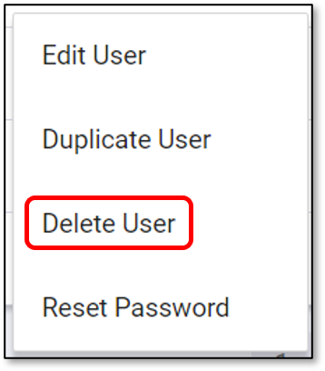<figcaption></figcaption></figure>

    A confirmation dialog opens.
5.  Click Delete.

    The user account is deleted from the system.

### Resetting User Account Credentials

An admin user can reset the account credentials for any user within the organization. This causes the system to automatically generate a new temporary password which the admin user must share with the user. The user will then need to reset his/her password at the next login.


Alternatively, the user can reset the password himself from the login screen.


To reset the credentials:

1.  In the main navigation, click the User Management icon.

    The Access Control screen opens in a new browser tab.
2. On the Access Control screen select the Users tab (default).
3.  On the Users tab, click on the context menu at the end of the row for the desired account.

    
<figure><figcaption></figcaption></figure>

4.  In the context menu, select Reset Password.

    
<figure>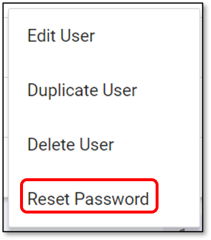<figcaption></figcaption></figure>

    A confirmation dialog opens.
5. Click Reset Password.


The account credentials are reset, and a new temporary password is shown. The admin must copy this password and share it with the user.


### Enabling Two-Factor Authentication Exemptions

An admin user can create an exemption to allow a user to authenticate without providing 2FA. This is essential for users who need to set up integrations using SCA Resolver and/or plugins. Unless the exemption is provided, all integrations will fail.

To grant an exemption:

1.  In the main navigation, click the User Management icon.

    The Access Control screen opens in a new browser tab.
2. On the Access Control screen select the Users tab (default).
3.  On the Users tab, click on the context menu at the end of the row for the desired account.

    
<figure><figcaption></figcaption></figure>

4.  In the context menu, select Enable Two-Factor authentication Exemption.

    
<figure>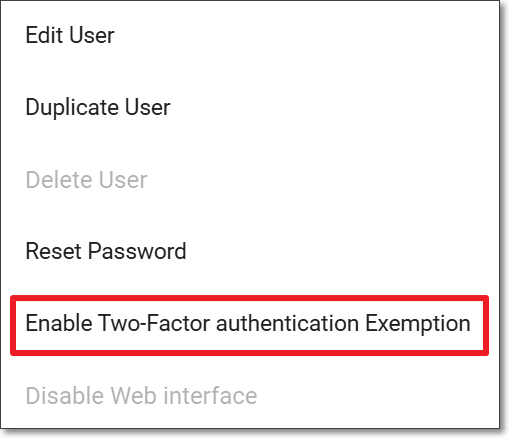<figcaption></figcaption></figure>

    A confirmation dialog opens.
5. Click Enable Exemption.
