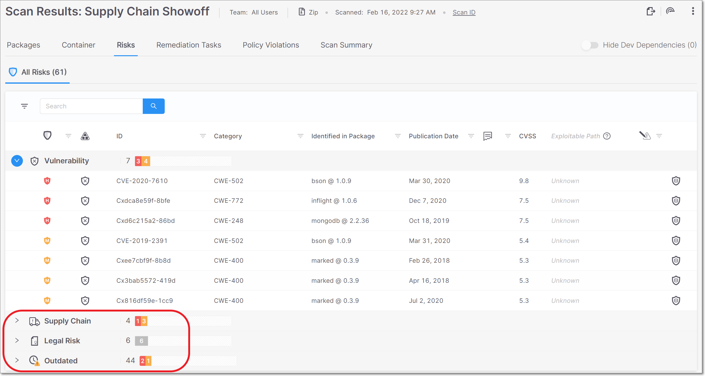
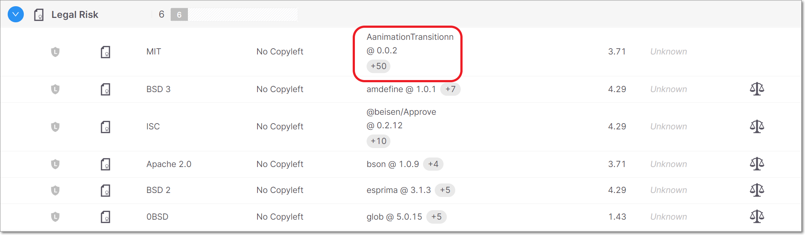
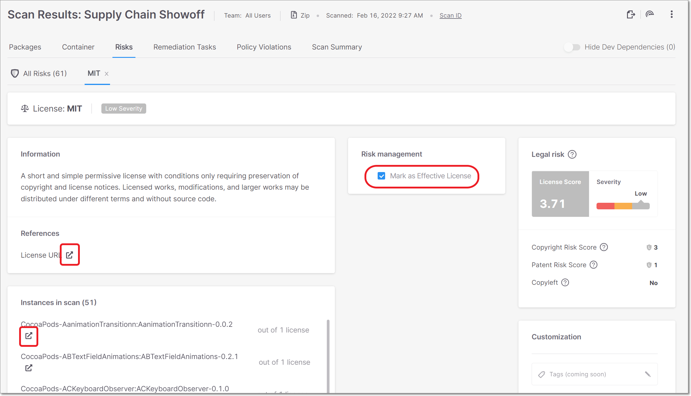

# Checkmarx SCA Release Notes February 2022

We are excited to announce important improvements in our Checkmarx SCA web application…

## Key improvements

### UI Improvements

We have made major improvements in the way that Risks are shown on the **Scan Results** page. The various types of Risks are now shown in separate tabs. By default the Vulnerabilities tab is expanded, showing all of the vulnerabilities in your Project. Below that, there are separate tabs for each of the following types of Risk:

- **Supply Chain** - shows various types of Supply Chain risks that affect the packages in your project, such as packages that are Malicious by design and packages that are vulnerable to ChainJacking attacks.
- **Legal Risk** - shows all of the Legal Risks relating to the licensing of the packages used in your project.
- **Outdated** - shows all packages in your project for which more recent versions have been released. For each package, the number of newer versions available is shown.

<figure></figure>

The following improvements have been made in the way that **Legal Risks** are shown:

- Legal Risks are now grouped by license name, so that if a Risk associated with a particular license affects several packages in your project, it is shown as a single Risk.

  
<figure></figure>

- You can now click on a Legal Risk in the All Risks table to open a separate page showing details about that Legal Risk. The Legal Risk details page shows info about the Risk and lists all instances of packages affected by the Risk. It also provides links to external documentation about the license and affected packages. In addition, the page includes a checkbox for marking the Risk as “Effective License”, in order to indicate that the Legal Risk isn’t applicable to your circumstances (e.g., you have purchased the required license).

  
<figure></figure>

### Checkmarx SCA Resolver Updates

We have released several new versions of Resolver with a wide range of improvements and bug fixes. The most recent release is 1.7.3

The following are some highlights from the recent releases:

- We now allow scanning with SAST using **offline** mode and then uploading the SAST results file using **upload** mode.

- For Gradle:

  - Improved multi-module resolution. The origin of dependencies is now specified by the corresponding module.
  - Added support for flat multi-module project structure.

- When Checkmarx SCA Resolver runs a scan with Exploitable Path, the Project settings are automatically updated to activate Exploitable Path on the Project level. (Previously, EP needed to be activated for the Project before it could be run in Checkmarx SCA Resolver.)
- For sbt, we no longer change the `.sbtopts` file in order to force dependency resolution through Ivy. Dependencies will be resolved using the customer’s sbt resolver.
- Improved security by fixing path traversal problem when creating logs file.
- Improved efficiency on Container scans by avoiding redundant requests to download images. This is done by downloading images to a unique file in the project root.

Download the latest version of Resolver [here](checkmarx-sca-resolver-download-and-installation.md).

## Improvements

| **Status** | **Item** | **Description** |
| --- | --- | --- |
| UPDATE | Gradle improvements | General improvements in Gradle resolution. |
| UPDATE | Gradle flat multi-module | Added support for Gradle flat multi-module projects. |
| UPDATE | Gradle multi-module | For Gradle multi-module projects, Checkmarx SCA now maps the dependencies to the correct manifest files. |
| NEW | Dotnet6 resolution | Added support for Dotnet6 resolution. |
| UPDATE | Improved Carthage resolution | We now use Redis cache to handle multiple requests of the same dependency in Carthage. Also, we now show private Carthage dependencies in the original Carthage.private file. These improvements increase the speed and accuracy of Carthage resolution. |
| UPDATE | Container scan efficiency | We have improved efficiency on Container scans by avoiding redundant requests to download images. This is done by downloading images to a unique file in the project root. |
