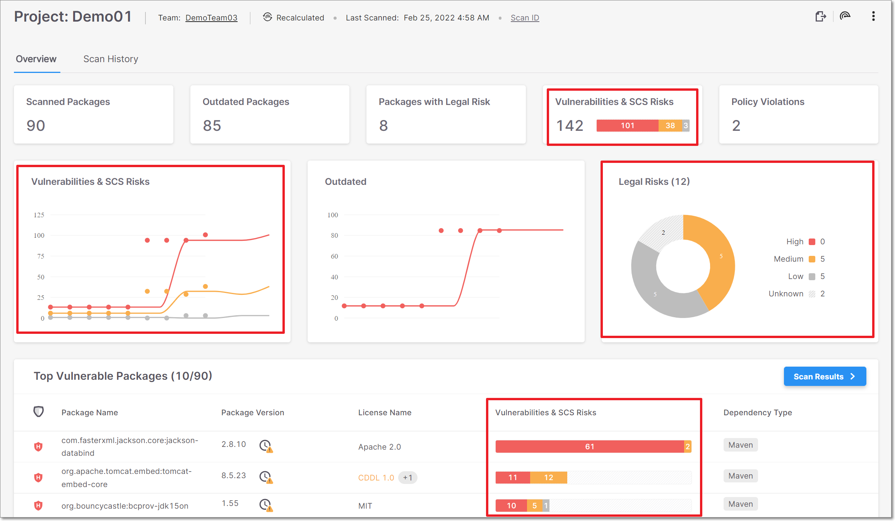

# Checkmarx SCA Release Notes July 2022

We are excited to announce important improvements in Checkmarx SCA…

## Key improvements

### UI Changes

We have updated several widgets and column headers on the Project page to show combined data for vulnerabilities and also supply chain security (SCS) risks.

Also, the Legal Risks widget now shows values for distinct legal risks (i.e., doesn’t take into account multiple instances of the same risk).

<figure></figure>

## Improvements and Bug Fixes

| **Status** | **Item** | **Description** |
| --- | --- | --- |
| FIXED | Error message | We now return 404 instead of 500 when a CVE is not found in the AppSec Knowledge Center. |
| FIXED | Pip Virtualenv | Certain packages were taking a long time to resolve. The issue was fixed by upgrading the pip virtualenv. |

## Checkmarx SCA Resolver Updates

We have released several new versions of Resolver with a wide range of improvements and bug fixes. Download the latest version of SCA Resolver [here](checkmarx-sca-resolver-download-and-installation.md).

### Version 1.10.4

- For NPM, fixed bug related to workspaces.

### Version 1.10.2

- Added the `--Sca-app-url` flag for specifying the url of the web application. Previously this could only be done via the config file.

- Added the ability to include the password in the config file. Previously this could only be done via the CLI command.

  
  It isn't recommended to include a password in clear text in the config file. Instead, you can use an environment variable for the password. Resolver first checks for an environment variable of the specified name, and uses the plain text value only if no variable is found.
  

- Added the `--override-default-excludes` flag, for disabling the default file exclusions.

### Version 1.9.10

- For Yarn, general improvements in dependency resolution.
- For NPM, added support for NPM workspaces.
- Fixed problems caused by duplicate values for environment variables by overriding saved values when a new value is submitted.
