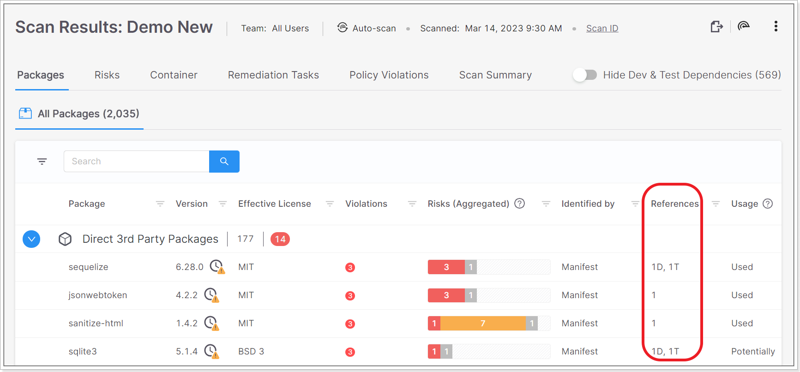

# Checkmarx SCA Release Notes March 2023



## Packages Screen Updates

- We have updated the "References" column on the **Scan Results** \> **Packages** screen. For Direct Packages, we now show separately the number of times that the package is referenced directly (D) and transitively (T).

  
<figure></figure>

- For a package that is referenced both directly and transitively, the total number of packages shown at the top of the All Packages tab now counts that package only once. Therefore, the total number of packages may be fewer than the total of the Direct packages plus the number of Transitive packages.

## Improvements and Bug Fixes

| **Status** | **Item** | **Description** |
| --- | --- | --- |
| UPDATE | Policy Configuration | We have simplified the policy configuration by removing the option to have multiple “sets” of conditions. A policy can still have multiple "rules", each of which contains one "set" of conditions. An OR operator is applied between rules, and an AND operator is applied to the conditions within each rule. |
| UPDATE | Exploitable Path | We updated the SAST queries for Exploitable Path. The new queries are available for download in zip archive and xml format [here](https://checkmarx.atlassian.net/wiki/spaces/CR/pages/6594035713/Checkmarx+SCA+Resources). |
