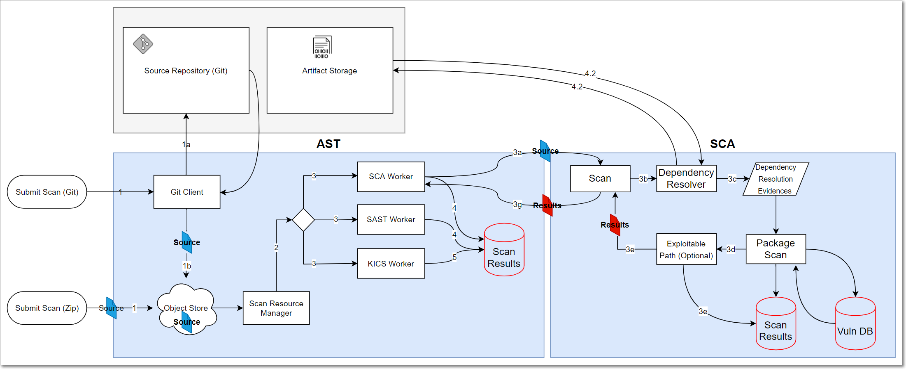

# Checkmarx SCA FAQ

## General

What are the connectivity requirements for using SCA?

In order to access the Checkmarx SCA Cloud, you will need to have access to the relevant Checkmarx URLs. You may need to add these to your firewall allowlists or proxies. See details [here](connectivity-to-checkmarx-sca-cloud.md).

When you trigger an SCA scan via Checkmarx One, what is the internal workflow (architecture)?

1. The source code is submitted via Checkmarx One.
2. The Checkmarx One Scan Resource Manager performs pre-processing actions (determine loc, engine sizes, etc.).
3. An SCA Worker in Checkmarx One sends the source code to the SCA Cloud where the standard SCA workflow is performed.
4. SCA Cloud returns the results to the SCA Worker in Checkmarx One, which makes the results available to the end user.

<figure></figure>

When Scanning code with CxSCA Resolver, what data is sent to the cloud?

The following data is sent to the cloud:

- The project name
- List of all file names and relative paths (except the ones that were excluded from the scan)
- Various checksums of the files (SHA-1, SHA-1 on content without spaces, etc.)
- Manifest files (except for scans run via Resolver with the `--no-upload-manifest` flag)


The complete list of files that are sent to the cloud can be seen in [Files Used for Manifest Resolution](files-used-for-manifest-resolution.md).


- Names of dependencies extracted from the manifest files
- Scan errors and warnings such as “Failed resolving dependencies”. Each warning message might contain a file path as an argument.
- SAST Exploitable Path Query result (for Exploitable Path scans)

What data is shown on the Global Inventory &amp; Risks screen?

This screen shows data for all packages and risks identified in any project in your tenant account. Data is retained in the system for a year and a half, so that packages and risks that haven't been detected by any recent scans aren't shown on this screen.


The data shown in Scan Results for specific projects is retained for a longer period of time.


## Data Security

Does Checkmarx store SCA scan data in the cloud?

**Answer:** SCA is a cloud based product and, as such, it does need to store some data in the cloud. When scans are run via SCA Resolver, only the metadata and manifest files are uploaded. They are stored for as long as the retention period requires. For scans run from the SCA web platform, the source code is also uploaded to the SCA cloud where it is stored for up to 24 hours.

What security measures does SCA use for sending data to the cloud?

**Answer:** Each customer is provisioned with a dedicated and encrypted S3 based storage path that stores its data along with proprietary settings and meta-data generated by Checkmarx SCA. The storage path is only accessible to the specific customer and its authorized, authenticated users. Uploads are performed over TLS 1.2 using pre-signed, time limited URLs that are only accessible on-demand and in the context of data access activities. In addition, in cases where the source code is uploaded to the Checkmarx SCA cloud (e.g., from the web platform), it is only stored for a limited period of up to 24 hours. Metadata and manifest files are stored for as long as the retention period requires.

We are compliant with the SOC 2 compliance standard.

Can I run an SCA scan locally, without sending my source code to the cloud?

Yes and no.

You don’t need to send your actual source code to the cloud. You can use a SCA Agent or SCA Resolver to resolve your packages locally. However, the actual scan, which checks your project against our databases, is run in the cloud. This is done by sending the extracted metadata such as manifest files, dependency trees and fingerprint data to the cloud. For more information, see [Understanding How Checkmarx SCA Scans Run Using Various Methods](understanding-how-checkmarx-sca-scans-run-using-various-methods.md).

## Vulnerability Database

What are "CxID" vulnerabilities? And, how do they differ from standard CVEs?

<figure></figure>

**Answer:** The "Cx" prefix indicates an "untracked" vulnerability that Checkmarx’s customers should be aware of. This can occur for two reasons:

1. Our Checkmarx AppSec experts have identified a new vulnerability that hasn't yet been registered as a CVE.

   
   In such cases, if the vulnerability is eventually registered as a CVE, it will be handled as a NEW vulnerability in Checkmarx One and your triage updates will not be applied.
   

2. We have determined that a known vulnerability, despite  never officially being registered as a CVE, may pose a threat to users. This may occur because neither of the relevant entities (the reporter or the maintainer) bothered to submit it to an authorized CVE Numbering Authority (CNA) for cataloging. It can also occur when there is a dispute between the involved parties. When we see that an uncatalogued vulnerability poses a real risk, we take the “security first“ approach by curating and publishing these issues, branding them with our "CxID", and making them available to our customers, to help them maintain a healthy cyber security posture.

Are "zero-day" vulnerabilities included in the Checkmarx SCA database?

**Answer:** When our AppSec experts identify a new vulnerability, we follow the industry standard practice of notifying the package maintainer and allowing them 90 days to remediate the vulnerability before disclosing it to the public. In the interim, we add the "zero-day" vulnerability to our database as a “Cx” vulnerability. However, we do not give details about the nature of the vulnerability until the remediation period has passed.

Do OSA and SCA share the same DB?

**Answer:** Yes

Which public Vulnerability databases does CxSCA make use of?

Checkmarx SCA is constantly collecting info about vulnerabilities from a wide range of sources. The following are some of our primary sources of info:

- [Vuldb](https://vuldb.com/)
- [NVD](https://nvd.nist.gov/)
- [CVE-MiTRE](https://cve.mitre.org/)
- [Retirejs](https://retirejs.github.io/)
- [Npm](https://www.npmjs.com/)
- [Bugzilla](https://www.bugzilla.org/)
- [NodeSecurity](https://github.com/nodesecurity)
- [Github Advisory Database](https://github.com/advisories?query=type%3Areviewed)

This list is constantly being updated and may change without notice.

What is Checkmarx's process for incorporating new vulnerabilities into their database ?

Analysis of newly-reported CVEs is handled by Checkmarx Zero, a research team that carefully analyzes each vulnerability database entry, enriches it with their own research findings, and corrects errors. The team uses various custom automations and tools to maximize efficiency and accuracy. When a new CVE is incorporated into the data, Checkmarx Zero applies curation and enrichment using information from relevant advisory databases. Below are examples of how this data is curated and enriched:

- Enhance advisory data — often advisories have incomplete or inaccurate lists of affected versions, identify components incorrectly, etc.  We analyze the affected items and correct the advisory data.
- Identify exploitable paths — advisories typically do not include information about where in the code the affected component has a vulnerability. Our analysts determine this alongside other exploitable path data to enable Exploitable Path analysis.

Performing this process for each new CVE takes time, which can create a gap between the publication of a vulnerability and the delivery of a complete analysis to customers. To address this, we use an automated process that provides immediate, preliminary analysis as soon as a CVE is collected. This ensures that customers receive timely updates, even before our research team has completed the full analysis.

## Running Scans

Why can’t I connect to the Checkmarx SCA cloud?

**Answer:** There are a number of URL’s that need to be added to the allowlist, depending on the customer’s region. For details, see [Connectivity to Checkmarx SCA Cloud](connectivity-to-checkmarx-sca-cloud.md).

Is there a timeout threshold for Checkmarx SCA scans?

Yes, an overly sluggish scan will timeout after about an hour, in order to free up our resources. This may occur when a project is too large or when network conditions are poor. The first step to troubleshoot this problem is to try running the scan via [Checkmarx SCA Resolver](checkmarx-sca-resolver-overview.md). You may also want to try breaking the project down into several smaller projects. If the problem persists, contact [Support](https://support.checkmarx.com/CheckmarxCustomerServiceCommunity/s/login/?ec=302&startURL=%2FCheckmarxCustomerServiceCommunity%2Fs%2F).

Is there a size limit for zip files that can be uploaded for scanning?

**Answer:** For scans run via SCA Resolver, there is no size limitation. For scans run in the Checkmarx SCA Cloud (e.g., via our web portal), in order to optimize performance, we recommend keeping files below 200 MB. This can be done by using file and folder exclusions or by breaking projects into several smaller units.

That being said, the only "hard" limitation for uploading zip files to the SCA Cloud is the 5GB limit of Amazon's S3 service, see [Uploading objects - Amazon S3](https://docs.aws.amazon.com/AmazonS3/latest/userguide/upload-objects.html).

How can you cause a pipeline to break the build when a SCA policy is violated?

**Answer:** Enable the "break build" setting for the relevant policy. The pipeline plugin also needs to be configured to break the build upon policy violation.

Do you support Telerik?

Telerik is a tricky case. As a rule of thumb we support open source components that can be consumed as dependencies. But, we don’t support components that are consumed through online private repositories – that require payment/registration (commercial).

Telerik components are mainly consumed through the private Telerik NuGet gallery, which requires registration and payment – so we don’t support that.

However, some Telerik components are being published to the public NuGet gallery, which we do support.

Therefore, the bottom line is that we identify components, and return vulnerabilities, only for Telerik components that can be consumed through the public NuGet gallery.

What is “Scan Recalculation”?

**Answer:** Checkmarx SCA takes the dependencies identified in a previous scan and re-assesses the risks affecting your project based on the current data. There is no need to resubmit the source code in order to run scan recalculation since it uses the dependency resolution output from the previous scan. Results from scan recalculation are shown in SCA as a separate scan, but with the label “Recalculated”. Results from a recalculation may differ from the original results in the following ways:

- We are constantly updating our vulnerability database. We may have identified additional vulnerabilities associated with the dependencies in your project that were not shown in your original results.
- If you have changed the Policies that apply to your project since the last scan, the policy violations for the project will be updated.

Do I need to run “Scan Recalculation” manually, or does it happen automatically?

**Answer:** If your project uses a package for which a new associated vulnerability has been added to our database, then Checkmarx SCA will automatically initiate a scan recalculation of that project. In addition, you can manually initiate a scan recalculation by clicking “Recalculate Last Scan” in the web portal. This is useful when you change the policy rules affecting a project and want to check which of the current policies are violated by this project.

## Scan Results

Why did the scan have no (or partial) results?

**Answer:** The following are some possible reasons why a scan may not have returned complete results:

- The scanned project doesn’t contain a manifest file. (This is VERY COMMON.)

- The manifest file includes private repositories. This is currently supported only when using the Checkmarx SCA Resolver tool. For more information, see [Checkmarx SCA Resolver](checkmarx-sca-resolver-overview.md).

- If you are using the SCA Resolver tool-

  - Make sure the relevant package managers are installed, see [Installing Supported Package Managers for Resolver](installing-supported-package-managers-for-resolver.md)
  - Ensure test commands are working (Package Manager Support in Checkmarx SCA)

If the project content is valid, and none of the above applies, please open a support ticket.

The remediation suggestion for a vulnerability seems incorrect.

**Answer:** The following are some possible reasons why the remediation suggestion doesn’t seem accurate::

- **Misunderstanding the remediation logic of SCA:** The remediation calculation suggests the closest non-vulnerable stable version of the used package, while considering all of the vulnerabilities that affect newer versions.

  For example: User is using package Maven-org.apache.ant:ant version 1.10.7 which is affected by both CVE-2020-11979 and CVE-2020-1945. CVE-2020-1945 is fixed in version 1.10.8 but CVE-2020-11979 is not, so the remediation logic suggests upgrading to version 1.10.9 which is not affected by any vulnerabilities.

- **Wrong remediation caused by a change in the package name:** In some cases, a package appears in the same package manager with more than one name. In the future, we plan to automatically detect those name changes and calculate the remediation suggestions accordingly, but for now, you can detect these cases by using our AppSec Knowledge Center. For example: the Maven 'ant' package exists under the name `ant:ant` from version 1.4.1 through version 1.7.0, but under the name `org.apache.ant:ant` for versions 1.7.0 and above. Searching for CVE-2020-11979 in the AppSec platform, we can see that there are 2 artifacts inside the Vulnerable Versions section. Projects using any version of ant:ant appear not to have any fix for this vulnerability, even though upgrading to `org.apache.ant:ant@1.10.9` fixes the vulnerability.

- **A possible bug in the remediation intelligence logic:** Since there is no definitive global standard for version naming, some inaccuracies may occur when comparing versions. If you suspect this is the case, please open a support ticket.

- **Checkmarx SCA vulnerability database is different than NVD:** Our data is not always the same as the data on NVD or other vulnerabilities data sources. Our in-depth AppSec analysis may produce a different list of vulnerable versions than other DBs. If you suspect that our data is inaccurate, please open a support ticket.

I think that I found a false positive or a false negative result.

Our in-depth AppSec analysis may produce a different list of vulnerable versions than those listed in NVD and other DBs. Further information about our analysis can be found in our AppSec Knowledge Center. You can use this information to better understand the reasons behind gaps between the data we present and the data from other sources.

For example:

- **Vulnerability Types** - Vulnerabilities with DISPUTED/USAGE types often have no fix, leaving all the versions of a package vulnerable.
- **Description** - For every NVD vulnerability (one with a CVE ID), you can see a comparison between our vulnerability's description and NVD's description. Changes we make in the description are intentional and based on careful analysis.
- **Vulnerability Timeline** - New vulnerabilities are constantly being added to Checkmarx SCA. If you suspect that a new vulnerability hasn’t been added, please open a support ticket so that we will know to prioritize this vulnerability.

If you nonetheless suspect that a result is inaccurate, please inform us by opening a support ticket. When contacting us, please include all relevant information, such as the CVE/Cx ID package name and version and a detailed explanation of why the you think that the result is not accurate.

A new vulnerability was identified in the project despite the fact that the project content hasn't changed.

- Due to prioritization, it may take time for a vulnerability to be added to our DB. Once we complete the analysis we add it to the project.
- In addition, vulnerability analysis is sometimes reviewed and changed.
- Sometimes NVD adds old vulnerabilities to their database, and since we follow their database, we add the relevant vulnerabilities to our backlog.

A vulnerability is wrongly displayed with a CVSS score of 10.

This could be one of the few cases where the CVSS score of a vulnerability is missing from our database. Please contact support and let us know so that we can add the missing info.

