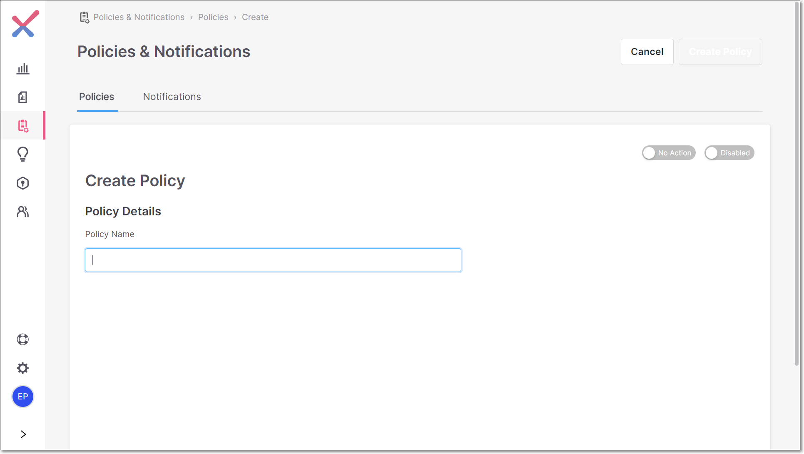
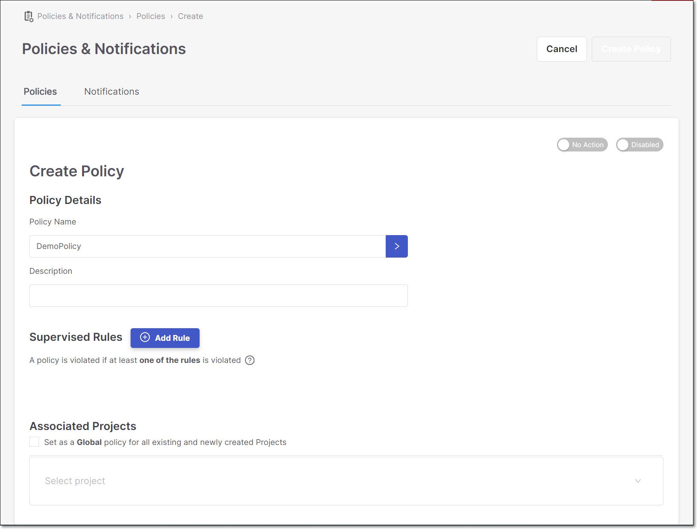
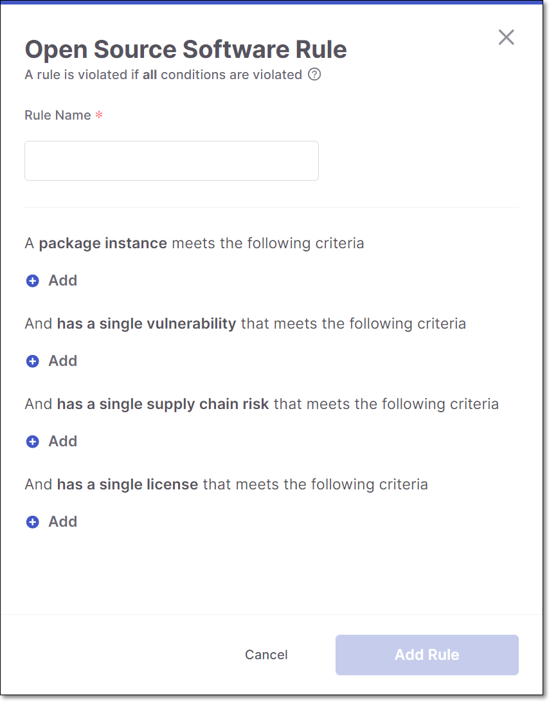
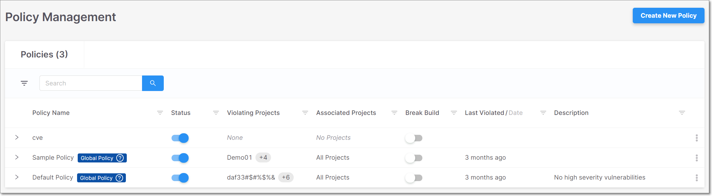
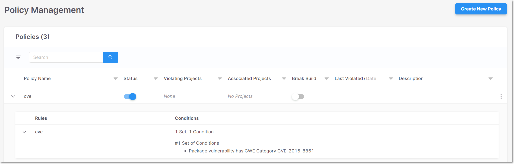
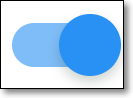

# Policy Management

Policy management enables you to apply customized security rules to the open-source packages in your Projects. This makes it easy to identify Projects that are non-compliant with your self-defined security policies. The **Policy Management** screen enables you to define, manage, and track your organization’s security Policies.

Each Policy consists of a series of rules that define a custom compliance threshold. Each rule includes one or more “sets” of conditions. For each set of conditions, you can specify which packages, vulnerabilities, and licenses the policy relates to. For example, you can create a set of conditions so that an “Outdated” package with an “Exploitable Path” and a High Severity vulnerability will violate the policy.


**All** of the **conditions** in a rule must be met in order for the rule to be considered violated. If **any** one of the **rules** in a policy is violated, the policy is considered to be violated.


The system comes with several **Predefined** Policies, which are automatically applied to all Projects. You can create additional custom Policies. When you create a custom Policy, you have the option to define it as a **Global** Policy, which is automatically assigned to all Projects. Otherwise, you need to specify which Projects the Policy is assigned to.

After a Policy is assigned to a Project, all subsequent scans of that Project will include the policy evaluation process as part of the scan. If there are any violations, they will be displayed on the **Policy Violations** tab in the **Scan Results** page for the scan. See [Policy Violations Tab](project-page-tabs.md#UUID-65dd1ab4-c309-cd57-7a33-5382adb0908a). Additionally, an email notification will be sent to the recipient specified in the Project Settings. See [Editing Project Settings - Activating Notifications](editing-project-settings.md).


Only users with SCA Manager or SCA Admin roles can create, update and delete Policies.


## Creating a Policy

Create a policy to flag specific situations that you want to call attention to. For each policy, specify a series of rules that define a custom compliance threshold. For each rule you can specify which packages, vulnerabilities and licenses the rule relates to.

The various types of conditions that can be used are described in the tables [below](policy-management.md#UUID-6754d293-65f3-d16a-e2b1-488fc05998c9_id_CreatingaPolicy-PackageConditions).


Only users with SCA Manager or SCA Admin roles can create, update and delete policies.




**To create a new Policy:**

1. On the Policy Management screen, click **Create New Policy**.

   The **Create Policy** page is displayed.

   
<figure></figure>

2. In the **Policy Details** section, in the **Policy Name** field, enter a name for the policy and press **Enter**.

   Additional fields are displayed.

   
<figure></figure>

3. In the **Description** field, enter a description for the policy. (Optional)

4. In the **Supervised Rules** section, click **Add Rule**.

   The **Open Source Software Rule** side panel is displayed on the right.

   
<figure><figcaption></figcaption></figure>

5. Configure the rule using the following procedure:

   1. In the **Rule Name** field, enter a name for the rule.

   2. Specify conditions for one or more of the condition categories, as follows:

      
      The AND operator is applied to the conditions, so that **all of the conditions must be met relative to a specific package** in order for the rule to be considered violated.
      

      - If you would like to set a condition related to the package instance, under **package instance,** click **Add**. Then, select the desired criterion, and specify a value (where relevant). See options [below](policy-management.md#UUID-6754d293-65f3-d16a-e2b1-488fc05998c9_id_CreatingaPolicy-PackageConditions).

      - If you would like to set a condition related to a vulnerability, click **Add** under **has a single vulnerability**, select the desired criterion and specify a value (where relevant). See options [below](policy-management.md#UUID-6754d293-65f3-d16a-e2b1-488fc05998c9_id_CreatingaPolicy-VulnerabilityConditions).

      - If you would like to set a condition related to a vulnerability, click **Add** under **has a single suspected malware risk**, select the desired criterion and specify a value (where relevant). See options [below](policy-management.md#UUID-6754d293-65f3-d16a-e2b1-488fc05998c9_id_CreatingaPolicy-SupplyChainRiskConditions).

      - If you would like to set a condition related to a license, click **Add** under **has a single license**, select the desired criterion and specify a value (where relevant). See options [below](policy-management.md#UUID-6754d293-65f3-d16a-e2b1-488fc05998c9_id_CreatingaPolicy-LicenseConditions).

        
        For certain criterion, you can enter multiple values. In this case, the OR operator is applied, so that if any of the values are identified the rule is considered to be violated.

        You can add multiple criteria in each section by clicking the **Add** button in the relevant section. However, you can only use each type of criterion once in each set of conditions.
        

   3. Click **Add Rule**.

      The **Policy was created with rules** window is displayed.

6. If you would like to add additional rules, click **Add Rule** and configure the rule, as described above.

   
   The OR operator is applied to the rules of a policy, so that if **any one of the rules is violated**, the policy is considered to be violated.
   

7. In the **Associated Projects** section, do one of the following:

   - To select specific Projects, click on the **Select project** field, and select the checkbox next to one or more of the Projects from the drop-down list. **OR**
   - To apply to all Projects, select the **Set as a Global…** checkbox.

8. If you would like to break the build when a Policy has been violated, set the **Break the build** toggle (at the top of the page) to the right (On).

   
   This option is only relevant when the scan was triggered by a plugin version that supports breaking builds on SCA policy violations.
   

9. Toggle the **Status** switch to the right if you would like to enable the policy upon creation.

   
   When the policy is enabled it is applied to future scans. When the policy is disabled it will not be applied to future scans, but results are still shown for Policy Violations in previous scans.
   

10. Click **Create Policy**.

    The **Policy has been created** window is displayed and the policy can be viewed on the Policy Management screen.

### Package Conditions

| **Type** | **Description** | **Values specified** |
| --- | --- | --- |
| Is Used | The rule applies only to packages that are being used in the project. **Tip** This is only supported for Projects for which the Exploitable Path feature is supported. | none |
| Is Outdated | The rule applies only to packages for which a more recent version is available. | none |
| Named | The rule applies only to the packages with the specified name. | Specify the full name of the package. |
| Name Contains | The rule applies only to packages that have the specified string in their name. | Specify a string that is contained in the package name. |
| Version is Higher than | The rule applies only to packages with a version higher than the specified version. | Specify the version number that it must be higher than. |
| Version is Lower than | The rule applies only to packages with a version lower than the specified version. | Specify the version number that it must be lower than. |
| Is not a Dev dependency | The rule only applies to packages that aren’t Dev dependencies. | none |
| Is not a Test dependency | The rule only applies to packages that aren’t Test dependencies. | none |
| Is a Direct dependency | The rule only applies to Direct dependencies (not to Transitive dependencies). | none |
| Is Malicious | The rule only applies to Malicious packages. | none |
| Is Not a Commercial License | The rule only applies to packages for which the organization doesn't have a commercial license. | none |
| Contributor Reputation score greater or equal to | The rule only applies to packages whose Contributor Reputation score is greater than or equal to the number indicated. See [Preventing Malicious Software Attacks](preventing-malicious-software-attacks.md) | number from 0 - 10 |
| Reliability score greater or equal to | The rule only applies to packages whose Package Reliability score is greater than or equal to the number indicated. See [Preventing Malicious Software Attacks](preventing-malicious-software-attacks.md) | number from 0 - 10 |
| Behavioral Integrity score greater or equal to | The rule only applies to packages whose Behavioral Integrity score is greater than or equal to the number indicated. See [Preventing Malicious Software Attacks](preventing-malicious-software-attacks.md) | number from 0 - 10 |

### Vulnerability Conditions

| **Type** | **Description** | **Values specified** |
| --- | --- | --- |
| has Exploitable Path | There is an Exploitable Path by which the vulnerable methods are actually used by your code. See [Exploitable Path](exploitable-path.md) **Tip** This is only supported for Projects in which the Exploitable Path feature is activated. | none |
| has a Remediation Recommendation | Checkmarx offers a remediation recommendation for eliminating the vulnerability from your Project. See [Remediation Tasks Tab](project-page-tabs.md#UUID-4838541d-dfbc-58bb-cef1-5e9c58de543c) **Tip** This is only supported for Projects in which the Exploitable Path feature is activated. | none |
| CVSS score is greater than or equal to | The CVSS score of the vulnerability is greater than or equal to the specified value. **Tip** The latest available CVSS version is used for this assessment. | Specify the minimum CVSS score for this condition. |
| Severity level is | The vulnerability has the specified severity level. | Select one or more severity levels (High, Medium, Low) for the vulnerabilities in this condition. |
| is a New Finding | The vulnerability instance was identified for the first time in a particular Project. | none |
| CWE Category is | The vulnerability has the specified CWE. | Specify the number of the CWE. |
| CVE ID is | The vulnerability has the specified CVE ID. | Specify a CVE ID, e.g., CVE-2019-2391. |
| number of Days Since Publication is greater than | The number of days since the vulnerability was published is greater than the specified value. | Specify the number of days that the value must be greater than. |
| EPSS score is greater than or equal to | The EPSS score of the vulnerability is greater than or equal to the specified value. | Specify the minimum EPSS score for this condition. |
| EPSS percentile is greater than or equal to | The EPSS percentile of the vulnerability is greater than or equal to the specified value. | Specify the minimum EPSS percentile for this condition. |
| Vulnerability state is | The vulnerability has the specified state. | Select one or more states (To Verify, Proposed not Exploitable, Confirmed, Urgent) for the vulnerabilities in this condition. |
| Vulnerability status is | The vulnerability has the specified staus. | Select a status (New or Recurrent) for the vulnerabilities in this condition. |

### Suspected Malware Risk Conditions

| **Type** | **Description** | **Values specified** |
| --- | --- | --- |
| Severity level is | The vulnerability has the specified severity level. | Select one or more severity levels (High, Medium, Low) for the vulnerabilities in this condition. |
| Risk Type | The rule only applies to the specified malware risk types. See [Preventing Malicious Software Attacks](preventing-malicious-software-attacks.md) | Select one or more risk types from the dropdown list. |

### License Conditions

| **Type** | **Description** | **Values specified** |
| --- | --- | --- |
| Named | Specify one or more specific licenses for this condition. | Select one or more licenses from the dropdown list of licenses in your account. |
| License severity is | The rule only applies to a Suspected Malware risk with the specified severity level. | Select one or more severity levels (High, Medium, Low) for this condition. |
| License state is | The rule only applies to a license with the specified state. | Select one or more states (Not Effective, Effective, To Verify) for this condition. |

## Viewing Policies

The Policy Management screen shows detailed information about the policies you have created. The policies table header bar includes the number of policies in your account. You can search for **Policy Name**, **Violating Projects**, and **Associated Projects** using the search box. You can also sort by column headers, and set filters for each column.

- Click on a specific row to open the **Edit Policy** screen.

- Click on the on the right side of a row to show options to **Edit** or **Delete** the Policy.

  
<figure></figure>

- Click on the arrow to the left of a Policy name to expand the table and show the rules applied to the Policy along with the number of conditions associated with each rule.

- Click anywhere on the row of a specific rule to further expand the table and show the conditions that are associated with that rule.

  
<figure></figure>

<table>
<thead>
<tr><th>
<strong>Item</strong>
</th><th>
<strong>Description</strong>
</th><th>
<strong>Possible Values</strong>
</th></tr>
</thead>
<tbody>
<tr><td>
<strong>Policy Name</strong>
</td><td>
The name of the policy.

A blue label is shown for the following types of Policies:

<strong>Predefined Policy</strong> - an out-of-the-box Policy, which is automatically assigned to all Projects

<strong>Global Policy</strong> - a custom Policy that has been assigned to all Projects
</td><td>
e.g., Outdated packages
</td></tr>
<tr><td>
<strong>Status</strong>
</td><td>
Toggle switch used to enable/disable the policy.

When the policy is enabled it is applied to future scans. When the policy is disabled it will not be applied to future scans, but results are still shown for Policy Violations in previous scans.
</td><td><figure></figure>
Enabled
<figure></figure>
Disabled
</td></tr>
<tr><td>
<strong>Violating Projects</strong>
</td><td>
Shows all of the projects that violated the policy in the last scan. For multiple projects, hover over the display to show all of the projects.
</td><td>
e.g., Zuul2, AltoroJ
</td></tr>
<tr><td>
<strong>Associated Projects</strong>
</td><td>
Shows all of the projects that are associated with the policy. For multiple projects, hover over the display to show all of the projects.
</td><td>
e.g., Zuul2, AltoroJ
</td></tr>
<tr><td>
<strong>Break Build</strong>
</td><td>
Toggle switch used to enable/disable the Break Build option.

Enable the switch if you would like to break the build if a policy has been violated.

<strong>Tip</strong>

This option is only relevant for scans triggered by a plugin version that supports breaking builds on SCA policy violations.
</td><td><figure></figure>
Enabled
<figure></figure>
Disabled
</td></tr>
<tr><td>
<strong>Last Violated/Date</strong>
</td><td>
The relative time or complete date that the policy was last violated.

Toggle between relative time and date by clicking <em><em>Last Violated</em></em> or <em><em>Date</em></em> in the column header.
</td><td>
e.g., 19 days ago

e.g., Jan 28, 2021
</td></tr>
<tr><td>
<strong>Description</strong>
</td><td>
The description of the policy.
</td><td>
e.g., Outdated packages and high legal risk
</td></tr>
<tr><td colspan="3">
<strong>Expanded Policy Section</strong>
</td></tr>
<tr><td>
<strong>Rules</strong>
</td><td>
The rules applied to the policy.
</td><td>
e.g., Outdated package, High severity legal risk
</td></tr>
<tr><td>
<strong>Conditions</strong>
</td><td>
The number of conditions in the rule.
</td><td>
e.g., 2 Conditions
</td></tr>
<tr><td colspan="3">
<strong>Expanded Rule Section</strong>
</td></tr>
<tr><td>
<strong>Conditions</strong>
</td><td>
The details of the conditions in the rule.
</td><td>
e.g., Package has legal risk High
</td></tr>
</tbody>
</table>
