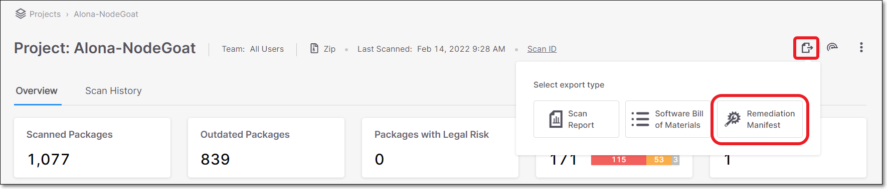

# Remediation using a Manifest File

Checkmarx enables you to generate a remediated manifest file for your project. Checkmarx provides a new manifest file that contains the recommended versions for your packages. You can download the remediated manifest file and use it to update your project.

This feature is currently supported for the following manifest files:

- npm `package.json`
- Python `requirement.txt`
- .NET `*.csproj`


If you update the dependency versions, your code may require some refactoring because of some possible functionality changes.



This remediation method is effective only for remediating risks in direct dependencies. An alternative method (currently in BETA and supported only for npm) addresses remediation of transitive dependencies as well. The alternative method is accessed from the **Remediation Tasks** tab on the **Scan Results** page, as described in [Remediation Tasks Tab](project-page-tabs.md#UUID-4838541d-dfbc-58bb-cef1-5e9c58de543c).


The remediation is generally done by exporting the remediated file and manually replacing the manifest file in your project. However, if your project is hosted in a private GitHub repository, you can remediate your project directly from the UI by sending a pull request. If you have the required permissions, you can then merge the pull request into your project.

**To remediate your project, do the following:**

1. Go to the **Scan Results** page for the scan of the Project that you would like to remediate.

2. Hover over the **Export**  icon at the top right corner of the page and click on **Remediation Manifest**.

   
<figure></figure>

   The **Remediate manifest** message appears, displaying a list of all the manifest files that can be remediated. A checkbox is displayed next to each file in the list.

   
<figure><figcaption></figcaption></figure>

   
   For a project in a private GitHub repository, an **Open Pull Request** button is displayed next to the download icon.
   

   
   If a manifest file cannot be remediated, for example it already contains the latest packages or the latest packages have still not been fixed for the known vulnerabilities, the manifest file will not be displayed.
   

3. Select the checkbox for each manifest file that you would like to remediate.

4. If you want to remediate your project manually, select the checkbox and click **Export** to download the remediated manifest file and use it to update your project.

5. If you want to remediate your project directly in GitHub, use the following procedure.

   1. Click **Open Pull Request** next to the package manager file that you require. A pull request is sent to your project’s GitHub repository. The **Open Pull Request** button is replaced with a **View Pull Request** button.
   2. To view the pull request, click **View Pull Request**. GitHub opens to your project, displaying **CxSCA-Remediation**. Under **Packages updated by CxSCA-Remediation**, there is a list of the remediated open source packages, the updated version numbers, and the fixed vulnerabilities.
   3. You can merge the remediated open source packages into your project by clicking **Merge pull request**, displayed in GitHub. The next scan of your project should show fewer (or no) vulnerabilities.
