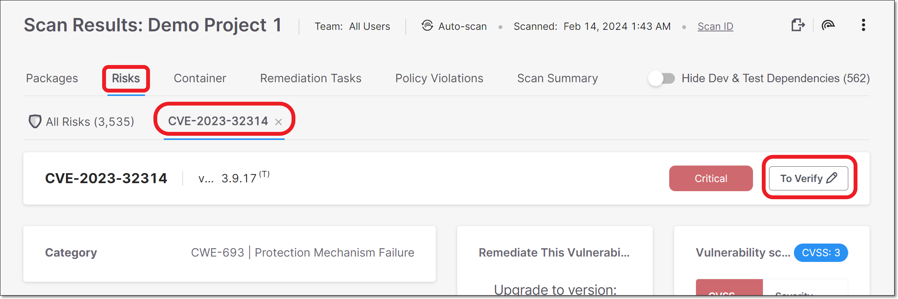
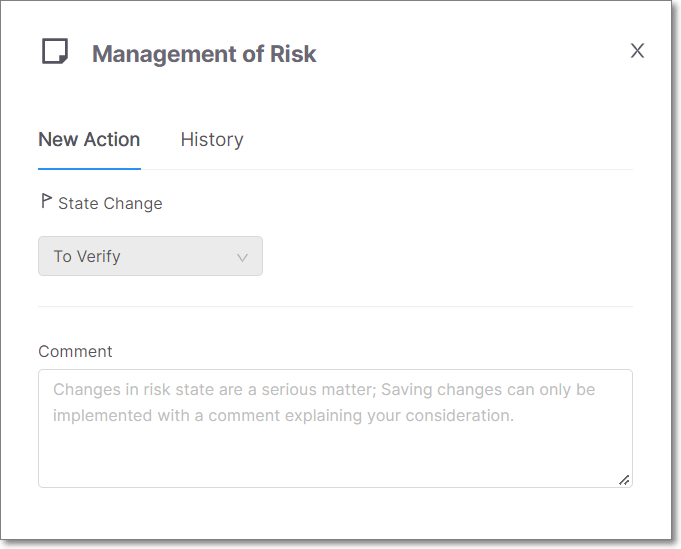
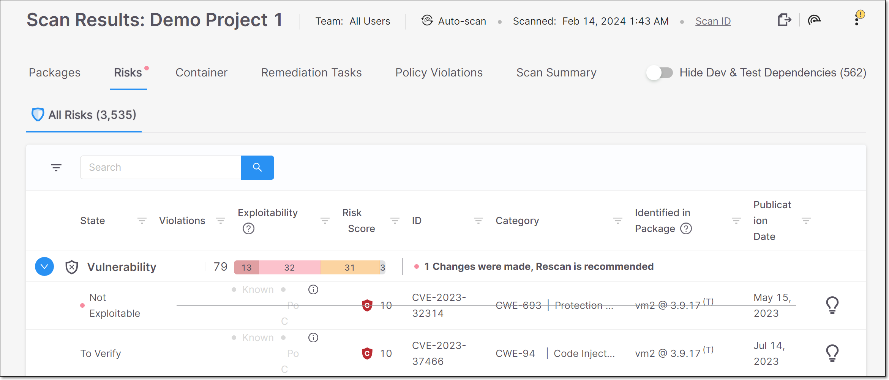
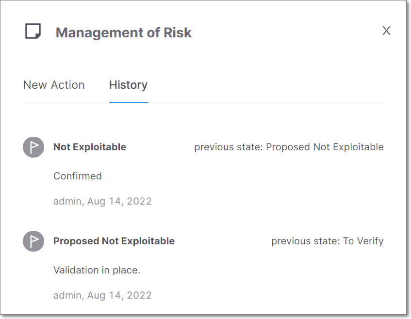

# Risk Management

Checkmarx SCA tracks specific risk instances throughout your SDLC. Each risk instance has a ‘Predicate’ associated with it, which is comprised of the **State** and **Comments**. After reviewing the results of a scan, you can triage the results and modify these predicates accordingly. If the identical risk instance is identified in subsequent scans of the same project, the predicate will automatically be applied to that instance.


Risk management is currently supported only for **Vulnerability** and **Suspected Malware** risks, but not for **Legal** risks.


A risk instance is defined as a specific **risk** affecting a specific **package** in a specific **project**. Therefore, changes that you make to the predicate of a risk aren’t applied to the identical risk when it is found in a different project. Also, if the risk affects other packages in your project, the changes won’t be applied to those risks.

While viewing the Risk Details page for a specific risk, you can open a side panel with tabs for **New Action** (i.e., making changes) and for viewing **History** of changes made.

<figure><figcaption></figcaption></figure>


Only users with the `manage-risk` role (e.g., Admin, SCA Manager) are able to change the state of a risk and add comments.


## Adding Comments

You can add a comment to a risk with info about your assessment of the risk posed to your project. For example, you can add resources related to the vulnerability, assessment of exploitability in the context of your code, remediation steps, assignment of responsibility for remediation etc. In addition, whenever you change the state of a risk, you are required to add a comment explaining the rationale behind the change.

## Changing Risk State

A risk state is assigned to each risk instance in your project. Initially, the state of each new risk is set as **To Verify**, indicating that it is a new finding that hasn’t yet been assessed by your AppSec team. Your AppSec team can adjust the risk state to one of the following options:

- **Not Exploitable** - Select this state if your team has determined that this risk doesn’t pose a threat to your application (and isn’t expected to cause a risk at any time in the future).


When a Risk is marked as **Not Exploitable**, in the **All Risks** page the CVE is marked with a strikethrough line, and the **Risk Details** page is grayed out. Also, Not Exploitable risks aren't counted in the risk summary counters.


- **Proposed Not Exploitable** - Select this state if your team has suggested tentatively that this risk doesn’t pose a threat to your application.
- **Confirmed** - Select this state if your team has confirmed that this risk **does** pose a threat and requires mitigation.
- **Urgent** - Select this state if your team has determined that this risk poses an imminent threat and requires urgent mitigation.

### What to consider when changing the Risk state

Before defining a new state for a Risk, it is important to ensure not only the security threat that the Risk **currently** poses but the threat that it may cause **at any stage** in your project’s development and deployment. On the other hand, it is sufficient to ensure that the presence of the Risk in **this particular package** and in **this Project** does not pose a threat, even if the Risk would pose a threat if it is identified in a different package and/or a different Project.

The following are some common reasons for changing the state of Risk:

- There is no exploitable path from your source code to the package that contains the Risk
- The Risk doesn’t affect the OS that you’re running
- You don’t consider the threat to be severe enough to require remediation

## How to Change the Risk Predicate

**To change the risk predicate:**

1. Go to the **Scan Results** page for the desired Project and click on the **Risks** tab \> **All Risks** sub-tab.

2. Click on a risk to open the **Risk Details** page for that risk.

3. In the tab’s header bar, click on the **Risk State** button (showing the current state).

   
<figure></figure>

   The **Management of Risk** panel opens.

   
<figure><figcaption></figcaption></figure>

   
   Alternatively, you can open the Management of Risk panel by clicking on the **Comments** button in the **Customization** section at the bottom of the **Risk Details** page.
   

4. To change the state, click on the **State Change** field, and select from the drop-down list the desired state.

   
   After changing the state, you are required to add a comment before the option to **Approve** the change becomes available.
   

5. In the **Comment** section, enter your comment.

6. Click **Approve**.

   The new State is immediately shown in the web application. However, the risk summary counters aren't recalculated until a new scan or scan recalculation is run on the project.

   

   

## Viewing Change History

Once a State change has been made, a red dot is shown next to the relevant Risk. This indicates that you need to run a scan recalculation in order to update all of the result counters to reflect the change.

State changes are shown in the **All Risks** table. Not Exploitable risks are marked with a strikethrough line.

<figure></figure>

In addition, a detailed history of all changes is shown in the **Management of Risk** panel \> **History** tab. For each change that was made, the name of the user who made the change and the time of the change are shown. In addition, for state changes, the new state is shown alongside the previous state.

<figure><figcaption></figcaption></figure>

