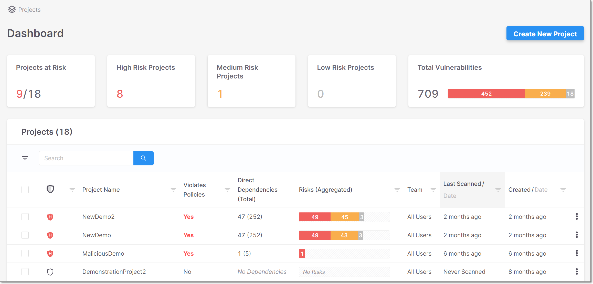
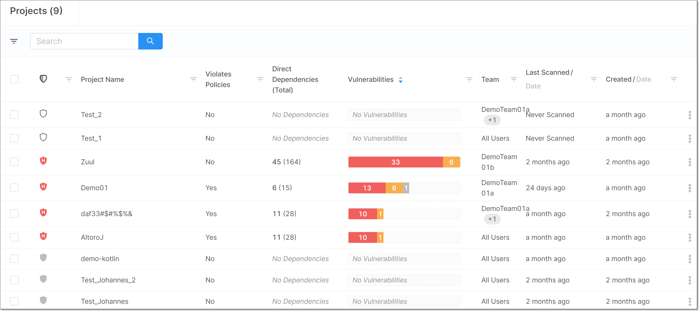

# Viewing the Dashboard (Home Page)

The Dashboard shows the overall status of all of your Projects.

- The **Overview** widgets - show aggregated results for all of your organization’s Projects (dependent on access control).
- The **Projects** pane - shows results for each individual Project. Each record shows general Project info and overall results for the most recent scan of that Project. You can click on a Project to open the Project page for that Project.

<figure></figure>

## Overview Widgets

<figure></figure>

The following table describes the info shown in the overview widgets.

<table>
<thead>
<tr><th>
<strong>Item</strong>
</th><th>
<strong>Description</strong>
</th><th>
<strong>Possible Values</strong>
</th></tr>
</thead>
<tbody>
<tr><td>
<strong>Projects at Risk</strong>
</td><td>
The total number of Projects at Risk over the total number of Projects in your organization. The number of Projects at risk is color coded to indicate the highest risk level of any of the Projects.
</td><td>
e.g., 4/9
</td></tr>
<tr><td>
<strong>High Risk Projects</strong>
</td><td>
The total number of Projects with a high risk.
</td><td>
e.g., 4
</td></tr>
<tr><td>
<strong>Medium Risk Projects</strong>
</td><td>
The total number of Projects with a medium risk.
</td><td>
e.g., 0
</td></tr>
<tr><td>
<strong>Low Risk Projects</strong>
</td><td>
The total number of Projects with a low risk.
</td><td>
e.g., 0
</td></tr>
<tr><td>
<strong>Total Vulnerabilities</strong>
</td><td>
The combined total number of vulnerabilities in all of your Projects followed by a color coded bar graph indicating the number of vulnerabilities of each severity level.
</td><td>
e.g.,
<figure></figure></td></tr>
<tr><td colspan="3">
<strong>Action Button</strong>
</td></tr>
<tr><td>
<strong>Create New Project Button</strong>
</td><td>
Click on this button to create a new project.
</td><td>
-
</td></tr>
</tbody>
</table>

## Projects Pane

The **Projects** pane shows a list of all Projects in your organization’s account. Each record shows general Project info as well as overall results for the most recent scan of that Project. You can search for specific packages using the search box. You can also sort by column headers and set filters for each column.

You can click on a row to open the **Project** page for that Project.

<figure></figure>

The following table describes the info shown in the **Projects** pane and the actions available in the context menu.

<table>
<thead>
<tr><th>
<strong>Item</strong>
</th><th>
<strong>Description</strong>
</th><th>
<strong>Possible Values</strong>
</th></tr>
</thead>
<tbody>
<tr><td>
<strong>Selection Box</strong>
</td><td>
Select multiple checkboxes to perform bulk action on all selected Projects. A delete button is shown above the Project Name column enabling you to delete all selected Projects.
</td><td>
-
</td></tr>
<tr><td>
<strong>Risk Level</strong>
</td><td>
The highest risk level of any vulnerability identified in the Project.
</td><td>
<em><em>High</em></em>, <em><em>Medium</em></em>, <em><em>Low</em></em>, <em><em>Unknown</em></em>, or <em><em>No Risk</em></em>
</td></tr>
<tr><td>
<strong>Project Name</strong>
</td><td>
The name of the Project.
</td><td>
e.g., Test_1
</td></tr>
<tr><td>
<strong>Violates Policies</strong>
</td><td>
Indicates if the last scan of this Project triggered any Policy violations, see <a href="policy-management.md">Policy Management</a>.
</td><td>
<em><em>Yes</em></em> or <em><em>No</em></em>
</td></tr>
<tr><td>
<strong>Direct Dependencies (Total)</strong>
</td><td>
The number of direct dependencies in the Project, followed by the total number of dependencies in parentheses.
</td><td>
e.g., 12 (34)
</td></tr>
<tr><td>
<strong>Risks (Aggregated)</strong>
</td><td>
A bar graph showing the number of risks in the project, according to risk level. This includes vulnerabilities, suspected malware risks and legal risks. Hover over a graph to show a breakdown by risk type.
<ul><li>
<strong>HIGH</strong>
</li><li>
<strong>MEDIUM</strong>
</li><li>
<strong>LOW</strong>
</li><li>
<strong>UNKNOWN</strong> (light grey - relevant only for legal risks)
</li></ul>
For more information, see <a href="severity-levels.md">SCA Risk Severity Levels</a>
</td><td>
e.g.,
<figure></figure></td></tr>
<tr><td>
<strong>Team</strong>
</td><td>
The Teams that are assigned to the Project.
</td><td>
e.g., All users, Team01
</td></tr>
<tr><td>
<strong>Last Scanned/Date</strong>
</td><td>
The relative time or calendar date that the last scan was performed on your Project. Toggle between relative time and date by clicking “Last Scanned” or “Date” in the column header.
</td><td>
e.g., 19 days ago

e.g., Jan 28, 2021 11:22 AM
</td></tr>
<tr><td>
<strong>Created/Date</strong>
</td><td>
The relative time or date that the project was created. Toggle between relative time and date by clicking “Created” or “Date” in the column header.
</td><td>
e.g., 19 days ago

e.g., Jan 28, 2021 11:22 AM
</td></tr>
<tr><td colspan="3">
<strong>Context Menu</strong>
</td></tr>
<tr><td>
<strong>Scan Project</strong>
</td><td>
Run a new scan on the Project.
</td><td>
-
</td></tr>
<tr><td>
<strong>Project Settings</strong>
</td><td>
Enables you to edit the Project settings as well as to activate/deactivate notifications.
</td><td>
-
</td></tr>
<tr><td>
<strong>Delete Project</strong>
</td><td>
Delete a Project and associated scans.
</td><td>
-
</td></tr>
<tr><td>
<strong>Latest Scan Results</strong>
</td><td>
Open the Risk Report page for the most recent scan of the Project.
</td><td>
-
</td></tr>
</tbody>
</table>
