# Installation and Initial Setup

## Initial Setup and Configuration

### Prerequisites

- You have an API Key for authenticating with Developer Assist.
- **VS Code:** Version 1.100.0 or above (supports both `settings.json` v1.100–1.101 and `mcp.json` v1.102+).
- **VS Code:** GitHub Copilot must be installed.
- **Kiro:** Version 0.6+ (latest version recommended).

### Installing and Configuring the Plugin

The instructions below cover the general setup for all supported IDEs. Open the collapsible section for your specific IDE for detailed steps.



### Install the extension

Install the **Checkmarx Developer Assist** extension from the **Marketplace**.



### Log in

In the IDE, open the extension, click **Log in**, and enter your **API Key**.



### Verify MCP

Make sure that the Checkmarx Developer Assist MCP is running.



### Optional settings

Optionally, adjust Checkmarx Developer Assist settings.







VS Code installation walkthrough


1. In the VS Code IDE main navigation, click on the **Extensions** icon.

2. Search for the **Checkmarx Developer Assist** extension, then click **Install**.

   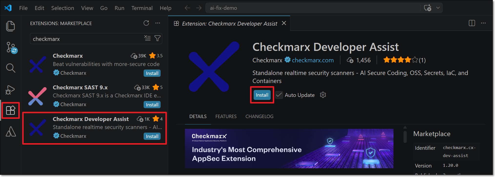

   The Developer Assist extension is installed and the Checkmarx icon appears in the left-side navigation panel.

3. Click on the Checkmarx extension icon. The **Checkmarx One Authentication** sidebar opens.

   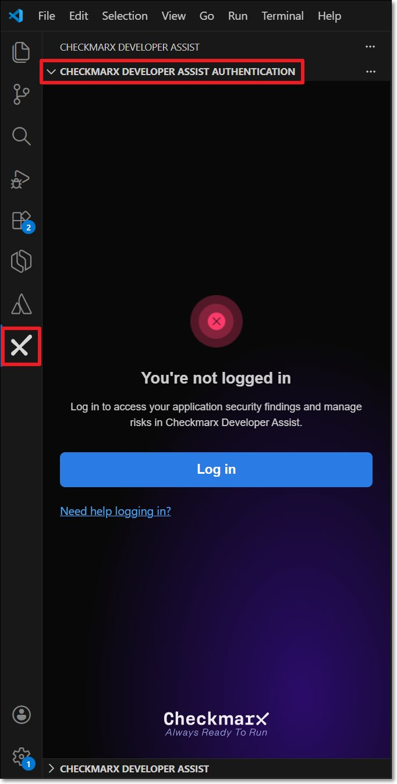

4. In the sidebar, click **Log in**. The Log in window opens.

   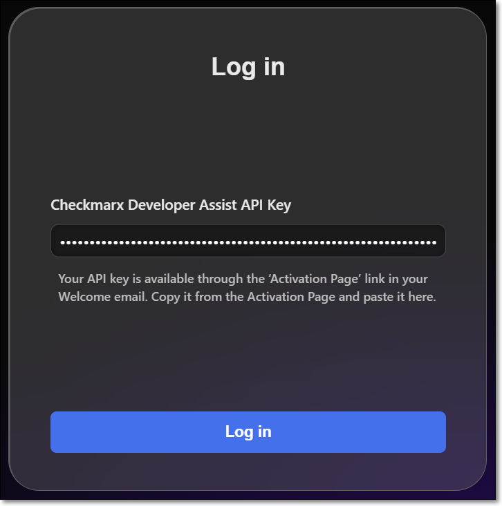

5. Enter your activation key in the **Checkmarx Developer Assist API Key** field and click **Log in**.

   The **Checkmarx Developer Assist Authentication** sidebar will now show that you are logged in.

   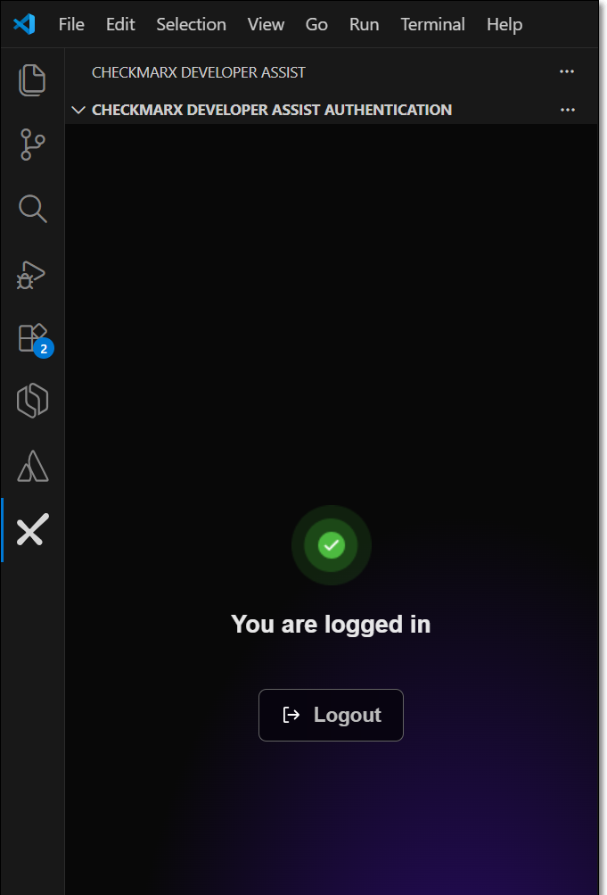

6. A welcome page is displayed after successful login. Scroll down and click **Mark Done**.

7. Click **View** > **Command Palette** and enter **MCP:List Servers**.

   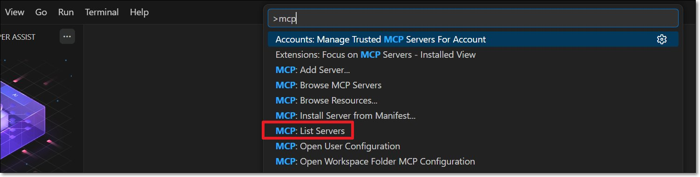

8. In the MCP servers list, select **Checkmarx Developer Assist**.

9. Click **Start Server**.

10. Optionally adjust settings:
    - Add **Additional Params** for proxy servers or debug mode.
    - Enable/disable specific realtime scanners (all enabled by default).
    - For IaC scanner: change the container platform (Docker by default, or Podman).
    - Select the **AI Assistant** for remediation: **Copilot** (default) or **Claude**.





Cursor installation walkthrough


1. In the Cursor IDE, click on the **Extensions** icon.

2. Search for the **Checkmarx Developer Assist** extension, then click **Install**.

3. Click the arrow next to the Extensions icon to open the drop-down menu. Click the **pin** icon beside the **Checkmarx** extension to add it to the top navigation bar.

4. Click on the Checkmarx extension icon. The **Checkmarx Developer Assist Authentication** sidebar opens.

   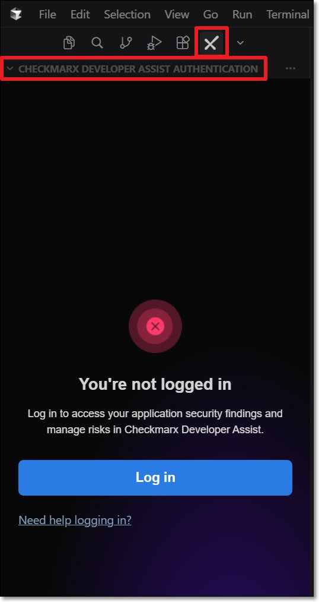

5. Click **Log in**. The Log in window opens.

   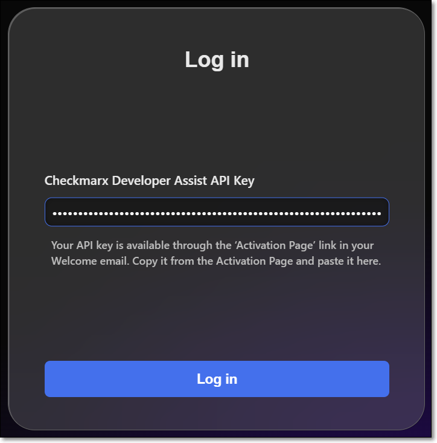

6. Enter your activation key in the **Checkmarx Developer Assist API Key** field and click **Log in**.

   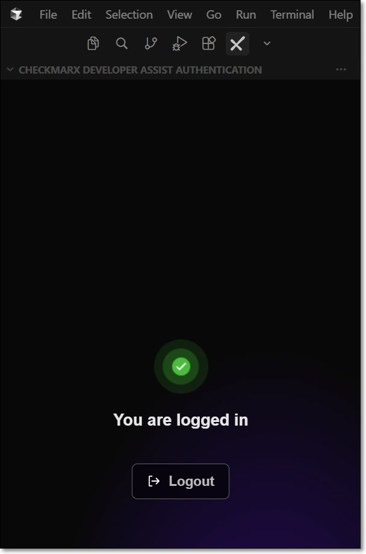

7. A welcome page is displayed after successful login. Scroll down and click **Mark Done**.

8. Verify MCP is running: in **Cursor Settings** under **Tools & MCP** > **Installed MCP Servers**, confirm the **Checkmarx Developer Assist** toggle is enabled.

   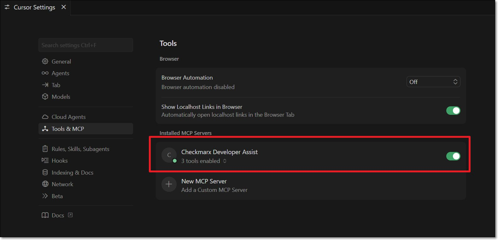

9. Optionally adjust settings:
    - Add **Additional Params** for proxy servers or debug mode.
    - Enable/disable specific realtime scanners.
    - For IaC scanner: change the container platform.
    - The IDE's built-in AI assistant is enabled by default. To use a different one: disable **Prefer Native AI Assistant**, then select **Copilot** or **Claude**.





Windsurf installation walkthrough


1. In the Windsurf IDE main navigation, click on the **Extensions** icon.

2. Search for the **Checkmarx Developer Assist** extension, then click **Install**.

   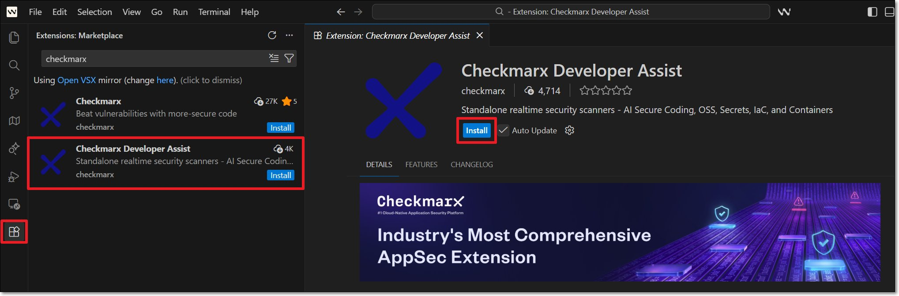

3. Click on the Checkmarx extension icon. The **Checkmarx Developer Assist Authentication** sidebar opens.

   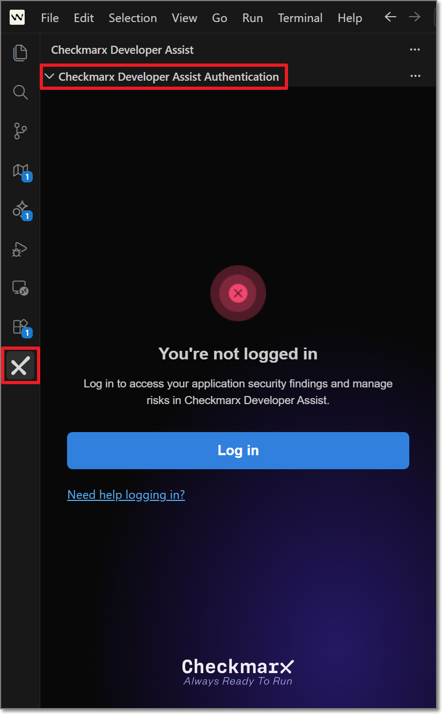

4. Click **Log in**. The Log in window opens.

   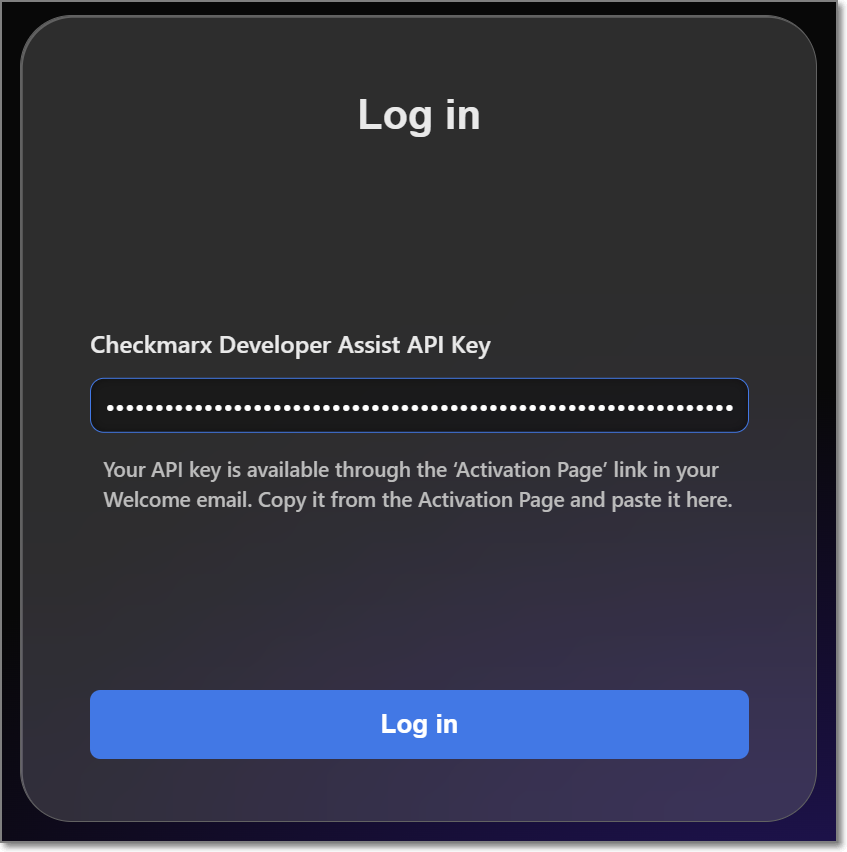

5. Enter your activation key and click **Log in**.

   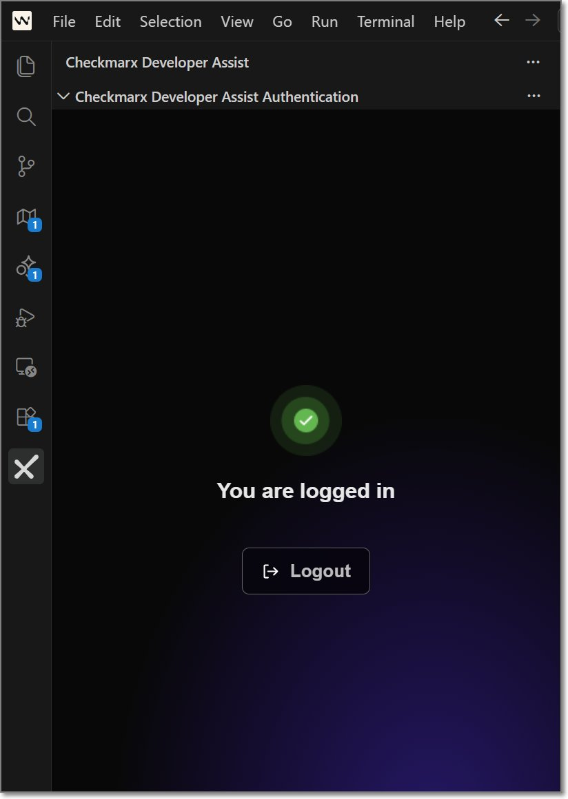

6. A welcome page is displayed after successful login. Scroll down and click **Mark Done**.

7. Verify MCP is running:

   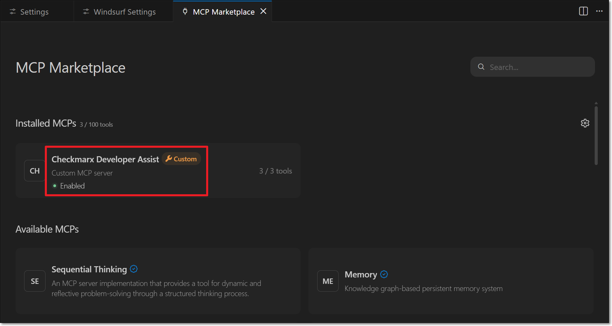

   Go to **Settings** > **Windsurf Settings**. Under **Cascade**, click **Open MCP Marketplace** and confirm the **Checkmarx Developer Assist** MCP is installed and enabled.

8. Optionally adjust settings:
    - Add **Additional Params** for proxy servers or debug mode.
    - Enable/disable specific realtime scanners.
    - For IaC scanner: change the container platform.
    - The IDE's built-in AI assistant is enabled by default. To use a different one: disable **Prefer Native AI Assistant**, then select **Copilot** or **Claude**.





Kiro installation walkthrough


1. In the Kiro IDE main navigation, click on the **Extensions** icon.

2. Search for the **Checkmarx Developer Assist** extension, then click **Install**.

   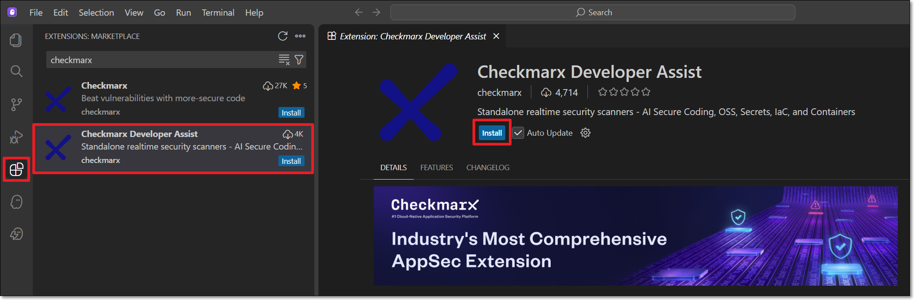

3. In the pop-up window, click **Trust Publisher and Install**.

4. Click on the Checkmarx extension icon. The **Checkmarx Developer Assist Authentication** sidebar opens.

   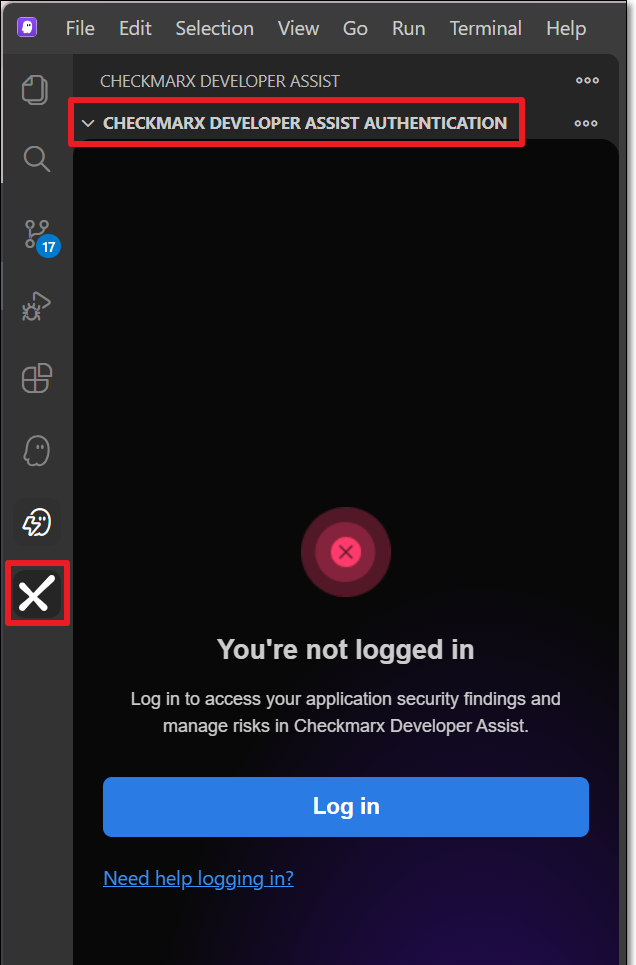

5. Click **Log in**. The Log in window opens.

   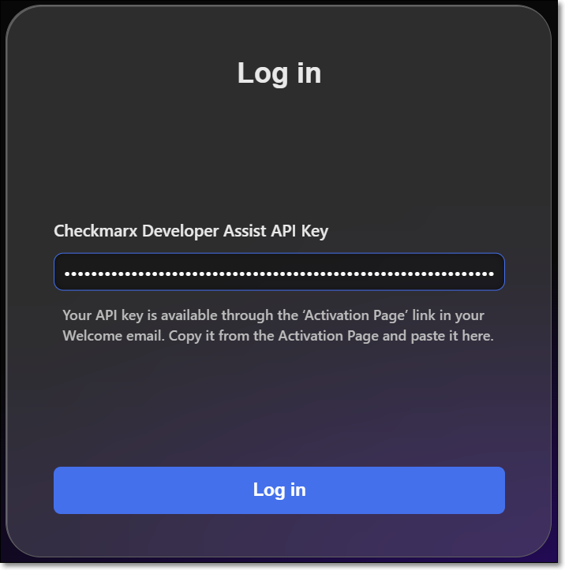

6. Enter your activation key and click **Log in**.

   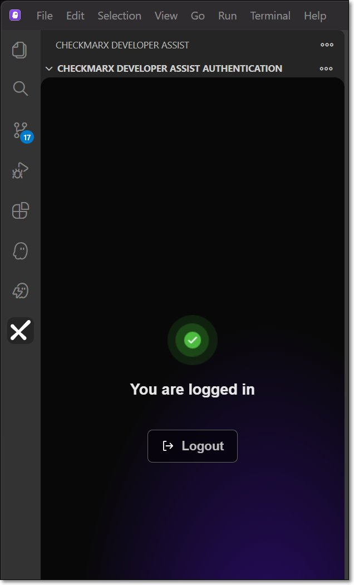

7. A welcome page is displayed after successful login. Scroll down and click **Mark Done**.

8. Verify MCP is connected:

   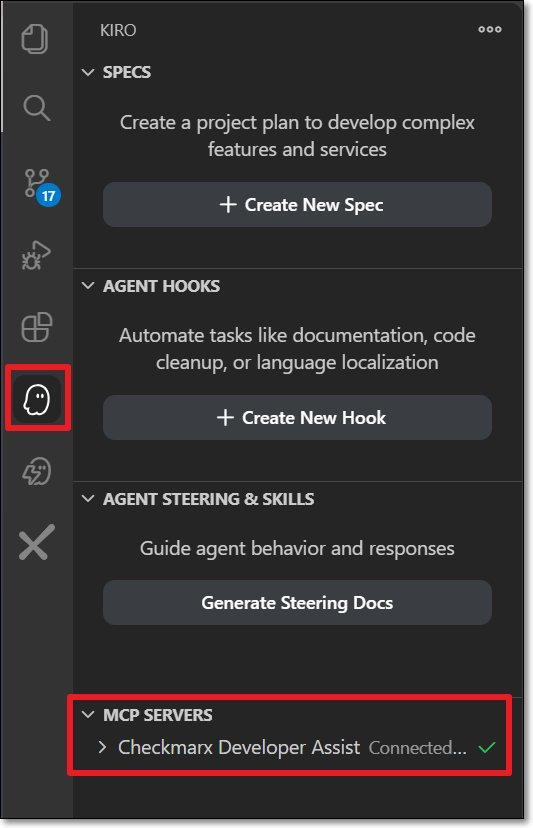

   Select the **Kiro** icon in the left-side navigation panel. Under **MCP servers**, confirm that **Checkmarx Developer Assist** is connected.

9. Optionally adjust settings:
    - Add **Additional Params** for proxy servers or debug mode.
    - Enable/disable specific realtime scanners.
    - For IaC scanner: change the container platform.
    - The IDE's built-in AI assistant is enabled by default. To use a different one: disable **Prefer Native AI Assistant**, then select **Copilot** or **Claude**.




---

## Troubleshooting — Manually Configuring the MCP Server

If the automatic installation procedure fails, you can manually configure access to the Checkmarx MCP server.




1. If it does not already exist, create an `mcp.json` file at: `${homeDir}\AppData\Roaming\Code\User\mcp.json`

2. Add the Checkmarx Developer Assist MCP using the following snippet, replacing `<Activation_Key>` with your Developer Assist Activation Key:

```json
{
  "servers": {
    "Checkmarx Developer Assist": {
      "url": "https://mea.ast.checkmarx.net/api/security-mcp/mcp",
      "headers": {
        "cx-origin": "VsCode",
        "Authorization": "<Activation_Key>"
      }
    }
  }
}
```

3. Start the MCP server:
   - Click **View** > **Command Palette** and enter **MCP:List Servers**.
   - Select **Checkmarx Developer Assist**.
   - Click **Start Server**.




1. If it does not already exist, create an `mcp.json` file at: `${homeDir}\.cursor\mcp.json`

2. Add the following snippet, replacing `<Activation_Key>` with your key:

```json
{
  "mcpServers": {
    "checkmarx Developer Assist": {
      "url": "https://mea.ast.checkmarx.net/api/security-mcp/mcp",
      "headers": {
        "cx-origin": "Cursor",
        "Authorization": "<Activation_Key>"
      }
    }
  }
}
```

3. Verify in **Cursor Settings** under **Tools & MCP** > **Installed MCP Servers** that the **Checkmarx Developer Assist** toggle is enabled.

   




1. If it does not already exist, create an `mcp_config.json` file at: `${homeDir}\.codeium\windsurf\mcp_config.json`

   
   If you are using windsurf-next, the file location should be `${homeDir}\.codeium\windsurf-next\mcp_config.json`
   

2. Add the following snippet, replacing `<Activation_Key>` with your key:

```json
{
  "mcpServers": {
    "checkmarx Developer Assist": {
      "url": "https://mea.ast.checkmarx.net/api/security-mcp/mcp",
      "headers": {
        "cx-origin": "Windsurf",
        "Authorization": "<Activation_Key>"
      }
    }
  }
}
```

3. Go to **Settings** > **Windsurf Settings**. Under **Cascade**, click **Open MCP Marketplace** and make sure the Checkmarx Developer Assist MCP is installed and enabled.




1. If it does not already exist, create an `mcp.json` file at: `${homeDir}\.kiro\settings\mcp.json`

2. Add the following snippet, replacing `<Activation_Key>` with your key:

```json
{
  "mcpServers": {
    "checkmarx Developer Assist": {
      "url": "https://mea.ast.checkmarx.net/api/security-mcp/mcp",
      "headers": {
        "cx-origin": "Kiro",
        "Authorization": "<Activation_Key>"
      }
    }
  }
}
```

3. Click on the **Kiro** icon in the left-side navigation. Under **MCP servers**, confirm that Checkmarx Developer Assist is connected.

   



